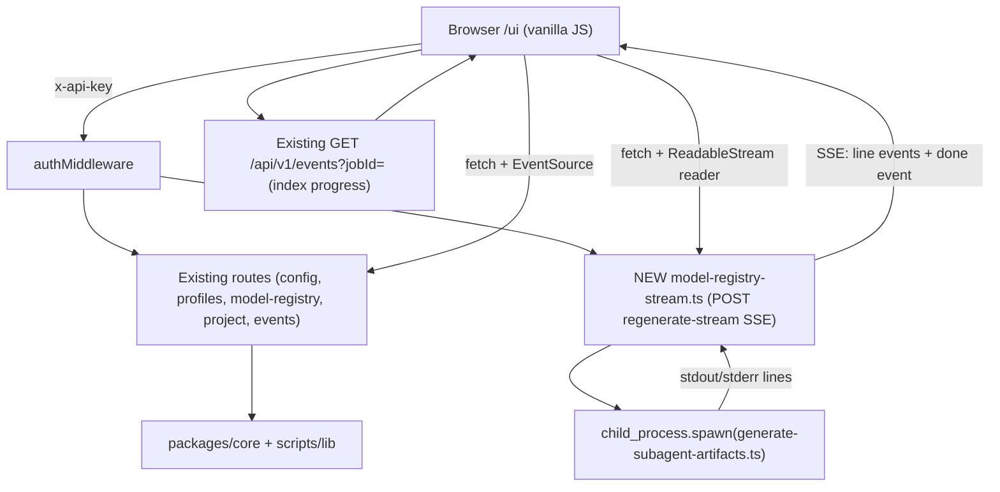

# Admin Portal Enhancements Design

**Spec**: `.specs/features/admin-portal-enhancements/spec.md`
**Status**: Draft

---

## Design Summary

This feature is a frontend-completion + one-new-backend-route layer over the
prior `admin-portal` feature (PR #92). The prior feature shipped renderers
and backend routes but left the frontend handlers, styling, confirmation
flow, and progress UX unimplemented. This design:

1. **Wires** every `data-action` the Config, Profiles, and Model Registry
   renderers emit to a real handler in `wireViewHandlers()`.
2. **Styles** all ~20 new CSS classes the renderers emit using the existing
   design tokens (CSS variables) so the views match the rest of the portal.
3. **Adds confirm-on-all-edits**: a `confirm()` dialog before every
   config/profile/registry disk-writing action (Save, Switch, Save Overlay,
   Regenerate, Clear Overlay). In-memory grid edits (cell edits,
   add/duplicate/delete/restore profile) do not confirm — they only commit
   on Save Overlay.
4. **Adds success/failure banners**: a `.success` class (green-tinted) for
   success, reuses `.error` for failure, shown at the top of the affected
   view, auto-hidden after 6s on success.
5. **Adds real-time progress**: project indexing tracks the job via the
   existing `GET /api/v1/events?jobId=` SSE channel (with a 2s polling
   fallback on `GET /api/v1/project/index/status/:jobId`); registry
   regeneration uses a new `POST /api/v1/model-registry/regenerate-stream`
   route that spawns the script with `child_process.spawn` and pipes
   stdout/stderr lines to an SSE stream.
6. **Surfaces** the model-registry editor as a sub-tab inside the Profiles
   view, with the active tab persisted in `localStorage`.

No new packages. One new backend route file (`model-registry-stream.ts`)
and one new frontend test file (`admin-handlers.test.ts`), plus one new
backend test (`model-registry-stream.test.ts`). Existing test seams are
extended for the new handler assertions.

---

## Architecture Overview



No new packages. The new route registers in `apps/tools-api/src/index.ts`
alongside the existing `modelRegistryRoutes`. The frontend changes are
confined to `apps/web-ui/src/static/app.js` (handler wiring + in-memory
overlay state + tab switcher + progress tracking) and `styles.css` (new
class definitions).

---

## Code Reuse Analysis

### Existing Components to Leverage

| Component | Location | How to Use |
| --- | --- | --- |
| `wireViewHandlers()` | `app.js:1397` | extend — add config-save, config-reveal, profile-switch, registry-* handler blocks |
| `collectFormData()` | `app.js:1511` | use — config save collects field values by section |
| `buildConfigSectionBody()` | `app.js:906` | use — builds the partial body for a config section PUT |
| `createApiClient` | `app.js:1252` | use — all API calls go through `api.request()` |
| `renderConfig` / `renderProfiles` / `renderModelRegistry` | `app.js:867,937,1021` | use unchanged — they already emit the right `data-action` attributes |
| SSE block | `app.js:1692` | extend — track `state.indexJobId` and update the progress line on `index_status` events for that jobId |
| `GET /api/v1/events?jobId=` | `events.ts:18` | use — filter SSE by jobId for index progress |
| `GET /api/v1/project/index/status/:jobId` | `project.ts:397` | use — polling fallback for index status |
| `POST /api/v1/model-registry/regenerate` (blocking) | `model-registry.ts:111` | keep — API compatibility; new streaming route is additive |
| `child_process.spawnSync` pattern | `model-registry.ts:115` | pattern for the new `spawn` (non-blocking) route |
| `loadEffectiveRegistry` | `scripts/lib/model-profiles.ts:448` | use — unchanged by this feature |
| CSS variables (`--bg-panel`, `--border`, `--accent`, `--fg-muted`, `--error-fg`) | `styles.css:3-29` | use — all new classes reference these tokens, no hardcoded colors |
| `.card`, `.filters`, `.form-field`, `.error` patterns | `styles.css:225,125,265` | pattern — new classes mirror their shape (padding, radius, border, background) |
| `confirm()` usage | `app.js:1428,1477,1491,1504` | pattern — existing confirm-before-destructive; new confirms follow the same shape |

### Integration Points

| System | Integration Method |
| --- | --- |
| Existing config/profile/registry routes | UI calls them via `api.request()`; no backend change to these |
| Existing SSE `/api/v1/events` | UI subscribes with `?jobId=` filter for index progress; existing `onmessage` block extended to update `state.indexJobStatus` |
| New `regenerate-stream` route | UI uses `fetch` + `ReadableStream` reader (not `EventSource`, because it's a POST); reads SSE-formatted chunks |
| `generate-subagent-artifacts.ts` | New route spawns it with `child_process.spawn`; pipes stdout/stderr line-by-line |

---

## Components

### Component 1 — Config View Handlers (frontend)

- **Purpose**: wire `config-save` and `config-reveal` to real handlers.
- **Location**: `apps/web-ui/src/static/app.js` — extend `wireViewHandlers()`.
- **Behavior**:
  - `config-save` (per-section): `confirm("Save <label> config? A backup will be created.")` → if confirmed, collect fields via `root.querySelectorAll('[data-section="' + section + '"]')`, build body via `buildConfigSectionBody(section, fieldValues)`, PUT `/api/v1/config`, show banner on result, re-render.
  - `config-reveal`: toggle `input.type` between `password` and `text` on the target field; update button label to "hide" / "reveal".
- **Dependencies**: `buildConfigSectionBody` (existing), `api.request`, `showBanner` (new helper).
- **Reuses**: `collectFormData` pattern; existing confirm pattern.

### Component 2 — Profiles View Tab Switcher + Switch Handler (frontend)

- **Purpose**: add a tab switcher (Switch Profile / Edit Registry); wire `profile-switch`.
- **Location**: `apps/web-ui/src/static/app.js` — extend `renderProfiles` to emit the tab switcher, or add a wrapper renderer; extend `wireViewHandlers()`.
- **Behavior**:
  - Tab switcher: two buttons at the top of the Profiles view; clicking sets `state.profilesTab` and re-renders; persisted in `localStorage massa-ai-profiles-tab`.
  - `profile-switch`: `confirm("Switch <host> to profile <name>? Replaces installed agent files. Session restart required.")` → if confirmed, POST `/api/v1/profiles/switch` with `{ profile, host }`, show banner with per-host results, re-render.
- **Dependencies**: `api.request`, `showBanner`.
- **Reuses**: existing `renderProfiles` and `renderModelRegistry` renderers (unchanged); the tab switcher wraps them.

### Component 3 — Model Registry In-Memory Overlay State + CRUD Handlers (frontend)

- **Purpose**: track the accumulated overlay client-side; wire all `registry-*` handlers.
- **Location**: `apps/web-ui/src/static/app.js` — new `state.registryOverlay` object; extend `wireViewHandlers()`.
- **Behavior**:
  - On registry view load, initialize `state.registryOverlay` from `source.overlay` (or `{ profiles: {}, hostDefaults: {}, workflowTiers: {}, tiers: [] }` if null).
  - `registry-model` / `registry-effort` (cell edit, on `change` event): update `state.registryOverlay.profiles[profileName].hosts[host][tier] = { model, effort }`. Mark `state.registryDirty = true`. Update unsaved indicator.
  - `registry-hostDefault` / `registry-workflowTier` (on `change`): update `state.registryOverlay.hostDefaults[host]` or `...workflowTiers[wf]`. Mark dirty.
  - `registry-add-profile`: `prompt` for name + description; if name provided, init `state.registryOverlay.profiles[name] = { description, hosts: { <each host>: { <each tier>: { model: null, effort: null } } } }`; re-render.
  - `registry-duplicate-profile`: `prompt` for new name; if provided, copy the selected profile's grid (find selected from a `data-selected` attr or the first profile); add to overlay; re-render.
  - `registry-delete-profile`: `prompt` for the profile name to delete; if valid, set `state.registryOverlay.profiles[name] = { _delete: true }`; re-render (profile moves to tombstoned list).
  - `registry-restore`: remove `_delete` from `state.registryOverlay.profiles[name]` (or delete the key if it was only a tombstone); re-render.
  - `registry-save-overlay`: `confirm("Save registry overlay? Validates and writes to ~/.config/massa-ai/model-profiles.json.")` → if confirmed, PUT `state.registryOverlay` to `/api/v1/model-registry`; show banner; on success, reset `registryDirty=false` and re-render with new `source.overlay`.
  - `registry-clear-overlay`: `confirm("Reset to built-in? This deletes the overlay file.")` → if confirmed, DELETE `/api/v1/model-registry/overlay`; show banner; re-render with builtin.
  - `registry-regenerate`: delegates to Component 4 (streaming).
- **Dependencies**: `api.request`, `showBanner`, `state.registryOverlay`.
- **Reuses**: existing `renderModelRegistry` renderer (emits the `data-action` attributes); the handler reads `data-profile`, `data-host`, `data-tier` from the event target.

### Component 4 — Registry Regenerate Streaming (frontend + backend)

- **Purpose**: confirm → call the new streaming route → show live log lines → terminal banner.
- **Location**: frontend `app.js` (new `handleRegistryRegenerate` function); backend new file `apps/tools-api/src/routes/model-registry-stream.ts`.
- **Frontend behavior**:
  - `confirm("Regenerate subagent artifacts? This overwrites installed variant dirs.")` → if confirmed:
    - Disable the Regenerate button, set label to "regenerating…".
    - Show a `.regenerate-log` panel (monospace, scrolling, max-height).
    - `fetch(url, { method: "POST", headers, signal })` to `/api/v1/model-registry/regenerate-stream`.
    - Read the response body as a `ReadableStream`; parse SSE-formatted chunks (`data: {...}\n\n`).
    - For each `type: "line"` event, append the text to the log panel.
    - For `type: "done"` event, show success banner (exitCode 0) or failure banner (non-zero + stderr tail), re-enable the button, re-render.
    - On fetch failure or stream close without a `done` event, show error banner, re-enable.
- **Backend behavior** (new route `POST /api/v1/model-registry/regenerate-stream`):
  - Set `Content-Type: text/event-stream`.
  - `spawn("bun", [GENERATE_SCRIPT], { env: { ...process.env }, stdio: ["pipe", "pipe", "pipe"] })`.
  - On each `child.stdout` / `child.stderr` `data` chunk, split by newline, emit `data: {"type":"line","stream":"stdout|stderr","text":"..."}\n\n`.
  - On `child.on("close", code)`, emit `data: {"type":"done","exitCode":code}\n\n` and end the response.
  - On spawn error, emit `data: {"type":"done","exitCode":null,"error":"..."}\n\n` and end.
- **Dependencies**: `child_process.spawn` (backend); `fetch` + `ReadableStream` reader (frontend).
- **Reuses**: `GENERATE_SCRIPT` path resolution from `model-registry.ts:28`; `profilesLib()` lazy pattern.
- **Note**: Elysia supports streaming responses by setting `set.headers["Content-Type"] = "text/event-stream"` and returning a `ReadableStream` or using the `stream` API. The existing `events.ts` route already streams SSE successfully — we follow its pattern.

### Component 5 — Project Index Progress (frontend)

- **Purpose**: show real-time progress for indexing jobs in the Projects view.
- **Location**: `apps/web-ui/src/static/app.js` — extend `handleProjectIndex` and the SSE block.
- **Behavior**:
  - `handleProjectIndex`: after `api.request("/api/v1/project/index", ...)`, if `res.data.jobId`, set `state.indexJobId = res.data.jobId` and `state.indexJobStatus = "pending"`; re-render (Projects view now shows a `.index-progress` line).
  - SSE block (existing `es.onmessage`): if `data.type === "index_status"` and `data.jobId === state.indexJobId`, update `state.indexJobStatus` and `state.indexJobPhase`/`state.indexJobFileCount` from the event payload; re-render if current view is projects.
  - Polling fallback: if `EventSource` is unavailable or the SSE connection errors, start a `setInterval(2000)` that calls `GET /api/v1/project/index/status/<jobId>`; update `state.indexJobStatus`; stop on `completed` or `failed`.
  - `renderProjects`: if `state.indexJobId` is set, prepend a `.index-progress` line with the jobId, status badge, phase, and file count.
- **Dependencies**: existing SSE `events.ts`; existing `GET /api/v1/project/index/status/:jobId`; `state.indexJobId`.

### Component 6 — Status Banner Helper (frontend)

- **Purpose**: a reusable helper to show success/failure banners at the top of any view.
- **Location**: `apps/web-ui/src/static/app.js` — new `showBanner(type, message)` function.
- **Behavior**:
  - `showBanner("success", "Config section logging saved.")` → inserts a `<div class="success">...</div>` as the first child of `#app`; auto-hides after 6s (success only; error stays until next action).
  - `showBanner("error", "Save failed: ...")` → inserts `<div class="error">...</div>`; does not auto-hide.
  - Clears any existing banner before showing a new one (only one banner at a time).
- **Dependencies**: `root` (the `#app` element); `setTimeout`.

### Component 7 — CSS Design System Extension (frontend)

- **Purpose**: style all ~20 new classes using existing tokens.
- **Location**: `apps/web-ui/src/static/styles.css` — append new rules.
- **Behavior**: each new class references `var(--bg-panel)`, `var(--border)`, `var(--accent)`, `var(--fg-muted)`, `var(--row-hover)`, `var(--error-fg)`, `var(--bg-code)` — no hardcoded colors. Matching shapes:
  - `.config-section` → like `.card` (panel bg, border, radius, padding, margin-bottom).
  - `.config-fields` → flex column gap.
  - `.config-field` → like `.form-field` (flex column, label + input).
  - `.save-btn`, `.switch-btn` → like `.filters button` (accent bg, white text, radius, padding).
  - `.reveal-btn` → muted secondary button (transparent bg, border).
  - `.badge` → inline pill (small font, padding, radius, muted bg); `.restart-badge` amber, `.overlay-badge` accent, `.active-badge` green.
  - `.profile-host` → like `.card` container.
  - `.profile-cards` → flex row gap, wrap.
  - `.profile-card` → like `.card` but smaller (inline-block, padding, border, radius).
  - `.registry-grid` → like `.grid` (border-collapse, th/td borders).
  - `.registry-cell` → padding, border; `.overlay-sourced` → accent-tinted background (`color-mix` or rgba of `--accent`).
  - `.cell-empty` → muted text center.
  - `.registry-actions`, `.registry-action-buttons` → flex row gap, margin.
  - `.registry-hostDefaults`, `.registry-workflowTiers` → like `.card` container.
  - `.tombstoned` → muted panel; `.tombstoned-item` → inline with restore button.
  - `.success` → like `.error` but green (`background: color-mix(in srgb, var(--bg-panel), green 8%)`, `border-color: green`); dark-mode override uses a darker green tint.
  - `.tab-switcher` → flex row, border-bottom; `.tab` → like `.nav a` (padding, radius, active uses accent).
  - `.regenerate-log` → `--bg-code` bg, monospace, max-height 300px, overflow-y auto, padding.
  - `.index-progress` → muted panel line, flex row with status badge.

---

## Data Models

### In-memory overlay state (frontend)

```typescript
state.registryOverlay = {
  profiles: Record<string, {
    description?: string;
    hosts?: Record<string, Record<string, { model: string|null; effort: string|null }>>;
    _delete?: true;
  }>;
  hostDefaults?: Record<string, string>;
  workflowTiers?: Record<string, string>;
  tiers?: string[];
};
state.registryDirty: boolean;
state.profilesTab: "switch" | "registry";
state.indexJobId: string | null;
state.indexJobStatus: string | null;
state.indexJobPhase: string | null;
state.indexJobFileCount: number | null;
```

### Regenerate-stream SSE events

```
data: {"type":"line","stream":"stdout","text":"Generating claude agents..."}\n\n
data: {"type":"line","stream":"stderr","text":"Warning: ..."}\n\n
data: {"type":"done","exitCode":0}\n\n
```
or on spawn failure:
```
data: {"type":"done","exitCode":null,"error":"spawn failed: ..."}\n\n
```

---

## Error Handling Strategy

| Error Scenario | Handling | User Impact |
| --- | --- | --- |
| Config save 400 | Banner lists all `details[]` | Inline error; form retains edited values (no re-render on error) |
| Config save 500/network | Banner shows failure message | Form retains values; user retries |
| Profile switch error | Banner shows error code + message | Profiles view re-renders with current state |
| Registry save 400 | Banner lists all `violations[]` | Grid retains in-memory overlay; user fixes and re-saves |
| Registry save 500 | Banner shows failure | Overlay not written; in-memory state preserved |
| Regenerate spawn failure | `done` event with `exitCode:null,error` → failure banner | Log panel shows error line; button re-enabled |
| Regenerate stream closes early | Error banner "stream closed unexpectedly" | Button re-enabled; log panel retains received lines |
| Index SSE disconnects | Polling fallback every 2s | Progress line continues updating via poll |
| Index job fails | Progress line shows "failed" + error | Projects view stays usable |
| User cancels any confirm | No request sent; state preserved | No banner; grid/form retains edits |

---

## Risks & Concerns

| Concern | Location | Impact | Mitigation |
| --- | --- | --- | --- |
| In-memory overlay state lost on page navigation | `state.registryOverlay` in `app.js` | User edits cells, navigates away, loses unsaved overlay | "unsaved changes" indicator (REG-WIRE-13) warns before navigation; `beforeunload` handler optional (V1: indicator only, no blocking prompt) |
| Streaming route holds connection open during long regeneration | `model-registry-stream.ts` | Connection timeout or proxy buffering | Set `X-Accel-Buffering: no` header; heartbeat comment lines every 15s if no output (future); V1 relies on the script finishing in reasonable time |
| `confirm()` on every save is prompt fatigue | app.js | User clicks through without reading | Confirm message names the entity + action; user explicitly requested this; in-memory grid edits skip confirm (only disk-writes confirm) |
| Polling fallback runs forever if SSE never connects and job never completes | app.js `setInterval` | Orphan interval | Stop on `completed`/`failed`; cap at 5 minutes (150 polls × 2s), then show "status unknown" |
| `color-mix` CSS not supported in older browsers | styles.css | Overlay-sourced tint falls back to no tint | Provide a `--accent-tint` fallback variable with a static rgba; `color-mix` is progressive enhancement |
| Regenerate button re-enabled before stream fully closed | app.js | Double-click triggers double spawn | Disable on confirm; re-enable only on `done` event or error; guard with `state.regenerating` boolean |

---

## Tech Decisions

| Decision | Choice | Rationale |
| --- | --- | --- |
| Regenerate uses `fetch` + `ReadableStream` reader, not `EventSource` | `EventSource` only supports GET; regenerate is a POST | `fetch` with streaming reader parses SSE chunks from a POST response |
| New `regenerate-stream` route is additive, blocking `/regenerate` stays | API compatibility — existing callers (MCP `generate:artifacts`) use the blocking route | No breaking change; UI uses the streaming route |
| Tab state in `localStorage`, not URL hash | URL hash is already used for the view (`#/profiles`); a sub-hash (`#/profiles/registry`) adds routing complexity | `localStorage` is simpler; tab is a view-internal state, not a navigable route |
| In-memory overlay state, not a server-side draft | Prior feature's overlay contract is full-replace on PUT; a draft endpoint is new surface | Client-side state matches the shallow-merge model; Save Overlay sends the full accumulated state |
| `showBanner` helper, not per-handler inline banners | Consistent banner shape across all views; auto-hide on success | DRY; one place to change banner behavior |
| Polling fallback caps at 5 min | Prevents orphan intervals | Bounds resource use; "status unknown" is honest |

---

## Verification Design

| High-risk requirement | How tests prove it |
| --- | --- |
| CFG-SAVE-02 (PUT on confirm) | `admin-handlers.test.ts`: mock `confirm` → true, mock `api.request`, click Save, assert PUT called with correct body |
| CFG-SAVE-04 (400 details banner) | `admin-handlers.test.ts`: mock PUT → 400 with `details`, assert `.error` banner contains all details |
| REG-WIRE-08 (PUT on confirm) | `admin-handlers.test.ts`: set `state.registryOverlay`, mock confirm → true, click Save Overlay, assert PUT called with overlay body |
| REG-WIRE-10 (400 violations banner) | mock PUT → 400 with `violations`, assert banner lists all |
| REGEN-SSE-03 (server spawn + SSE) | `model-registry-stream.test.ts`: mock `spawn`, assert SSE chunks emitted for stdout lines + `done` event |
| REGEN-SSE-07 (spawn failure) | mock spawn → error, assert `done` event with `exitCode:null,error` |
| PROJ-PROG-02 (SSE update) | `admin-handlers.test.ts`: set `state.indexJobId`, simulate `index_status` SSE event with matching jobId, assert progress line updates |
| PROJ-PROG-03 (poll fallback) | mock `EventSource` unavailable, mock `api.request` for status poll, assert interval calls status endpoint |
| DS-01..07 | `app-renderers.test.ts` / `config-forms.test.ts` / `registry-editor.test.ts`: assert classes present in rendered HTML (existing pattern) |

---

## Requirement Traceability (by ID)

| Requirement ID | Component | Notes |
| --- | --- | --- |
| CFG-SAVE-01..08 | Component 1 | Config handlers |
| PROFTAB-01..05 | Component 2 | Tab switcher |
| PROFSW-01..04 | Component 2 | Switch handler |
| REGWIRE-01..13 | Component 3 | Registry CRUD handlers + in-memory state |
| REGEN-SSE-01..08 | Component 4 | Streaming regenerate |
| PRG-01..06 | Component 5 | Index progress |
| DS-01..07 | Component 7 | CSS styling |

Coverage: 51/51 requirements mapped to components.