# Admin Portal Operations Suite Design

**Spec**: `.specs/features/admin-portal-ops-suite/spec.md`
**Status**: Draft

---

## Design Summary

Four independent vertical slices, sharing no code and orderable in any sequence.

1. **MBD — bulk memory delete**: UI-only. The Memory tab grows an inline
   typed-confirmation form that calls the **existing**
   `POST /api/v1/project/reset` with the memories-only scope flags. No new
   endpoint, no new repository method, no new audit op.
2. **SCH — scheduler config**: a `scheduler` section joins `MassaAiConfig`, the
   config-writer's validator set, and `RESTART_SECTIONS`; `scheduler-defaults.ts`
   and `Scheduler`'s constructor grow a config read *between* env and literal
   defaults. The Config tab gains one more `CONFIG_SECTIONS` entry — the
   renderer already supports nested dotted field names and booleans.
3. **LOG — logs tab**: two new config-free modules in `packages/shared/src/utils/`
   (`log-buffer.ts`, `log-sink.ts`) that `Logger` drives; three new authenticated
   routes in a new `apps/tools-api/src/routes/logs.ts`; one new `#/logs` view in
   `apps/web-ui`.
4. **CPP — Claude parity**: a new `claude-marketplace.ts` resolver in
   `packages/shared/src/profile-switch/`, an optional `marketplaceRoot` input to
   the still-filesystem-free `hosts.ts`, route-eligibility narrowed to codex in
   `detectRoute`, and a recorded-profile re-apply in the Claude installer
   mirroring the one Codex already ships.

Nothing in slice 1–3 touches slice 4, and no slice changes the MCP tool surface
(AD-017: plugins deliver, MCP serves tools — 54 tools, unchanged).

```mermaid
graph TD
    subgraph MBD
      MUI[Memory tab inline confirm] --> RESET["POST /api/v1/project/reset<br/>clearMemories only"]
      RESET --> REPO["MemoryRepositoryPg.deleteByProject<br/>+ operation_log"]
    end
    subgraph SCH
      CFG["config.json .scheduler"] --> RESOLVE["env &gt; config &gt; default"]
      RESOLVE --> SD[scheduler-defaults.ts]
      RESOLVE --> SC["Scheduler ctor"]
      CTAB[Config tab section] --> PUTCFG["PUT /api/v1/config"] --> CFG
    end
    subgraph LOG
      LG[Logger.emit] --> BUF[log-buffer ring]
      LG --> SINK["log-sink file + rotation"]
      BUF --> SSE["GET /api/v1/logs/stream"]
      SINK --> RANGE["GET /api/v1/logs"]
      SINK --> EXP["GET /api/v1/logs/export"]
      SSE --> LTAB["#/logs tab"]
      RANGE --> LTAB
    end
    subgraph CPP
      STATE["install-state platforms.claude"] --> ROUTE[detectRoute]
      REG["~/.claude/plugins/installed_plugins.json"] --> MKT[claude-marketplace.ts]
      MKT --> HOSTS["hosts.ts marketplaceRoot"]
      HOSTS --> ENG["listProfiles / switchProfile / syncGeneratedVariants"]
      ENG --> PTAB[Models tab]
    end
```



---

## Requirements Traceability

| Req IDs | Slice | Primary code owner |
| --- | --- | --- |
| MBD-01..07 | 1 | `apps/web-ui/src/static/app.js` |
| SCH-01..03, SCH-06 | 2 | `packages/shared/src/config/{massa-ai-config,index}.ts`, `packages/core/src/services/scheduler/{scheduler,scheduler-defaults}.ts` |
| SCH-04, SCH-05, SCH-07 | 2 | `packages/shared/src/config/config-writer.ts` |
| SCH-08 | 2 | `apps/web-ui/src/static/app.js` (`CONFIG_SECTIONS`) |
| LOG-01, LOG-07, LOG-08 | 3 | `packages/shared/src/utils/{log-buffer,log-sink,logger}.ts` |
| LOG-02 | 3 | `packages/shared/src/config/index.ts` (`logging` defaults) |
| LOG-03..06, LOG-09..12 | 3 | `apps/tools-api/src/routes/logs.ts` |
| LOG-13..15 (UI side) | 3 | `apps/web-ui/src/static/app.js`, `index.html` |
| CPP-01, CPP-02, CPP-06 | 4 | `packages/shared/src/profile-switch/claude-marketplace.ts`, `hosts.ts` |
| CPP-03, CPP-04, CPP-05 | 4 | `packages/shared/src/profile-switch/engine.ts`, `variant-sync.ts` |
| CPP-07 | 4 | `apps/claude-plugin/install.sh` |

---

## Current Codebase Evidence

Files read in this session, with the fact each supplied:

| File:line | Fact |
| --- | --- |
| `apps/tools-api/src/routes/project.ts:199-311` | `/reset` already accepts `clearVectors`/`clearSymbols`/`clearMemories`, calls `deleteByProject`, and writes the `operation_log` row |
| `packages/core/src/data/memory/memory-repository-pg.ts:420` | `deleteByProject(projectId): Promise<number>` exists |
| `apps/web-ui/src/static/app.js:323-446` | `renderMemoryBrowser` + its write-mode gating |
| `apps/web-ui/src/static/app.js:694-870` | `CONFIG_SECTIONS`; nested dotted names in use (`search.queryUnderstanding.enabled`, `memory.decay.lambda`); types `text`/`number`/`boolean`/`enum`/`string[]` |
| `apps/web-ui/src/static/app.js:996-1030` | `setByPath` splits on `.`; `buildConfigSectionBody` coerces per declared type |
| `apps/web-ui/src/static/app.js:1703-1746` | `collectConfigSectionFields` reads `[data-section][data-field]`, checkbox → boolean |
| `apps/web-ui/src/static/app.js:1071-1078` | the `available.length === 0` branch carrying the reported message |
| `apps/web-ui/src/static/app.js:2472` | `viewFromHash` allow-list — a new view must be added here **and** to `index.html`'s nav |
| `apps/web-ui/src/static/app.js:2594-2760` | `wireViewHandlers` per-action wiring pattern |
| `packages/shared/src/config/massa-ai-config.ts:152` | the `scheduler` non-goal comment this feature overrides |
| `packages/shared/src/config/config-writer.ts:7` | `RESTART_SECTIONS = ["database","embedding","llm","security"]` |
| `packages/shared/src/config/index.ts:851-858` | `logging` resolution shape: `process.env.X \|\| fileConfig.logging?.y \|\| literal` |
| `packages/shared/src/utils/logger.ts:106-118` | `write()` — stderr always, file sink when configured, "v1: no rotation" |
| `packages/core/src/services/scheduler/scheduler.ts:78-108` | `readEnabled()`, `DEFAULTS = {tickMs:60_000, maxConcurrent:2}`, ctor opts seams |
| `packages/core/src/services/scheduler/scheduler-defaults.ts:55-101,219-242` | the 5 job defs, their env var names, `applySafeDefaults`, `envBool`/`envNum` |
| `packages/core/src/services/scheduler/scheduler-types.ts:18-26` | `ScheduleSpec` supports `type:"cron"` — the spec's out-of-scope reason was corrected against this |
| `apps/tools-api/src/routes/events.ts:44-131` | SSE shape: `ReadableStream`, heartbeat, max-duration, and the `cancel()` teardown seam (`start`'s return value is ignored) |
| `apps/tools-api/src/middleware/auth.ts:42,52` | `PUBLIC_PATHS = ["/health","/swagger","/ui"]`, prefix-matched — `/api/v1/logs` is authenticated by default |
| `apps/tools-api/src/index.ts:131-155` | route registration order; `authMiddleware` is `.use`d before every route module |
| `packages/shared/src/profile-switch/hosts.ts:78-112,124-139` | `resolveHostLayout` (no fs access, by docblock contract) and `detectRoute`'s marketplace refusal |
| `packages/shared/src/profile-switch/engine.ts:90-132,251-310` | `listProfiles`, `listVariantProfiles`, and the switch loop's route check + post-copy state write |
| `packages/shared/src/profile-switch/variant-sync.ts:107-127` | the `variantsRoot`-must-exist skip (F6) |
| `apps/codex-plugin/install.sh:113-117,477-507,656-658` | `VARIANTS_SRC`/`VARIANTS_DEST`, `recorded_profile()`, and the re-apply block Claude will mirror |
| `scripts/lib/installer-shared.sh:292-330` | the installer already reads `~/.claude/plugins/installed_plugins.json` for the marketplace sentinel |
| `turbo.json:66-80` | 12 `MASSA_AI_SCHEDULER_*` vars listed; `MASSA_AI_SCHEDULER_OBSERVATION_BRIDGE_INTERVAL_MS` is **absent** |

---

## Approach Exploration (Large/Complex — user-confirmed)

Four approach choices were presented to the user with trade-offs before this
design was written; the confirmed selections are recorded in `spec.md`'s
Assumptions table. Restated here as the design commitments:

| Slice | Chosen | Rejected |
| --- | --- | --- |
| CPP | Marketplace-cache layout resolved from `installed_plugins.json` | (a) convert Claude to the file route — would leave the bundle's agents **and** loose `~/.claude/agents` copies discoverable, 17 duplicate specialists; (b) keep the refusal, fix only the wording — no parity, which is the reported defect |
| LOG | Ring buffer for live tail + file sink for history/export | (a) buffer only — an hour-range query legitimately returns nothing after a restart; (b) file only — a live tail would poll or tail-follow the file, adding I/O per client and losing sub-second latency |
| SCH | `config.json` section, restart to apply | (a) live re-registration on save — adds a concurrency and catch-up surface for a knob that is set once; (b) read-only panel — does not meet the request |
| MBD | All memories for the project, reusing `project/reset` | (a) filter-scoped delete — needs a new endpoint `deleteByProject` cannot express, plus a preview count; (b) both — superset, largest surface |

---

## Code Reuse Analysis

Reuse scan run inline over the four touched areas (fallback reason recorded in
`## Plan Challenge

Full gate, `pre_mortem` mode, run as a standalone fresh-eyes critique — see
`context.md`. Seven findings; three were valid `critical`/`high` defects in this
design and were revised above before Execute (empty-string sink sentinel,
missing sink directory creation, breaking `detectRoute` signature). One became a
mandatory acceptance step (Claude cache-refresh cadence is unverifiable from
this repository). Three became disclosures and test constraints.

## Delegation` below). Decisions: **use** / **extend** / **new**.

| Need | Existing asset | Location | Decision |
| --- | --- | --- | --- |
| Bulk memory delete backend | `/project/reset` + `deleteByProject` + `operation_log` | `apps/tools-api/src/routes/project.ts:199` | **use** unchanged |
| Destructive inline form pattern | `renderAddProfileForm` / `renderDeleteProfileForm` + `state.registryForm` | `app.js:1204-1290` | **extend** — same `state.<x>Form = {kind, error}` shape |
| Banner feedback | `showBanner(root, kind, msg, {persist})` | `app.js` | **use** |
| Config section rendering | `CONFIG_SECTIONS` + `renderConfigField` + `buildConfigSectionBody` + `collectConfigSectionFields` | `app.js:694,896,1006,1703` | **use** — dotted nested names already supported |
| Config validate/backup/atomic-write | `savePartialConfig`, `changedRestartSections`, backup retention | `config-writer.ts` | **extend** — one new section validator + one `RESTART_SECTIONS` entry |
| Restart proposal + button | `handleConfigSave` banner, `data-action="server-restart"` | `app.js:1715,2751` | **use** |
| env > file > default resolution | `logging`/`llm` blocks | `config/index.ts:851` | **extend** — same shape for `scheduler` |
| Positive-int env parse | `parsePositiveIntEnv` | `@massa-ai/shared/config` | **use** |
| SSE route shape | `eventsRoutes` (`ReadableStream`, heartbeat, max-duration, `cancel()` teardown) | `routes/events.ts` | **extend** — copy the teardown discipline verbatim; do **not** import, the event source differs |
| File sink | `Logger.write`'s `appendFileSync` | `utils/logger.ts:113` | **extend** — moved into `log-sink.ts`, gains rotation |
| Host layout + variant enumeration | `resolveHostLayout`, `listVariantProfiles`, `copyFileRouteVariant` | `profile-switch/hosts.ts`, `engine.ts` | **extend** |
| Install-state read/write | `readInstallState`, `updatePlatform` | `profile-switch/state.ts` | **use** |
| Marketplace registry read | the sentinel's `installed_plugins.json` probe | `scripts/lib/installer-shared.sh:322-328` | **reference** — the TS resolver is new; the shell probe stays as-is |
| Installer recorded-profile re-apply | `recorded_profile()` + apply block | `apps/codex-plugin/install.sh:492-507,656+` | **extend** — mirror into `apps/claude-plugin/install.sh` |
| Mock-CLI installer harness | `test-plugin-marketplace-cache-refresh.sh`, `test-model-profile-installer-reapply.sh` | `scripts/tests/` | **extend** |

### New code (nothing existing covers it)

| New module | Why nothing existing fits |
| --- | --- |
| `packages/shared/src/utils/log-buffer.ts` | No in-memory log retention exists anywhere in the repo |
| `packages/shared/src/utils/log-sink.ts` | The current sink is 6 inline lines with no rotation and no size accounting |
| `apps/tools-api/src/routes/logs.ts` | No log read surface exists |
| `packages/shared/src/profile-switch/claude-marketplace.ts` | No TypeScript reader of `installed_plugins.json` exists |

---

## Components

### 1. Memory bulk delete (MBD)

- **Purpose**: one confirmed action clears a project's memories.
- **Location**: `apps/web-ui/src/static/app.js` only.
- **Interfaces**:
  - `renderMemoryBrowser(data, state)` — gains a `bulkDelete` block. Rendered
    only when `state.writeMode && state.project`. Emits
    `data-action="memory-delete-project"`, and — when
    `state.memoryBulkForm` is open — an inline form with
    `data-bulk="confirm-id"`, a submit `data-action="memory-delete-project-confirm"`,
    a cancel `data-action="memory-delete-project-cancel"`, and a
    `.form-error` line.
  - `handleMemoryDeleteProject(ctx)` — reads the typed value, compares to
    `ctx.state.project`, and on match POSTs
    `{projectId, clearVectors:false, clearSymbols:false, clearMemories:true}`
    to `/api/v1/project/reset`.
- **Dependencies**: `ctx.api`, `ctx.state.project`, `showBanner`, `ctx.render`.
- **Reuses**: `/project/reset`; the registry editor's inline-form state shape.
- **Guard placement**: the in-flight flag lives on `ctx.state`, never module
  scope — a module flag latched by a harness's never-resolving request disables
  the handler for every later caller in the same process
  (`handleServerRestart`'s recorded precedent, `app.js:1751-1770`).
- **Fake-DOM hazard**: `startApp` synthetically clicks every `data-action`
  button in some suites, and the harness's generic child carries an **empty
  dataset**. The confirm handler must therefore read the typed value from a
  `root.querySelector('[data-bulk="confirm-id"]')` lookup and bail when the
  element is absent — never rely on `btn.dataset`.

### 2. Scheduler configuration (SCH)

- **Purpose**: `config.json` becomes a supported scheduler surface.
- **Locations**:
  - `packages/shared/src/config/massa-ai-config.ts` — the interface + defaults.
  - `packages/shared/src/config/index.ts` — merged runtime resolution.
  - `packages/shared/src/config/config-writer.ts` — validation + restart section.
  - `packages/core/src/services/scheduler/scheduler.ts` — ctor fallback chain.
  - `packages/core/src/services/scheduler/scheduler-defaults.ts` — per-job chain.
  - `apps/web-ui/src/static/app.js` — one `CONFIG_SECTIONS` entry.
  - `turbo.json` — add the one missing passThroughEnv var (below).
- **Interfaces**:

```typescript
/** Registered scheduler job kinds exposed on the config surface. The row ids
 *  (`scheduled-*`) stay an implementation detail; the kind is the contract
 *  shared by handler registration and the env var names. */
export const SCHEDULER_JOB_KINDS = [
  "memory-consolidation",
  "decay-sweep",
  "auto-improve",
  "observation-bridge",
  "checkpoint-purge",
] as const;

export interface SchedulerJobConfig {
  enabled?: boolean;
  /** Interval between runs. Cron is deliberately not exposed here — see spec
   *  Out of Scope. */
  intervalMs?: number;
}

export interface SchedulerConfig {
  enabled?: boolean;
  tickMs?: number;
  maxConcurrent?: number;
  jobs?: Partial<Record<(typeof SCHEDULER_JOB_KINDS)[number], SchedulerJobConfig>>;
}
```

- **Resolution chain** (SCH-02), one helper per value, env first:

```
scheduler.enabled        = MASSA_AI_SCHEDULER_ENABLED        ?? config.scheduler?.enabled        ?? false
scheduler.tickMs         = MASSA_AI_SCHEDULER_TICK_MS        ?? config.scheduler?.tickMs         ?? 60_000
scheduler.maxConcurrent  = MASSA_AI_SCHEDULER_MAX_CONCURRENT ?? config.scheduler?.maxConcurrent  ?? 2
jobs[k].enabled          = <k>_ENABLED                       ?? config…jobs[k]?.enabled          ?? applySafeDefaults(def).defaultEnabled
jobs[k].intervalMs       = <k>_INTERVAL_MS                   ?? config…jobs[k]?.intervalMs       ?? applySafeDefaults(def).schedule.intervalMs
```

  `applySafeDefaults` keeps its current position — it runs **before** the
  resolution chain reads the literal default, so `MASSA_AI_SCHEDULER_SAFE_DEFAULTS`
  still preloads consolidation + decay, and both env and config.json still win
  over the preset. That ordering is load-bearing (`scheduler-defaults.ts:123-126`).

- **Reuses**: the existing `envBool`/`envNum` helpers, widened from
  `(key, fallback)` to `(key, fileValue, fallback)`; `parsePositiveIntEnv` in
  the `Scheduler` ctor.
- **`Scheduler` ctor seam**: `SchedulerOptions` already carries
  `tickIntervalMs`/`maxConcurrent`/`enabled` test overrides. The config read is
  inserted **below** those options and **above** the env read is *not* possible
  without changing precedence — so the order becomes
  `opts.X ?? env ?? config ?? literal`, preserving the existing test seams
  untouched.
- **Config unreadable (SCH-06)**: every config read goes through a
  `readSchedulerConfig()` wrapper with a `try/catch` returning `{}` — the same
  fallback discipline `Logger.ensureInitialized` uses (`logger.ts:41-46`).
- **`turbo.json`**: add `MASSA_AI_SCHEDULER_OBSERVATION_BRIDGE_INTERVAL_MS`.
  It is read today via `process.env[def.intervalEnvVar]`, a **dynamic** index,
  which is precisely why `scripts/__tests__/turbo-passthrough-env.test.ts`
  (literal-accessor scan) never flagged it. Adding it satisfies AD-010; the
  sensor gap itself is recorded as a risk below rather than widened here.

### 3. Logs (LOG)

#### 3a. `packages/shared/src/utils/log-buffer.ts` (new)

```typescript
export interface LogEntry {
  /** Monotonic within a process; the SSE cursor and the stable sort key. */
  seq: number;
  /** ISO-8601 UTC. */
  ts: string;
  level: "debug" | "info" | "warn" | "error" | "raw";
  message: string;
  meta?: Record<string, unknown>;
}

export interface LogBuffer {
  push(entry: Omit<LogEntry, "seq">): void;
  /** Newest-first snapshot, optionally filtered. Never mutates. */
  snapshot(opts?: { from?: number; to?: number; level?: string; q?: string }): LogEntry[];
  subscribe(fn: (entry: LogEntry) => void): () => void;
  setCapacity(n: number): void;
  size(): number;
  _resetForTesting(): void;
}
export const logBuffer: LogBuffer;
```

- **Zero config imports** — capacity is pushed in by `Logger`, so no import
  cycle with `config/index.ts` and no import-time filesystem side effect.
- **Re-entrancy guard**: `push` sets a `dispatching` flag while notifying
  subscribers and queues any nested `push` into a pending list drained
  afterwards. Without it, a subscriber that logs recurses infinitely.
- **Subscriber isolation**: each subscriber call is wrapped in `try {} catch {}`
  that swallows — the catch block must **not** log (LOG-12 feedback loop).

#### 3b. `packages/shared/src/utils/log-sink.ts` (new)

```typescript
export interface LogSinkOptions {
  filePath: string;
  maxFileSizeBytes: number;   // logging.maxFileSizeMb * 1024 * 1024
  maxFiles: number;           // logging.maxFiles
}
export function appendLine(opts: LogSinkOptions, line: string): void;
/** Newest file first: [file, file.1, …, file.<maxFiles>] that exist. */
export function sinkFiles(filePath: string, maxFiles: number): string[];
```

- **Append semantics (LOG-08)**: `fs.appendFileSync` opens with `O_APPEND`, so
  concurrent process writes of a single line do not truncate each other.
- **Rotation (LOG-07)**: size is tracked in-process and re-`stat`ed when the
  tracked delta exceeds 1 MB or the tracked total crosses the cap — a `statSync`
  per line would dominate logging cost. On rotation: unlink `file.<maxFiles>`,
  shift `file.<n>` → `file.<n+1>` newest-last, `rename(file, file.1)`. Rotation
  from two processes at once can misfile a few lines; documented, not engineered
  around (spec assumption).
- **Creates its directory (pre-mortem #2)**: `mkdirSync(dirname, {recursive:true})`
  once per resolved path, memoized, before the first write. The current sink
  never needed this — it was opt-in with an operator-supplied path that already
  existed — so the swallow that made it safe would make a default-on sink
  silently dead.
- **Never throws**: every fs call is wrapped; a broken path degrades to
  stderr-only exactly as today (`logger.ts:114-116`). A swallowed failure is
  **reported**, not hidden: the sink exposes `lastError`, and the range route
  answers `source:"buffer"` rather than presenting an empty file read as history.

#### 3c. `packages/shared/src/utils/logger.ts` (modified)

`write(message, level)` becomes `emit(level, message, meta)`:

1. build the formatted line (unchanged format — existing `logging.file`
   consumers keep byte-identical output),
2. `console.error(line)` (unchanged),
3. `appendLine(sinkOptions, line)` when a sink path resolves,
4. `logBuffer.push({ts, level, message, meta})`.

Public `debug`/`info`/`warn`/`error`/`metric`/`child` signatures are unchanged.

#### 3d. `logging` config additions

```typescript
logging: {
  level: string;
  enableMetrics: boolean;
  file?: string;            // empty/absent -> <dataDir>/logs/massa-ai.log
  enableFileSink?: boolean; // default true; the ONLY way to disable the sink
  bufferSize?: number;      // default 2000
  maxFileSizeMb?: number;   // default 32
  maxFiles?: number;        // default 5
}
```

`file` resolves `MASSA_AI_LOG_FILE > non-empty logging.file > <dataDir>/logs/massa-ai.log`.

**An empty `logging.file` must never mean "disabled" (pre-mortem #1).**
`GET /api/v1/config` returns `loadConfig()` — the *file* config — so the
Logging card renders an empty `file` input whenever the key was never written,
and `collectConfigSectionFields` submits that empty string on any unrelated
Logging save. An in-band `""` sentinel would therefore let a routine
`level: info -> debug` edit permanently disable the sink, reported as success.
Disabling is the explicit `enableFileSink: false` boolean, which the card
renders as a checkbox that round-trips truthfully.

#### 3e. `apps/tools-api/src/routes/logs.ts` (new)

| Route | Response |
| --- | --- |
| `GET /api/v1/logs?from&to&level&q&limit&offset` | `{success, data:{entries, total, source:"file"\|"buffer", truncated}}` |
| `GET /api/v1/logs/stream` | `text/event-stream`, `data: <LogEntry JSON>` per entry, `: heartbeat` comments |
| `GET /api/v1/logs/export?from&to&level&q&format=jsonl\|txt` | `Response` with `Content-Disposition: attachment; filename="massa-ai-logs-<from>_<to>.<ext>"` |

- **Validation before any I/O (LOG-04)**: parse `from`/`to` with `Date.parse`,
  reject `NaN`, reject `from > to`, reject `limit > 1000`. HTTP 400, no read.
- **Parsing**: `^\[(?<ts>[^\]]+)\] \[(?<level>[A-Z]+)\] (?<rest>[\s\S]*)$`; a
  trailing `{...}` on `rest` is `JSON.parse`d into `meta` and stripped from
  `message`; anything unparseable becomes `{level:"raw", message:<line>}`
  (spec edge case) with the previous entry's timestamp so ordering holds.
- **Scan bound**: files newest-first, at most 64 MB scanned; stopping early sets
  `truncated: true` rather than silently short-reading.
- **Explicit `Response` objects** for the stream and the export — a bare string
  body flips the wire content-type to `text/plain` under the node adapter, and
  an in-process handler call cannot observe it (documented trap; the export
  suite asserts over real HTTP).
- **This module never calls `logger`** (LOG-12).

#### 3f. Web UI `#/logs`

- `index.html`: one `<a href="#/logs">Logs</a>` between Dashboard and Config.
- `app.js`: `"logs"` added to the `viewFromHash` allow-list; a `render()` branch;
  `renderLogs(data, state)`; state keys `logsFrom`, `logsTo`, `logsLevel`,
  `logsQuery`, `logsLive`, `logsEntries`, `logsStreamAbort`.
- **Live transport**: `fetch(url, {headers:{"x-api-key":…}, signal})` plus a
  `ReadableStream` reader, parsing `data:` frames by hand.
  `EventSource` is **not** usable — it cannot set request headers, and every
  non-public route requires `x-api-key` (AD-011). Passing the key as a query
  parameter would put it in access logs and browser history.
- **Teardown**: an `AbortController` stored on `ctx.state`; aborted when Live is
  turned off **and** when `render()` leaves the logs view — mirroring
  `clearIndexPoll()`'s navigate-away discipline (`app.js:2495`).
- **Export**: a normal `fetch` with the API-key header, then an object-URL
  anchor click — a plain `<a href>` would send no header and 401.

### 4. Claude profile parity (CPP)

#### 4a. `packages/shared/src/profile-switch/claude-marketplace.ts` (new)

```typescript
export interface ClaudeMarketplaceRootOptions {
  targetHome?: string;
  /** Registry key; defaults to "massa-ai@massa-ai". */
  pluginKey?: string;
}
/**
 * Resolves the versioned install root Claude copied the plugin bundle into,
 * or null when the registry is absent, unparseable, lists no record for the
 * plugin, or names a path that does not exist on disk.
 *
 * NEVER cached: the path is version pinned
 * (~/.claude/plugins/cache/<mp>/<plugin>/<version>) and moves on every
 * `claude plugin update`.
 */
export function resolveClaudeMarketplaceRoot(
  opts?: ClaudeMarketplaceRootOptions,
): string | null;
```

Selection rule when several records exist: prefer `scope === "user"`, then the
most recent `lastUpdated`, then the last entry — deterministic in every case.

#### 4b. `hosts.ts` (modified, still filesystem-free)

```typescript
export interface ResolveHostLayoutOpts {
  targetHome?: string;
  projectRoot?: Partial<Record<Host, string>>;
  /** Pre-resolved marketplace bundle root per host. Supplied by the caller
   *  (engine/variant-sync) so this module keeps owning no fs access. When
   *  present for claude, it replaces the whole $HOME-derived root. */
  marketplaceRoot?: Partial<Record<Host, string>>;
}
```

`case "claude"`: when `opts.marketplaceRoot?.claude` is set, return
`fileLayout("claude", <root>/agents, "massa-ai-*.md", <root>/agent-profiles)`;
otherwise unchanged. `projectRoot.claude` keeps precedence over
`marketplaceRoot.claude` — an explicit `--project` override is a stronger
statement than a discovered install.

`detectRoute` (CPP-06, CPP-08): `"marketplace"` proceeds **for claude only**;
codex keeps a refusal whose reason names codex alone. The host arrives as an
**optional trailing** parameter:

```typescript
export function detectRoute(platform: PlatformRecord | undefined, host?: Host): RouteDecision;
```

Additive by necessity, not by taste: `detectRoute` is re-exported from
`packages/shared/src/index.ts:55`, so it is published `@massa-ai/shared` API
(pre-mortem #3). A leading `host` parameter would put a `PlatformRecord` in the
host slot for any out-of-tree caller, making `route` read `undefined` and every
host refuse — a total switch outage that points at the wrong slice. With the
parameter trailing and optional, existing calls compile and behave identically,
and omitting the host keeps today's conservative marketplace refusal. In-repo
callers measured: `engine.ts:290` (one) and `hosts.test.ts` (four).

#### 4c. `engine.ts` / `variant-sync.ts` (modified)

A shared private helper composes the marketplace root once per call:

```typescript
function marketplaceRoots(targetHome: string, state: InstallState) {
  return state.platforms.claude?.installRoute === "marketplace"
    ? { claude: resolveClaudeMarketplaceRoot({ targetHome }) ?? undefined }
    : {};
}
```

- `listProfiles` passes it to `resolveHostLayout`. When the route is
  `marketplace` and the root is unresolvable, the host row reports
  `installed:false` and `availableProfiles: []` (CPP-06) — never the file-route
  fallback paths.
- `switchProfile` passes it too. Ordering is unchanged: copy → `updatePlatform`,
  so `modelProfile` is still recorded only after a successful copy (CPP-04) and
  a per-host failure never rolls back another host (existing F4 amendment).
- `syncGeneratedVariants` passes it, which makes the regenerate bridge write
  `apps/claude-plugin/agent-profiles/*` into the cache bundle's
  `agent-profiles/` — the F6 `variantsRoot`-must-exist guard is satisfied
  because the bundle ships that directory (measured).
- `switchProfile` grows no new `targetHome` read: `resolveCommon` already
  supplies it, and the state file is already loaded before the layout pass.

#### 4d. `apps/claude-plugin/install.sh` (modified)

Mirror Codex's `recorded_profile()` + apply block, keyed on the marketplace
root rather than a fixed dotdir:

1. after the existing `claude plugin update` step succeeds, resolve the current
   `installPath`,
2. read `platforms.claude.modelProfile.profile` (read-only — AD-015: the
   installer never invents or edits `modelProfile`),
3. when set **and** `<installPath>/agent-profiles/<profile>/` exists, copy that
   variant's `massa-ai-*.md` over `<installPath>/agents/`,
4. log one line; a missing profile directory is a no-op, not a failure.

#### 4e. `app.js` `renderProfiles` (modified)

The `available.length === 0` copy loses its false marketplace claim:

> No profile variants are installed for this host. Re-run the installer, or use
> `MASSA_AI_MODEL_PROFILE` with Save & Apply on the Model Catalog tab.

---

## Data Models

Only additive, all optional — no migration, no persisted schema change.

```typescript
// packages/shared/src/config/massa-ai-config.ts  (additive)
interface MassaAiConfig {
  // …
  logging: {
    level: string;
    enableMetrics: boolean;
    file?: string;
    bufferSize?: number;
    maxFileSizeMb?: number;
    maxFiles?: number;
  };
  scheduler?: SchedulerConfig;   // replaces the "do not add it" comment
}
```

`install-state.json` is **unchanged** — `installRoute` already carries
`"marketplace"` and `modelProfile` already exists (AD-015). No new field.

---

## Error Handling Strategy

| Scenario | Handling | User impact |
| --- | --- | --- |
| Typed confirmation mismatch | Client-side compare; no request | `Project id does not match.` under the field |
| `/project/reset` partial failure | Route already returns `{success:false, data, errors}` | Errors listed; no "deleted" claim (MBD-05) |
| `scheduler` value out of bounds | `savePartialConfig` returns `{success:false, details:[…]}` → HTTP 400 | Existing save banner lists the offending paths |
| Unknown `scheduler.jobs` key | Same 400 path, message names the key | Same banner |
| `config.json` unreadable at scheduler resolution | `try/catch` → `{}` → literal defaults | Scheduler behaves as today; one `warn` line |
| Log range invalid | HTTP 400 before any file read | Inline error on the Logs tab; entries kept |
| Log file absent/unreadable | Serve the ring buffer, `source:"buffer"` | Tab shows a "showing in-memory buffer" note |
| Log line unparseable | Returned as `level:"raw"` | Row renders verbatim |
| Log stream fails mid-tail | Abort, Live off, banner | Already-rendered rows retained (LOG-15) |
| Rotation race between processes | Best-effort rename; a few lines may land in the rotated file | None visible |
| `installed_plugins.json` missing/corrupt | Resolver returns `null` | Claude reported `installed:false`; switch row `failed` with the unresolved path named |
| Concurrent profile switch | Existing `acquireLock` → `LockError` → HTTP 409 | Second caller told to retry |
| Codex marketplace switch | Refusal retained, reason names codex | Unchanged behavior |

---

## Verification Design

| Requirement | Deterministic proof |
| --- | --- |
| MBD-01..04 | `apps/web-ui/src/__tests__` renderer assertions on presence/absence of `data-action="memory-delete-project"` across `{writeMode, project}`; handler test asserts the exact request body |
| MBD-03 | Mismatch case asserts **zero** `api.request` calls — the discriminating assertion, not just the error text |
| MBD-05/06/07 | tools-api `project.test.ts` extension: memories-only scope leaves `vectorsDeleted`/`symbolsCleared` absent from `result`, and the `operation_log` row records `requestedScopes.memories:true, vectors:false, symbols:false` |
| SCH-01..03 | shared config unit tests over the resolution matrix: env-only, config-only, both (env wins), neither (literal) — one case per value, `MASSA_AI_*` vars restored in `afterEach` |
| SCH-04/05 | `config-writer` tests assert HTTP-400-shaped `{success:false, details}` **and** that `config.json` is byte-unchanged after the rejected save |
| SCH-06 | Point the loader at an unreadable path; assert literal defaults and no throw |
| SCH-07 | `changedRestartSections` includes `"scheduler"` on a real change and **excludes** it on an unchanged re-save |
| SCH-08 | web-ui `config-forms.test.ts` round-trip: render → collect → `buildConfigSectionBody` reproduces the nested `jobs.<kind>.<field>` tree |
| LOG-01/LOG-08 | `log-buffer` unit tests: capacity eviction, monotonic `seq`, subscriber add/remove, and a **re-entrant subscriber that logs** must terminate |
| LOG-07 | `log-sink` tests against a temp dir: write past the cap, assert `file.1` exists, `file` restarted, and `maxFiles` never exceeded |
| LOG-03/04/09/10 | tools-api route tests over a temp sink fixture; the invalid-range case asserts **no file read** via an injected reader spy |
| LOG-06 | **Real HTTP** assertion on `Content-Type` and `Content-Disposition` — an in-process call cannot see the bare-string trap |
| LOG-11 | Register the route, then call without `x-api-key`, assert 401 — a 404 would prove nothing (Elysia matches routes before `onBeforeHandle`) |
| LOG-12 | Buffer size unchanged across a range query + an export |
| CPP-01/02/06 | `claude-marketplace.test.ts` over temp fixtures: valid, absent file, corrupt JSON, missing `installPath` on disk, multi-record precedence; plus an assertion that two calls across a moved path return two different roots (no caching) |
| CPP-03/04/05 | `engine.test.ts` fixture with a synthetic marketplace tree: list reports the variants; switch copies and records; a re-switch to the active profile still reports `switched` |
| CPP-08 | `hosts.test.ts` — codex + `marketplace` still refuses, and the reason matches `/codex/i` and **not** `/claude/i` |
| CPP-07 | Extend `scripts/tests/test-plugin-marketplace-cache-refresh.sh`: seed a recorded `modelProfile`, run the mock `claude plugin update`, assert `<installPath>/agents/*.md` match the variant, not the bundle default |

Every suite that reaches `@massa-ai/core` config sets a scratch
`XDG_CONFIG_HOME` **before the first core-reaching import** (dynamic imports —
static imports hoist), because the developer's own `~/.config/massa-ai/config.json`
enables the LLM path and turns a 690 ms test into a 42 s cold model load.

---

## Risks & Concerns

| Concern | Location (file:line) | Impact | Mitigation |
| --- | --- | --- | --- |
| Default-on log sink writes to every operator's disk from every massa-ai process, including the stdio MCP server | `packages/shared/src/utils/logger.ts:106` | Unbounded growth if rotation regresses; surprise disk use | Rotation is part of the same task, tested against a temp dir; `logging.file: ""` restores stderr-only; the default path sits under the existing `dataDir` |
| A subscriber that logs would recurse through `logBuffer.push` | new `log-buffer.ts` | Stack overflow, taking the server down | Explicit `dispatching` re-entrancy flag + queued drain, with a test whose subscriber logs |
| The Logs routes could log their own reads | new `logs.ts` | Feedback loop that fills the buffer | LOG-12 test asserts buffer size is unchanged across a query; the module imports no logger |
| `turbo-passthrough-env.test.ts` cannot see dynamically-indexed `process.env[key]` reads | `scheduler-defaults.ts:104,110` | Any future `*_INTERVAL_MS` var silently misses `passThroughEnv` again | This feature adds the one missing var and records the sensor gap here; widening the sensor to dynamic reads is a separate, unrequested change |
| `detectRoute` gains a `host` parameter — a signature change on exported surface | `profile-switch/hosts.ts:124` | Any out-of-tree caller breaks | `packages/shared` exports it, but the only callers are `engine.ts` and two test files (measured); the change is compile-visible, not silent |
| The marketplace cache is overwritten by `claude plugin update`, reverting a switch | `~/.claude/plugins/cache/...` | Operator silently loses the profile they chose | CPP-07 re-apply in the installer; the recorded `modelProfile` remains the source of truth |
| Writing into Claude's plugin cache is writing into host-managed state | new marketplace layout | A future Claude release could validate cache contents | The files written are the same 17 `massa-ai-*.md` the bundle already ships, differing only in frontmatter model pins; no file is added or removed |
| `.specs/project/STATE.md` is 344 KB with a duplicated `## Decisions` heading (L3735 and L3845) and interleaved fragments from a prior rotation defect | `.specs/project/STATE.md:3735,3845` | A future reader can miss active decisions | Out of scope for this feature; the close-out appends to the **first** `## Decisions` table (the one holding AD-007..AD-019) and records this observation in HANDOFF |
| The ring buffer is per process, but the file sink is shared by every massa-ai process incl. the stdio MCP server | `utils/log-buffer.ts` vs `utils/log-sink.ts` | Live tail and range query disagree; reads as dropped entries | Disclosure, not redesign — the tab labels the live region as this server's process, and the spec records the scope difference as a stated edge case |
| `getScheduler()` caches a module-level instance, so a ctor config read resolves the developer's real `~/.config/massa-ai/config.json` at first import | `services/scheduler/scheduler.ts:104-108` | A suite that never mentions the scheduler starts depending on a file outside the repo — the 42 s-cold / 690 ms-warm class of flake CI never reproduces | T5/T6 tests set a scratch `XDG_CONFIG_HOME` before the first core-reaching import and call `resetScheduler()` in `beforeEach` |
| Live-tail tests run in a fake DOM where `startApp` synthetically clicks every `data-action` button | `apps/web-ui/src/__tests__` | A click could open a real stream and hang the suite | The stream handler is guarded on `ctx.state.logsLive` and bails without an abort controller; the suite injects a stub reader |

---

## Tech Decisions

| Decision | Choice | Rationale |
| --- | --- | --- |
| Bulk delete transport | Reuse `/project/reset` with memories-only flags | The route already owns `deleteByProject` + the `operation_log` row; a second endpoint would duplicate both and give the audit trail two op names for one action |
| Bulk delete confirmation | Inline typed form, not `confirm()` | `confirm()` cannot take typed input; the registry editor already replaced `prompt()`/`alert()` with inline forms; testable without stubbing globals |
| Log history source | The file sink only — the buffer is never merged into a range query | One source per operation removes cross-source de-duplication entirely; every buffered entry is also on disk |
| Log file format | Unchanged human line format, parsed on read | Existing `logging.file` consumers keep byte-identical output; JSONL would be a silent breaking change to a shipped opt-in surface |
| Live-tail transport | `fetch` + `ReadableStream` reader, not `EventSource` | `EventSource` cannot set `x-api-key` (AD-011); a query-string key would leak into access logs and history |
| Buffer/sink module placement | Two new config-free modules under `packages/shared/src/utils/` | `logger.ts` already lazy-reads config to dodge a cycle; keeping the new modules config-free means no import-time filesystem side effect and no cycle |
| Scheduler config keys | `jobKind`, not the `scheduled-*` row id | The kind is what handler registration and the env var names already key on; the row id is an implementation detail |
| Scheduler precedence insertion point | `opts ?? env ?? config ?? literal` | Preserves both existing test seams (`SchedulerOptions`) and AD-010's env authority without reordering anything shipped |
| Marketplace root resolution | Read `installed_plugins.json` on every call, never cached | The path is version pinned and moves on every plugin update; a cached root would write into a stale bundle |
| `hosts.ts` stays filesystem-free | Callers pass a pre-resolved `marketplaceRoot` | The module's docblock states it owns no fs access, and its whole test suite depends on that purity |
| Marketplace refusal narrowing | Proceed for claude; keep refusing codex, reason names codex only | The checkout-dirtying premise was measured false for Claude and is unverified for Codex; deleting the refusal outright would ship an unverified claim |

> **Project-level decision** — this design supersedes the marketplace half of
> the `model-profile-switching` F1 refusal. Appended to
> `.specs/project/STATE.md` `## Decisions` as **AD-020** at close-out:
>
> **AD-020** — *A Claude marketplace-route install is switchable; the switch
> target is the host's own versioned plugin cache, resolved from
> `installed_plugins.json` at every call and never cached.* This narrows AD-015's
> `installRoute` semantics: `"marketplace"` is no longer a synonym for
> "unswitchable". The original refusal's reason — an in-place bundle rewrite
> would dirty the checkout — was measured false for Claude: `installLocation`
> points at the checkout, but `installPath` is a real copy under
> `~/.claude/plugins/cache/<marketplace>/<plugin>/<version>/` carrying both
> `agents/` and `agent-profiles/`. Codex's marketplace route keeps the refusal
> because the same premise is unverified there. Rejected alternative: converting
> Claude to the file route, which would leave the bundle's agents and loose
> `~/.claude/agents/` copies both discoverable — 17 duplicate specialists.
> Consequence: `claude plugin update` overwrites the cache, so the installer
> re-applies the recorded `platforms.claude.modelProfile` after every update
> (AD-015's installer-reads-never-writes rule is preserved).

---

## Active-Decision Conformance

| Decision | Status for this design |
| --- | --- |
| AD-010 (one `MASSA_AI_` prefix; `passThroughEnv` tax) | **Conform** — no new env var is introduced; the one missing `MASSA_AI_SCHEDULER_OBSERVATION_BRIDGE_INTERVAL_MS` is added to `turbo.json` |
| AD-011 (Tools API never anonymous; fixed `PUBLIC_PATHS`) | **Conform** — all three log routes are authenticated; `PUBLIC_PATHS` unchanged |
| AD-012 (`controllers/` retired) | **Conform** — no new orchestrator; scheduler config lives in `services/scheduler/` |
| AD-015 (`modelProfile` engine-owned; installers read only) | **Conform** — the Claude installer reads and re-applies; only the engine writes |
| AD-016 (generated plugin bundles untracked) | **Conform** — `syncGeneratedVariants` bridges `apps/claude-plugin/agent-profiles/` into the cache; nothing new is tracked |
| AD-017 (plugins deliver, MCP serves tools) | **Conform** — no MCP tool added; the tool surface stays at 54 |
| AD-019 (class-wide directives ship as one normative reference) | **N/A** — no cross-workflow harness directive here |
| `model-profile-switching` F1 marketplace refusal | **Superseded for claude by AD-020**; retained for codex |

---

## Plan Challenge

Full gate, `pre_mortem` mode, run as a standalone fresh-eyes critique — see
`context.md`. Seven findings; three were valid `critical`/`high` defects in this
design and were revised above before Execute (empty-string sink sentinel,
missing sink directory creation, breaking `detectRoute` signature). One became a
mandatory acceptance step (Claude cache-refresh cadence is unverifiable from
this repository). Three became disclosures and test constraints.

## Delegation

The mandatory reuse scan ran **inline in the main agent** rather than through
read-only sub-agents. Reason, verbatim: *the session's operating instruction is
"Do not call the AgentTool unless the user requested it"; the reuse scan's
findings are recorded in the Code Reuse Analysis table above with file:line
evidence for every row.* The sub-agent offer for Execute is presented to the
user before implementation begins, per `references/spec-driven/sub-agents.md`.
