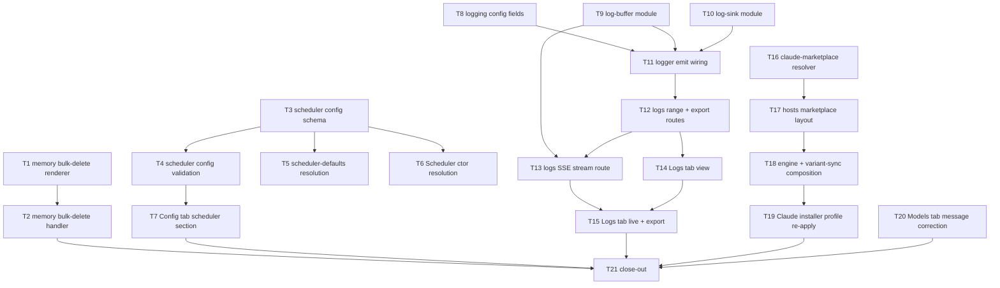

# Admin Portal Operations Suite — Tasks

**Spec**: `.specs/features/admin-portal-ops-suite/spec.md`
**Design**: `.specs/features/admin-portal-ops-suite/design.md`

Sizing: **8 Phases = 21 Tasks**. Every phase holds at most 3 Tasks.
One atomic commit per Task, after its Gate passes.

---

## Execution Plan

Phases run in order and are grouped by dependency level, not by slice: every
`Depends on` points at a **strictly earlier** phase, so the tasks inside one
phase are always mutually independent. The four vertical slices (MBD, SCH, LOG,
CPP) interleave across phases and touch disjoint files within any single phase,
except Phase 7 where both tasks edit `app.js` and run sequentially under one
owner. Only Phase 8 joins the slices.



| Phase | Focus | Tasks |
| --- | --- | --- |
| Phase 1 | Independent foundations — UI, config schema, marketplace resolver | T1, T3, T16 |
| Phase 2 | Independent foundations — log config, buffer, sink | T8, T9, T10 |
| Phase 3 | First dependents — bulk-delete handler, config validation, host layout | T2, T4, T17 |
| Phase 4 | Scheduler consumption and logger wiring | T5, T6, T11 |
| Phase 5 | Config tab section, log read routes, switch-engine composition | T7, T12, T18 |
| Phase 6 | Log stream, Logs tab view, installer re-apply | T13, T14, T19 |
| Phase 7 | Logs tab interactivity and Models tab copy | T15, T20 |
| Phase 8 | Close-out | T21 |

---

## Task Breakdown

### Phase 1 — Independent foundations — UI, config schema, marketplace resolver

#### T1: Memory tab bulk-delete control and inline confirmation form

Render a `data-action="memory-delete-project"` control plus, when
`state.memoryBulkForm` is open, an inline form carrying
`data-bulk="confirm-id"`, submit/cancel actions, and a `.form-error` line.
Gated on `writeMode && state.project`; with no project, render the literal
`Select a project to enable bulk delete.`

**Requirements**: MBD-01, MBD-02
**Depends on**: none
**Where**: `apps/web-ui/src/static/app.js`
**Tests**: `apps/web-ui/src/__tests__/app-renderers.test.ts` — four render cases (`writeMode`×`project`), the open-form case, and the error-line case
**Gate**: `cd apps/web-ui && bun test`

---

#### T3: `scheduler` config type, defaults, and merged resolution

Add `SCHEDULER_JOB_KINDS`, `SchedulerJobConfig`, `SchedulerConfig`, and the
optional `scheduler` key to `MassaAiConfig`, replacing the
"intentionally NOT a config key … Do not add it" comment with one recording the
reversal, its date, and the deciding party. Add the merged
`env > config.json > literal` resolution in the runtime config builder, wrapped
so an unreadable config yields literal defaults rather than a throw.

**Requirements**: SCH-01, SCH-02, SCH-03, SCH-06
**Depends on**: none
**Where**: `packages/shared/src/config/massa-ai-config.ts`, `packages/shared/src/config/index.ts`
**Why two files**: two halves of one resolution contract — the type and the code that fills it; splitting them leaves a commit that does not compile against its own default
**Tests**: `packages/shared/src/config/__tests__/scheduler-config.test.ts` (new) — resolution matrix per value: env-only, config-only, both (env wins), neither (literal); absent-key parity with today; unreadable-config fallback
**Gate**: `cd packages/shared && bun test`

---

#### T16: `claude-marketplace.ts` install-root resolver

`resolveClaudeMarketplaceRoot({targetHome, pluginKey})` reads
`<targetHome>/.claude/plugins/installed_plugins.json`, prefers the
`scope:"user"` record, then the most recent `lastUpdated`, and returns its
`installPath` only when that path exists on disk — otherwise `null`. Never
caches.

**Requirements**: CPP-01, CPP-02, CPP-06
**Depends on**: none
**Where**: `packages/shared/src/profile-switch/claude-marketplace.ts`
**Tests**: `packages/shared/src/profile-switch/__tests__/claude-marketplace.test.ts` (new) — valid single record; absent file; corrupt JSON; record present but path missing on disk; multi-record precedence; two calls across a moved path return two different roots
**Gate**: `cd packages/shared && bun test`

---

### Phase 2 — Independent foundations — log config, buffer, sink

#### T8: `logging` config fields for buffer and rotation

Add `bufferSize`, `maxFileSizeMb`, `maxFiles`, and `enableFileSink` (default
`true`) to the `logging` block, and make `file` resolve
`MASSA_AI_LOG_FILE > non-empty logging.file > <dataDir>/logs/massa-ai.log`.
An empty or absent `file` means "use the default path" and must **not** disable
the sink — the Logging card renders an empty input whenever the key was never
written, so an in-band `""` sentinel would let any unrelated Logging save kill
the sink permanently (pre-mortem #1).

**Requirements**: LOG-02
**Depends on**: none
**Where**: `packages/shared/src/config/massa-ai-config.ts`, `packages/shared/src/config/index.ts`
**Why two files**: same type-and-filler pairing as T3
**Tests**: `packages/shared/src/config/__tests__/` — default path derives from `dataDir`; env override wins; **an empty `file` still resolves to the default path**; `enableFileSink:false` is the only disable; the three numeric fields resolve env > file > default
**Gate**: `cd packages/shared && bun test`

---

#### T9: `log-buffer.ts` ring buffer with re-entrancy guard

New config-free module exporting the `logBuffer` singleton: capacity-bounded
FIFO, monotonic `seq`, newest-first filtered `snapshot`, `subscribe`
returning an unsubscribe, `setCapacity`, `_resetForTesting`. Subscriber
dispatch is wrapped in a swallowing `try/catch` that never logs, and a
`dispatching` flag queues nested pushes.

**Requirements**: LOG-01
**Depends on**: none
**Where**: `packages/shared/src/utils/log-buffer.ts`
**Tests**: `packages/shared/src/utils/__tests__/log-buffer.test.ts` (new) — eviction at capacity, monotonic `seq` across eviction, snapshot filters, unsubscribe stops delivery, a throwing subscriber does not break the next one, and **a subscriber that itself pushes terminates**
**Gate**: `cd packages/shared && bun test`

---

#### T10: `log-sink.ts` append and size-capped rotation

New config-free module: `appendLine` (always `O_APPEND`, never throws) and
`sinkFiles` (newest-first existing files). Creates the parent directory once per
resolved path before its first write — without it the new default path never
exists and the existing best-effort `catch {}` makes a default-on sink silently
dead (pre-mortem #2). Exposes `lastError` so a swallowed failure is reportable.
Size tracked in process, re-`stat`ed when the tracked delta exceeds 1 MB or
crosses the cap. Rotation unlinks the oldest, shifts newest-last, then renames
the live file to `.1`.

**Requirements**: LOG-07, LOG-08
**Depends on**: none
**Where**: `packages/shared/src/utils/log-sink.ts`
**Tests**: `packages/shared/src/utils/__tests__/log-sink.test.ts` (new) — **an absent parent directory is created and the line lands**; rotation at the cap; `maxFiles` never exceeded; oldest dropped; an unwritable path is swallowed and sets `lastError`; `sinkFiles` ordering
**Gate**: `cd packages/shared && bun test`

---

### Phase 3 — First dependents — bulk-delete handler, config validation, host layout

#### T2: Bulk-delete handler, typed-match guard, and wiring

`handleMemoryDeleteProject(ctx)` compares the typed value against
`ctx.state.project` and, on an exact match only, POSTs
`{projectId, clearVectors:false, clearSymbols:false, clearMemories:true}` to
`/api/v1/project/reset`. In-flight guard on `ctx.state`, never module scope.
Reads the typed value via `root.querySelector('[data-bulk="confirm-id"]')` and
bails when absent — the fake-DOM harness clicks every action button with an
empty dataset.

**Requirements**: MBD-03, MBD-04, MBD-05, MBD-06
**Depends on**: T1
**Where**: `apps/web-ui/src/static/app.js`
**Tests**: `apps/web-ui/src/__tests__/admin-handlers.test.ts` — exact request body; mismatch asserts **zero** `api.request` calls; `success:false` renders errors and claims no deletion; re-entrancy guard
**Gate**: `cd apps/web-ui && bun test`

---

#### T4: `scheduler` save validation and restart section

Validate the section in `savePartialConfig`: `tickMs >= 1000`,
`maxConcurrent >= 1`, every `intervalMs >= 60000`, and every `jobs` key a member
of `SCHEDULER_JOB_KINDS`. Add `"scheduler"` to `RESTART_SECTIONS` so both
`restartNeededSections` and `changedRestartSections` cover it.

**Requirements**: SCH-04, SCH-05, SCH-07
**Depends on**: T3
**Where**: `packages/shared/src/config/config-writer.ts`
**Tests**: `packages/shared/src/config/__tests__/` — each bound rejected with the offending path in `details`; the rejected save leaves `config.json` byte-unchanged; unknown job key named; `changedRestartSections` includes `scheduler` on a real change and excludes it on an unchanged re-save
**Gate**: `cd packages/shared && bun test`

---

#### T17: `hosts.ts` marketplace layout and host-aware `detectRoute`

Add `marketplaceRoot?: Partial<Record<Host,string>>` to
`ResolveHostLayoutOpts`; for claude it replaces the whole `$HOME`-derived root
while `projectRoot.claude` keeps precedence over it. `detectRoute` gains an
**optional trailing** `host?: Host` and proceeds for claude+marketplace, while
codex keeps a refusal whose reason names codex only. The parameter is trailing
because `detectRoute` is re-exported from `packages/shared/src/index.ts:55` and
is therefore published API — a leading host parameter would silently make every
host refuse for any out-of-tree caller (pre-mortem #3). The module still
performs no filesystem access.

**Requirements**: CPP-01, CPP-06, and the codex-refusal clause
**Depends on**: T16
**Where**: `packages/shared/src/profile-switch/hosts.ts`
**Tests**: `packages/shared/src/profile-switch/__tests__/hosts.test.ts` — marketplace layout paths; `projectRoot` beats `marketplaceRoot`; claude+marketplace proceeds; codex+marketplace refuses with a reason matching `/codex/i` and **not** `/claude/i`; absent route still refuses; **the four existing single-argument calls keep their current verdicts unchanged**
**Gate**: `cd packages/shared && bun test`

---

### Phase 4 — Scheduler consumption and logger wiring

#### T5: Per-job resolution in `registerDefaultJobs`

Widen `envBool`/`envNum` to `(key, fileValue, fallback)` and feed
`config.scheduler?.jobs?.[kind]` as the middle layer, keeping
`applySafeDefaults` in its current position (it must still run before the
literal default is read). Add the missing
`MASSA_AI_SCHEDULER_OBSERVATION_BRIDGE_INTERVAL_MS` to `turbo.json`'s
`passThroughEnv` (AD-010).

**Requirements**: SCH-02
**Depends on**: T3
**Where**: `packages/core/src/services/scheduler/scheduler-defaults.ts`, `turbo.json`
**Why two files**: the env var this task starts honoring is read by that exact source through a dynamic index accessor, which is why the literal-accessor sensor never flagged its absence from the allowlist
**Tests**: `packages/core/src/__tests__/scheduler-safe-defaults.test.ts` extension — per-kind precedence matrix, and safe-defaults preset still overridden by both config and env
**Gate**: `cd packages/core && bun scripts/run-tests-isolated.ts --unit --filter='scheduler'` and `bun test scripts/__tests__/turbo-passthrough-env.test.ts`

---

#### T6: `Scheduler` constructor resolution chain

Insert the config read as `opts.X ?? env ?? config ?? literal` for `enabled`,
`tickIntervalMs`, and `maxConcurrent`, leaving the existing `SchedulerOptions`
test seams first in precedence and unchanged.

**Requirements**: SCH-02
**Depends on**: T3
**Where**: `packages/core/src/services/scheduler/scheduler.ts`
**Tests**: `packages/core/src/__tests__/scheduler.test.ts` extension — options still beat env, env still beats config, config beats the literal, and the existing seam-based cases stay green untouched. Scratch `XDG_CONFIG_HOME` before the first core-reaching import plus `resetScheduler()` in `beforeEach`, or the module-cached singleton resolves the developer's real config (pre-mortem #7)
**Gate**: `cd packages/core && bun scripts/run-tests-isolated.ts --unit --filter='scheduler'`

---

#### T11: `Logger.emit` writes stderr, sink, and buffer

Replace the private `write(message, level)` with
`emit(level, message, meta)`: build the line in the **unchanged** format, keep
`console.error` first, append through `log-sink`, then push the structured
entry into `log-buffer`. Public `debug`/`info`/`warn`/`error`/`metric`/`child`
signatures unchanged.

**Requirements**: LOG-01, LOG-02
**Depends on**: T8, T9, T10
**Where**: `packages/shared/src/utils/logger.ts`
**Tests**: `packages/shared/src/utils/__tests__/logger.test.ts` — the emitted line is byte-identical to today's format; stderr still receives every level; the buffer receives structured `meta`; `child` context reaches the buffer; a broken sink path still logs to stderr
**Gate**: `cd packages/shared && bun test`

---

### Phase 5 — Config tab section, log read routes, switch-engine composition

#### T7: Config tab scheduler section

Add the `scheduler` entry to `CONFIG_SECTIONS`: `enabled`, `tickMs`,
`maxConcurrent`, and `jobs.<kind>.enabled` / `jobs.<kind>.intervalMs` for the
five kinds, each with a guide string.

**Requirements**: SCH-08
**Depends on**: T4
**Where**: `apps/web-ui/src/static/app.js`
**Tests**: `apps/web-ui/src/__tests__/config-forms.test.ts` — render → `collectConfigSectionFields` → `buildConfigSectionBody` reproduces the nested `jobs.<kind>.<field>` tree with correct booleans and numbers
**Gate**: `cd apps/web-ui && bun test`

---

#### T12: `GET /api/v1/logs` and `/logs/export`

New route module: range/level/substring query over the sink files newest-first
with a 64 MB scan bound and a `truncated` flag, falling back to the buffer with
`source:"buffer"` when no file is readable; export returns an explicit
`Response` with `Content-Disposition: attachment`. Validation rejects an
unparseable or inverted range and `limit > 1000` **before** any read. The
module imports no logger. Register it in the server.

**Requirements**: LOG-03, LOG-04, LOG-06, LOG-09, LOG-10, LOG-11, LOG-12
**Depends on**: T11
**Where**: `apps/tools-api/src/routes/logs.ts`, `apps/tools-api/src/index.ts`
**Why two files**: a route module that is never registered is dead code, so registration is part of the same behavior
**Tests**: `apps/tools-api/src/routes/logs.test.ts` (new) — temp-sink fixture range/level/substring; invalid range asserts **no read** through an injected reader spy; absent file serves the buffer; repeated query is stable; export asserted over **real HTTP** for `Content-Type` and `Content-Disposition`; a registered path without `x-api-key` returns 401 (not 404); buffer size unchanged across a query and an export
**Gate**: `bun test apps/tools-api/src/routes/logs.test.ts`

---

#### T18: Engine and variant-sync compose the marketplace root

One private helper resolves the claude marketplace root from the loaded install
state and is passed to `resolveHostLayout` in `listProfiles`, `switchProfile`,
and `syncGeneratedVariants`. An unresolvable root yields `installed:false` for
listing and a `failed` row naming the unresolved path for switching — never the
file-route fallback. Copy-then-record ordering is unchanged.

**Requirements**: CPP-03, CPP-04, CPP-05, CPP-06
**Depends on**: T17
**Where**: `packages/shared/src/profile-switch/engine.ts`, `packages/shared/src/profile-switch/variant-sync.ts`
**Why two files**: one helper consumed by both; adding it to only one leaves the regenerate bridge writing to a path the switch no longer reads
**Tests**: `packages/shared/src/profile-switch/__tests__/engine.test.ts` + `variant-sync` suite — synthetic marketplace tree lists its variants; switch copies into `<root>/agents` and records `modelProfile`; re-switch to the active profile still reports `switched`; unresolvable root yields `installed:false` / `failed`; the bridge writes into the cache bundle's `agent-profiles/`
**Gate**: `cd packages/shared && bun test`

---

### Phase 6 — Log stream, Logs tab view, installer re-apply

#### T13: `GET /api/v1/logs/stream` SSE tail

SSE route over `logBuffer.subscribe`, reusing the events-route discipline:
heartbeat interval, max-duration auto-close, and teardown in the
`ReadableStream` `cancel()` hook (a function returned from `start` is ignored
and would leak the subscription and both timers).

**Requirements**: LOG-05, LOG-11, LOG-12
**Depends on**: T9, T12
**Where**: `apps/tools-api/src/routes/logs.ts`
**Tests**: `apps/tools-api/src/routes/logs.test.ts` — a pushed entry reaches the stream; `cancel()` unsubscribes and clears both timers (asserted by buffer subscriber count, not by timing); missing `x-api-key` returns 401
**Gate**: `bun test apps/tools-api/src/routes/logs.test.ts`

---

#### T14: `#/logs` view, renderer, and navigation

`renderLogs(data, state)` with from/to `datetime-local` inputs, a level select,
a substring input, a Live toggle, an Export control, and the entry table;
`"logs"` added to the `viewFromHash` allow-list with its `render()` branch; the
nav link added to the served HTML.

**Requirements**: LOG-13
**Depends on**: T12
**Where**: `apps/web-ui/src/static/app.js`, `apps/web-ui/src/static/index.html`
**Why two files**: the view is unreachable without its nav entry, and the existing index suite already asserts nav/route agreement
**Tests**: `apps/web-ui/src/__tests__/app-renderers.test.ts` + `index.test.ts` — every control rendered; `source:"buffer"` shows the in-memory note; empty result shows an empty state; the nav href and the `viewFromHash` allow-list agree
**Gate**: `cd apps/web-ui && bun test`

---

#### T19: Claude installer re-applies the recorded profile after a plugin update

After the existing `claude plugin update` step succeeds, resolve the current
`installPath`, read `platforms.claude.modelProfile.profile` (read-only —
AD-015), and when that variant exists under `<installPath>/agent-profiles/`,
copy its `massa-ai-*.md` over `<installPath>/agents/`. A missing variant is a
logged no-op, never a failure.

**Requirements**: CPP-07
**Depends on**: T18
**Where**: `apps/claude-plugin/install.sh`
**Tests**: `scripts/tests/test-plugin-marketplace-cache-refresh.sh` extension — seed a recorded `modelProfile`, run the mock CLI update, assert `<installPath>/agents/*.md` match the variant rather than the bundle default; assert `modelProfile` itself is never written by the installer
**Gate**: `bash scripts/tests/test-plugin-marketplace-cache-refresh.sh`

---

### Phase 7 — Logs tab interactivity and Models tab copy

#### T15: Live tail and export handlers

`fetch` + `ReadableStream` reader parsing `data:` frames, with an
`AbortController` on `ctx.state` aborted both when Live is toggled off and when
`render()` leaves the logs view. Export fetches with the API-key header and
triggers an object-URL download. A stream failure turns Live off, banners the
error, and keeps already-rendered rows.

**Requirements**: LOG-14, LOG-15
**Depends on**: T13, T14
**Where**: `apps/web-ui/src/static/app.js`
**Tests**: `apps/web-ui/src/__tests__/admin-handlers.test.ts` — a stubbed reader appends without re-issuing the range query; navigating away aborts; a failing stream turns Live off and retains rows; export sends the `x-api-key` header; the handler is a no-op when `ctx.state.logsLive` is false, so the harness's synthetic click cannot open a stream
**Gate**: `cd apps/web-ui && bun test`

---

#### T20: Models tab no-variants message correction

Replace the `available.length === 0` copy so it no longer asserts that a
marketplace install cannot switch profiles, while still explaining the
`MASSA_AI_MODEL_PROFILE` + Save & Apply path.

**Requirements**: CPP-09
**Depends on**: none
**Where**: `apps/web-ui/src/static/app.js`
**Tests**: `apps/web-ui/src/__tests__/app-renderers.test.ts` — the branch still renders for a variant-less host, and the rendered text does **not** contain `marketplace`
**Gate**: `cd apps/web-ui && bun test`

---

### Phase 8 — Close-out

#### T21: Specs, state, registry, and changelog

Write `validation.md` placeholders consumed by the verification pass, update
`.specs/project/STATE.md` (including the new **AD-020** entry appended to the
first `## Decisions` table), `.specs/project/FEATURES.json`, `.specs/HANDOFF.md`,
and the `[Unreleased]` CHANGELOG section (`### Added` + `### Fixed` → minor
bump). Note the observed duplicate `## Decisions` heading in HANDOFF.

**Requirements**: all — delivery gate
**Depends on**: T2, T7, T15, T19, T20
**Where**: `.specs/` and `CHANGELOG.md`
**Tests**: none — documentation-only close-out; the Test Coverage Matrix records `none` for this layer
**Gate**: `bun skills/massa-ai/scripts/check_specs_delivered.ts admin-portal-ops-suite --root .`

---

## Test Coverage Matrix

| Requirement | Layer | Test file | Task |
| --- | --- | --- | --- |
| MBD-01, MBD-02 | web-ui renderer | `app-renderers.test.ts` | T1 |
| MBD-03..06 | web-ui handler | `admin-handlers.test.ts` | T2 |
| MBD-07 | tools-api route | `routes/project.test.ts` (existing, extended in T2's gate run) | T2 |
| SCH-01, SCH-02, SCH-03, SCH-06 | shared config | `config/__tests__/scheduler-config.test.ts` | T3 |
| SCH-04, SCH-05, SCH-07 | shared config-writer | `config/__tests__/` | T4 |
| SCH-02 (per-job) | core scheduler | `scheduler-safe-defaults.test.ts` | T5 |
| SCH-02 (engine) | core scheduler | `scheduler.test.ts` | T6 |
| SCH-08 | web-ui config form | `config-forms.test.ts` | T7 |
| LOG-02 | shared config | `config/__tests__/` | T8 |
| LOG-01 | shared util | `utils/__tests__/log-buffer.test.ts` | T9 |
| LOG-07, LOG-08 | shared util | `utils/__tests__/log-sink.test.ts` | T10 |
| LOG-01, LOG-02 (wiring) | shared util | `utils/__tests__/logger.test.ts` | T11 |
| LOG-03, LOG-04, LOG-06, LOG-09..12 | tools-api route | `routes/logs.test.ts` | T12 |
| LOG-05 | tools-api route | `routes/logs.test.ts` | T13 |
| LOG-13 | web-ui renderer | `app-renderers.test.ts`, `index.test.ts` | T14 |
| LOG-14, LOG-15 | web-ui handler | `admin-handlers.test.ts` | T15 |
| CPP-01, CPP-02, CPP-06 | shared profile-switch | `__tests__/claude-marketplace.test.ts` | T16 |
| CPP-01, CPP-06, codex refusal | shared profile-switch | `__tests__/hosts.test.ts` | T17 |
| CPP-03, CPP-04, CPP-05 | shared profile-switch | `__tests__/engine.test.ts`, variant-sync suite | T18 |
| CPP-07 | installer shell | `scripts/tests/test-plugin-marketplace-cache-refresh.sh` | T19 |
| CPP-09 | web-ui renderer | `app-renderers.test.ts` | T20 |
| (close-out) | none | none | T21 |

---

## Gate Check Commands

Per-task gates are named on each task. The phase-boundary and final gates:

```bash
# per-package
cd apps/web-ui        && bun test
cd packages/shared    && bun test
cd packages/core      && bun scripts/run-tests-isolated.ts --unit --filter='scheduler'
bun test apps/tools-api/src/routes/logs.test.ts
bash scripts/tests/test-plugin-marketplace-cache-refresh.sh

# final aggregate — exit codes captured, never eyeballed
bun run lint
bun run type-check
bun run test
bun run test:scripts
bun run test:plugins
bun skills/massa-ai/scripts/check_specs_delivered.ts admin-portal-ops-suite --root .
```

Every suite reaching `@massa-ai/core` config runs under a scratch
`XDG_CONFIG_HOME` (`XDG_CONFIG_HOME=$(mktemp -d) …`) — the developer's real
config enables the LLM path and turns a 690 ms test into a 42 s cold model load,
which CI never sees.
