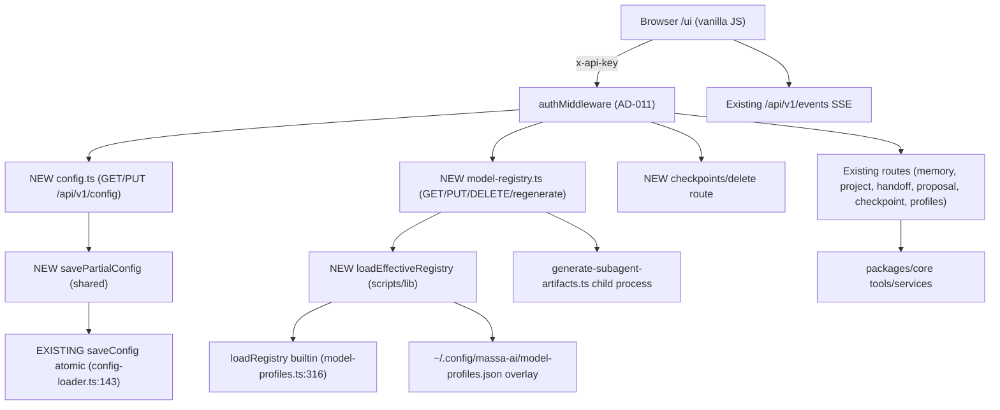

# Admin Portal Design

**Spec**: `.specs/features/admin-portal/spec.md`
**Status**: Draft

---

## Design Summary

Elevate the existing `apps/web-ui` zero-build vanilla bundle + `apps/tools-api`
Elysia routes from read-only to a full admin portal. Three backend additions
(config CRUD, checkpoint delete, model-registry overlay CRUD) and four frontend
additions (write-mode default-on refactor, create/delete forms for existing
CRUD APIs, Config view, Profiles+registry view) over the existing trust-gated
API-key-injection model. All new routes reuse the existing `authMiddleware`
(AD-011). No new dependencies; Elysia `t.*` validation only.

Key reuse discoveries that shrink the work vs the PRD:
- `saveConfig(config)` **already exists** with atomic temp+rename
  (`packages/shared/src/config/config-loader.ts:143`). Only the partial-merge +
  validate + backup layer is new.
- `deleteCheckpoint(id)` **already exists** in the checkpoint store
  (`packages/core/src/services/checkpoint/checkpoint-store-pg.ts:358`). Only a
  route + optional `DeleteCheckpointTool` wrapper are new.
- `isWriteModeEnabled()` + `renderMemoryBrowser`/`renderProposals` edit/delete
  buttons **already exist** and are gated by write-mode
  (`apps/web-ui/src/static/app.js:62`, `write-mode.test.ts:157`). The refactor
  flips the default to ON when the API-key meta tag is present; the existing
  ~60% scaffolding is consumed, not rewritten.
- `loadConfig()` already does shallow per-section merge over defaults
  (`config-loader.ts:32-46`) — the new `savePartialConfig` reuses the same
  section list.

---

## Architecture Overview



No new packages. New routes register in `apps/tools-api/src/index.ts` via
`app.use(...)` (same pattern as the 19 existing route modules). New shared
helpers land in `packages/shared/src/config/` (config writer) and
`scripts/lib/model-profiles.ts` (effective loader) — both are existing modules
extended, not new modules.

---

## Code Reuse Analysis

### Existing Components to Leverage

| Component | Location | How to Use |
| --- | --- | --- |
| `authMiddleware` | `apps/tools-api/src/middleware/auth.ts:120` | use — all new routes sit behind it (AD-011); no PUBLIC_PATHS change |
| `isPublicPath` + PUBLIC_PATHS | `middleware/auth.ts:42-53` | use — `/ui` already public; new `/api/v1/*` routes need key |
| `saveConfig(config)` atomic write | `config-loader.ts:143` | use — the new partial writer calls it after merge+validate+backup |
| `loadConfig()` shallow merge | `config-loader.ts:23` | use — pattern for the partial-merge layer |
| `MassaAiConfig` interface + defaults | `massa-ai-config.ts:4,216` | use — source of the 15 section shapes + default fallback |
| `defaultMassaAiConfig` | `massa-ai-config.ts:216` | use — GET returns this when config.json absent |
| `deleteCheckpoint(id)` | `checkpoint-store-pg.ts:358` | use — the new delete route calls it |
| `ListCheckpointsTool`/`Create`/`Restore` | `checkpoints.ts:13` | use — pattern for the new `DeleteCheckpointTool` if added |
| `loadRegistry` + `validateRegistry` + `HOST_EFFORT_ENUM` | `model-profiles.ts:316,158,71` | extend — `loadEffectiveRegistry` wraps `loadRegistry` + overlay merge |
| `selectProfile` + `resolveTier` | `model-profiles.ts:349,378` | use — unchanged by this feature |
| `profileRoutes` (list/switch) | `routes/profiles.ts:68` | use — registry editor view reuses `GET /api/v1/profiles` |
| `isTrustedWebUiCaller` + key injection | `routes/web-ui.ts:181` | use — write-mode default-on reads the injected meta tag |
| `isWriteModeEnabled` + renderMemoryBrowser/Proposals buttons | `app.js:62` | extend — flip default to ON when meta tag present |
| `markdownToHtml` + `escapeHtml` + `createApiClient` | `app.js:94,73,638` | use — new views render through the same helpers |
| `viewFromHash` allow-list | `app.js:693` | extend — add `config` + `profiles` |
| `errorHandler` | `middleware/error.ts:11` | use — unchanged |
| Test seam: `app-renderers.test.ts` | web-ui tests | extend — add renderConfigSection, renderProfiles, renderModelRegistry |
| Test seam: `write-mode.test.ts` | web-ui tests | extend — add default-ON, create/delete button, registry-editable tests |
| Test seam: `route-contract.test.ts` | web-ui tests | extend — add config/profiles/registry contract rows |
| Test seam: `web-ui-contract.test.ts` | tools-api tests | extend — add config + registry golden fixtures |
| Test seam: `profiles.test.ts` | tools-api tests | use as template for `model-registry.test.ts` |
| Test seam: `model-profiles.test.ts` | scripts tests | extend — add loadEffectiveRegistry overlay merge + fallback |

### Integration Points

| System | Integration Method |
| --- | --- |
| Existing memory/project/handoff/proposal APIs | UI calls them directly (already key-gated); no backend change |
| Existing checkpoint create/restore/list | UI calls them; new delete route added to `checkpointRoutes` |
| `generate-subagent-artifacts.ts` | regenerate route spawns it as child process with current env; must update it to call `loadEffectiveRegistry()` |
| XDG config dir | overlay + config.json both resolved via existing `configDir("massa-ai")` |

---

## Components

### Component 1 — `configRoutes` (new)

- **Purpose**: `GET /api/v1/config` (masked, +restartNeededSections) and
  `PUT /api/v1/config` (partial section, validate, backup, atomic write).
- **Location**: `apps/tools-api/src/routes/config.ts` (new file)
- **Interfaces**:
  - `GET` → `{ success: true, data: { config: MassaAiConfig, restartNeededSections: string[] } }`
    with sensitive fields masked to `"***"`
  - `PUT` body: `t.Object` with optional top-level keys matching `MassaAiConfig`
    sections. On validation failure → 400 `{ success:false, error:"validation failed", details:string[] }`.
    On success → 200 with updated masked config + `restartNeededSections`.
- **Dependencies**: `savePartialConfig` (Component 2), `loadConfig`, `defaultMassaAiConfig`
- **Reuses**: route-registration pattern from `profiles.ts:68`; error envelope from `profiles.ts:59`

### Component 2 — `savePartialConfig` (new)

- **Purpose**: merge a partial config over the current config.json, validate,
  back up, write atomically. Does not update the running in-memory singleton.
- **Location**: `packages/shared/src/config/config-writer.ts` (new file, sibling
  to `config-loader.ts`) — keeps the writer out of import-time path of
  `config-loader.ts` (lesson: `resolveApiKey()` import-time hazard).
- **Interfaces**:
  - `savePartialConfig(partial: Partial<MassaAiConfig>): { config: MassaAiConfig, restartNeededSections: string[] }`
  - `maskSensitive(config: MassaAiConfig): MassaAiConfig` — replaces
    `security.apiKey`, `llm.apiKey`, `embedding.apiKey`, `database.url` with `"***"`
  - `restartNeededSections(config): string[]` — returns the hard-coded list
    `["database","embedding","llm","security"]` filtered to keys present in the
    config (V1 hard-coded per spec Assumption).
- **Dependencies**: `loadConfig`, `saveConfig` (existing atomic writer),
  `MassaAiConfig`, `fs` (for backup copy)
- **Reuses**: `saveConfig` atomic write (config-loader.ts:143); shallow
  per-key merge pattern from `loadConfig` (config-loader.ts:32-46)
- **Validation**: runtime shape check per provided section (required fields
  present, types correct, enums valid, numeric ranges). No Zod — plain
  typeof/enum/range guards mirroring the `MassaAiConfig` interface. Returns
  `details[]` on failure (never throws on validation).
- **Masked-sentinel handling**: if a sensitive field in the PUT body equals
  `"***"`, preserve the existing loaded value (no change).

### Component 3 — checkpoint delete route (new)

- **Purpose**: `POST /api/v1/checkpoints/delete` deletes a checkpoint by ID.
- **Location**: extend `apps/tools-api/src/routes/checkpoints.ts` (existing file)
- **Interfaces**:
  - Body: `{ id: string, projectId?: string }`
  - Response: `{ success:true, data:{ ok:true } }` or
    `{ success:false, error:"not found" }` (404) / `{ success:false, error:"..." }` (500)
- **Dependencies**: `CheckpointStore.deleteCheckpoint` (existing,
  `checkpoint-store-pg.ts:358`) via a lazy singleton getter (same pattern as
  `getCreateCheckpointTool` at `checkpoints.ts:31`)
- **Reuses**: the lazy-tool getter pattern from `checkpoints.ts:24-43`. A
  `DeleteCheckpointTool` wrapper is added to `packages/core` only if the store
  is not directly reachable from the route; otherwise the route calls the
  store directly (verify during Execute — spec CHKP-05).

### Component 4 — `modelRegistryRoutes` (new)

- **Purpose**: `GET/PUT /api/v1/model-registry`, `POST .../regenerate`,
  `DELETE .../overlay`.
- **Location**: `apps/tools-api/src/routes/model-registry.ts` (new file)
- **Interfaces**:
  - `GET` → `{ success:true, data:{ registry: Registry, source:{ builtin: Registry, overlay: OverlayData|null, tombstoned: string[] }, overlayError?: string } }`
  - `PUT` body: full overlay object. Validate merged (builtin+overlay) via
    `validateRegistry()`. On failure → 400 with `details` (all violations).
    On success → atomic write to `~/.config/massa-ai/model-profiles.json`,
    return updated effective registry.
  - `POST /regenerate` → spawns `generate-subagent-artifacts.ts` child process;
    returns `{ success:true, data:{ regenerated:true } }` or
    `{ success:false, error:"..." }`.
  - `DELETE /overlay` → deletes the overlay file, returns builtin registry.
- **Dependencies**: `loadEffectiveRegistry` (Component 5), `validateRegistry`,
  `fs` (atomic write + delete), `child_process` (regenerate)
- **Reuses**: route envelope from `profiles.ts`; `validateRegistry` from
  `model-profiles.ts:158`; atomic-write pattern from `saveConfig` (temp+rename)

### Component 5 — `loadEffectiveRegistry` (new)

- **Purpose**: read builtin + overlay, merge shallowly per profile with
  tombstone semantics, validate, fall back to builtin on overlay failure.
- **Location**: extend `scripts/lib/model-profiles.ts` (existing file)
- **Interfaces**:
  - `loadEffectiveRegistry(opts?: { overlayPath?: string }): { registry: Registry, source: { builtin: Registry, overlay: OverlayData|null, tombstoned: string[] }, overlayError?: string }`
  - `OverlayData = { profiles?: Record<string, Profile|{_delete:true}>, hostDefaults?: ..., workflowTiers?: ..., tiers?: string[] }`
  - Merge: per profile key — if overlay has `_delete:true`, remove from
    effective; else overlay profile replaces entire builtin profile.
    `hostDefaults`/`workflowTiers`/`tiers` replaced wholesale if present.
- **Dependencies**: `loadRegistry` (builtin, existing), `validateRegistry`,
  XDG `configDir`, `fs`
- **Reuses**: `loadRegistry` (model-profiles.ts:316), `validateRegistry` (:158)
- **Fallback**: overlay read/parse/validation failure → return
  `{ registry: builtin, source:{ builtin, overlay:null, tombstoned:[] }, overlayError:"<msg>" }`

### Component 6 — `generate-subagent-artifacts.ts` update

- **Purpose**: switch the script's registry read from `loadRegistry` (builtin
  only) to `loadEffectiveRegistry` so regenerated variants reflect the overlay.
- **Location**: `scripts/generate-subagent-artifacts.ts` (existing)
- **Interfaces**: replace the `loadRegistry(DEFAULT_REGISTRY_PATH)` call with
  `loadEffectiveRegistry().registry`. No CLI interface change.
- **Reuses**: existing `selectProfile`/`resolveTier` flow unchanged
- **Risk**: the build gate (`--check`) still validates the builtin alone via
  `loadRegistry` — unchanged. Only the runtime generation reads the effective
  registry.

### Component 7 — `isWriteModeEnabled` refactor + nav + views

- **Purpose**: default write-mode ON when the API-key meta tag is present;
  add Config + Profiles nav items + viewFromHash entries + footer text.
- **Location**: `apps/web-ui/src/static/app.js` (existing), `index.html`
- **Interfaces**:
  - `isWriteModeEnabled()` → returns true when `massa-ai-api-key` meta tag
    present (trusted); `MASSA_AI_WEB_WRITE_MODE=false` and `localStorage`
    opt-out remain.
  - `viewFromHash` allow-list gains `config`, `profiles`.
  - New renderers: `renderConfig(data)`, `renderProfiles(data)`,
    `renderModelRegistry(data, overlaySource)`, create-form renderers.
  - Remove `FORBIDDEN_MUTATING_PATHS` export + its comment block; add an
    allow-list note (any `/api/v1/*` with the injected key).
- **Dependencies**: `createApiClient` (existing), `escapeHtml`, `markdownToHtml`
- **Reuses**: existing render pattern (`renderCheckpoints`, `renderProposals`);
  existing `createApiClient` (app.js:638)

---

## Data Models

### Config response (GET/PUT)

```typescript
// Reuses MassaAiConfig from packages/shared/src/config/massa-ai-config.ts
interface ConfigGetResponse {
  success: true;
  data: {
    config: MassaAiConfig; // sensitive fields masked to "***"
    restartNeededSections: string[]; // subset of ["database","embedding","llm","security"]
  };
}

interface ConfigPutBody {
  // optional top-level sections; only provided sections are merged
  database?: { url: string };
  embedding?: MassaAiConfig["embedding"];
  // ... 15 sections
}

interface ConfigPutResponse {
  success: true;
  data: { config: MassaAiConfig; restartNeededSections: string[] };
}
// or
{ success: false; error: "validation failed"; details: string[] } // 400
```

### Model-registry response

```typescript
// Reuses Registry, Profile from scripts/lib/model-profiles.ts
interface OverlayProfile extends Partial<Profile> {
  _delete?: true;
}
interface OverlayData {
  profiles?: Record<string, OverlayProfile>;
  hostDefaults?: Record<string, string>;
  workflowTiers?: Record<string, string>;
  tiers?: string[];
}

interface ModelRegistryGetResponse {
  success: true;
  data: {
    registry: Registry;
    source: {
      builtin: Registry;
      overlay: OverlayData | null;
      tombstoned: string[];
    };
    overlayError?: string; // present when overlay corrupted (200 status)
  };
}
```

### Checkpoint delete

```typescript
interface CheckpointDeleteBody { id: string; projectId?: string }
interface CheckpointDeleteResponse {
  success: true; data: { ok: true };
} | { success: false; error: string } // 404 not found / 500
```

---

## Error Handling Strategy

| Error Scenario | Handling | User Impact |
| --- | --- | --- |
| Config PUT invalid value | 400 + `details[]` listing each violation | Inline error per field; save blocked |
| Config GET when config.json missing | Return `defaultMassaAiConfig` + warning | Config view shows defaults |
| Config write fails (disk full / permission) | `saveConfig` throws → 500 `{ success:false, error }` | Error feedback; no partial write (atomic) |
| Overlay corrupted JSON | `loadEffectiveRegistry` returns builtin + `overlayError` | Registry view shows builtin + warning banner |
| Overlay validation failure on PUT | 400 + all violations collected | Inline errors; overlay not written |
| Regenerate child process non-zero exit | 500 `{ success:false, error: stderr snippet }` | Spinner → error message |
| Checkpoint delete non-existent ID | 404 `{ success:false, error:"not found" }` | Row already gone; user refreshes |
| Checkpoint delete store error | 500 `{ success:false, error }` | Error feedback |
| Untrusted caller (no meta tag) | `isWriteModeEnabled` false; write buttons hidden | Read-only view (existing behavior) |
| Concurrent config PUT race | Atomic temp+rename → last writer wins; no partial | No corruption; both writers see their own result after refresh |

---

## Risks & Concerns

| Concern | Location (file:line) | Impact | Mitigation |
| --- | --- | --- | --- |
| `isWriteModeEnabled` refactor breaks existing write-mode-off tests | `app.js:62`, `write-mode.test.ts:147` | Existing test "returns false by default" flips red | Update the test to reflect new default-ON-when-trusted semantics; keep env/localStorage opt-out tests; the trusted-path is tested by injecting a meta tag fixture |
| Removing `FORBIDDEN_MUTATING_PATHS` breaks any test asserting its members are never fetched | `app.js:19` (no `web-ui-readonly.test.ts` exists, only the comment block + `write-mode.test.ts`) | Low — no readonly test file exists; the comment block is the only reference | Remove the export + comment block; the `route-contract.test.ts` + `write-mode.test.ts` cover mutating calls now being intentional |
| `savePartialConfig` import-time side effect on config.json (lesson: `resolveApiKey()`) | new `config-writer.ts` | Tests initializing real `~/.config/massa-ai` | Writer module exports functions only; never reads/writes at import time; tests use a scratch XDG dir |
| Config validation does not catch every `MassaAiConfig` field (V1 hand-written guards) | new `config-writer.ts` | A bad value the guard misses is written | Guards mirror the interface field-by-field; the restart-required sections are conservative; a follow-up could generate guards from the TS interface |
| Regenerate route spawns a script that writes to host dirs (`~/.claude/...`) | `generate-subagent-artifacts.ts` | Running it from the API mutates the operator's installed agents | Confirm dialog is not required (regenerate is not destructive — it creates/overwrites variant dirs); the route is key-gated (trusted caller only); documented in the spec |
| Overlay merge is shallow — an overlay profile replaces the entire builtin profile | `model-profiles.ts` (new `loadEffectiveRegistry`) | Editing one cell in the UI requires sending the full profile object | UI reads the current overlay + builtin, applies the single-cell edit, sends the full overlay (spec Assumption: shallow merge) |
| `generate-subagent-artifacts.ts` switch to `loadEffectiveRegistry` changes build-time vs runtime semantics | `scripts/generate-subagent-artifacts.ts` | The `--check` gate still uses builtin only (correct); runtime generation now reflects overlay | Keep `--check` on `loadRegistry` (builtin); only the non-`--check` generation path switches; test the split |
| Checkpoint store `deleteCheckpoint` is synchronous-mirror, durable delete is async | `checkpoint-store-pg.ts:358,368` | A delete returns `true` from the mirror before the DB row is gone; a subsequent list might still show it briefly | Route returns `{ ok:true }` on mirror-hit; the existing list route reads the mirror too, so the view is consistent; document the async-durability note |
| Config PUT accepts a partial with a section that has the right shape but wrong semantics (e.g. a URL that is unreachable) | new `config-writer.ts` | No reachability validation in V1 (out of scope) | Spec Out-of-Scope: no config liveness check; restart-required badge is the only feedback |

---

## Tech Decisions (only non-obvious ones)

| Decision | Choice | Rationale |
| --- | --- | --- |
| `savePartialConfig` in a new `config-writer.ts`, not in `config-loader.ts` | New sibling file | `config-loader.ts` is imported at module-load time by the API + MCP + hooks; a writer function there risks import-time side effects (the `resolveApiKey()` lesson). A sibling file is imported only by the new route. |
| Config validation via hand-written guards, not a schema library | No Zod / no generated schema | Spec decision: Elysia `t.*` covers route-body shape; the section validator mirrors `MassaAiConfig` with typeof/enum/range checks. Adding Zod is a new dependency the repo does not use. |
| `loadEffectiveRegistry` lives in `scripts/lib/model-profiles.ts` (existing), not a new module | Extend existing | `loadRegistry`, `validateRegistry`, `HOST_EFFORT_ENUM` are already there; the effective loader is the same domain. The build gate (`--check`) keeps calling `loadRegistry` unchanged. |
| `generate-subagent-artifacts.ts` switches its runtime read to `loadEffectiveRegistry` but `--check` keeps `loadRegistry` | Split read path | The build gate must validate the shipped builtin alone (a broken overlay must not fail the build); runtime regeneration must reflect the operator's overlay. Two entry points, one module. |
| Checkpoint delete route calls the store directly if reachable; `DeleteCheckpointTool` only if MCP parity is needed | Verify during Execute (CHKP-05) | The store already has `deleteCheckpoint`; a tool wrapper is only needed if the MCP surface should expose delete. Minimum-change path: direct store call. |
| Write-mode default ON reads the meta tag, not a new env flag | Reuse existing trust model | `isTrustedWebUiCaller` already injects the key into the meta tag for local callers; flipping the default to ON when the tag is present needs no new env var. |
| No confirm-dialog for regenerate (only for destructive delete/reset/cancel/clear) | Regenerate is create/overwrite, not delete | Spec: confirm-and-go is for destructive ops; regenerate writes variant dirs (idempotent). |

> **Project-level decisions:** none of these set a new project-wide convention;
> they are feature-local. No new `AD-NNN` entry. The feature conforms to AD-011
> (auth always on, public paths unchanged) and AD-014 (no new credential-scrub
> surface — config PUT writes config.json, not Observations).

---

## Verification Design

| High-risk requirement | How tests prove it |
| --- | --- |
| CFG-05 validation rejects bad input | `config.test.ts`: PUT with wrong type / bad enum / out-of-range → 400 + `details` |
| CFG-06 backup + atomic write | `config.test.ts`: assert `.bak.<ts>` exists before write; assert temp file cleaned on failure |
| CFG-07 masked sentinel preserved | `config.test.ts`: PUT with `security.apiKey="***"` → GET returns the real key masked, not `"***"` |
| REG-11 overlay validation rejects violations | `model-registry.test.ts`: PUT overlay that breaks `validateRegistry` → 400 + all violations |
| REG-16 corrupted overlay fallback | `model-profiles.test.ts`: write bad JSON to overlay path → `loadEffectiveRegistry` returns builtin + `overlayError` (no throw) |
| REG-17 tombstone merge | `model-profiles.test.ts`: overlay `{profiles:{balanced:{_delete:true}}}` → effective registry lacks `balanced`; `source.tombstoned=["balanced"]` |
| UX-01 write-mode default ON when trusted | `write-mode.test.ts`: inject meta tag fixture → `isWriteModeEnabled()` true |
| UX-11 FORBIDDEN_MUTATING_PATHS removed | `write-mode.test.ts` / `app-renderers.test.ts`: assert the export is gone; mutating paths are called intentionally |
| CHKP-04 checkpoint delete | `checkpoints.test.ts`: POST `/delete` with existing ID → 200 `{ok:true}`; non-existent → 404 |

---

## Requirement Traceability (by ID)

| Requirement ID | Component | Notes |
| --- | --- | --- |
| MEM-01..04 | Component 7 (UI) | Existing memory APIs; only UI surface |
| PROJ-01..06 | Component 7 (UI) | Existing project APIs; only UI surface |
| HAND-01..04 | Component 7 (UI) | Existing handoff APIs; only UI surface |
| PROP-01..03 | Component 7 (UI) | Existing proposal APIs; only UI surface |
| CHKP-01..03 | Component 7 (UI) | Existing checkpoint APIs; only UI surface |
| CHKP-04 | Component 3 | New delete route |
| CHKP-05 | Component 3 | Store delete verified; tool wrapper conditional |
| CFG-01..10 | Components 1, 2, 7 | New config route + writer + UI |
| PROF-01..02 | Component 7 (UI) | Existing profiles API; only UI surface |
| REG-01..18 | Components 4, 5, 6, 7 | New registry routes + loader + script update + UI |
| UX-01..11 | Component 7 | write-mode refactor + nav + footer + allow-list + FORBIDDEN removal |

Coverage: 61/61 requirements mapped to components.