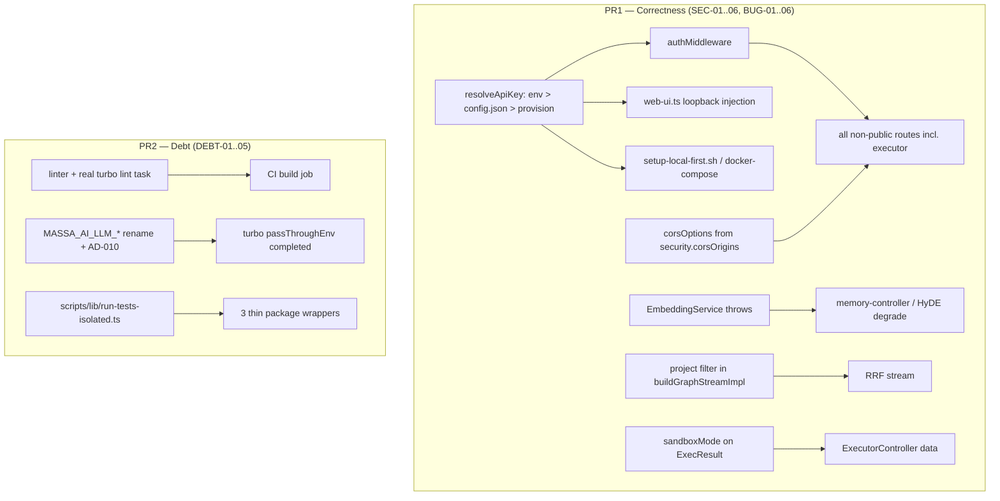

# Audit Remediation 2026-07 — Design

**Spec**: `.specs/features/audit-remediation-2026-07/spec.md`
**Status**: Draft — awaiting user approval before Tasks
**Scope**: Large. 17 requirements, 2 PRs.

---

## Active Decision Handling (mandatory)

Read from `.specs/project/STATE.md` `## Decisions` before any architectural choice.

| Active decision | Relevance | Handling |
| --- | --- | --- |
| **AD-007** — executor sandbox default is `auto`, falls back to best-effort | SEC-03 touches `sandbox.ts` | **Conform.** SEC-03 changes no default and removes no fallback. It only makes the fallback *observable* (one warn line + a `sandboxMode` field). AD-007's "best-effort" contract is preserved verbatim. |
| **AD-008** — json_schema constrained decoding, version-gated, graceful fallback | DEBT-03 edits `llm-client.ts` | **Conform.** Only the two `RLM_*` names in comments at `llm-client.ts:11,149` change. No gating logic is touched. |
| **AD-009** — D5 Cypher subset removal | none | N/A |
| AD-001..006 — native tree-sitter runtime, FQN codec, parser pool | none | N/A. No requirement touches `services/structural/**` or `prisma/migrations/**`, so the CI grammar verifier does not fire. |

### New decision requiring supersession

`AD-010` (proposed below) **supersedes a documented prior boundary**. Prior approved artifacts —
`.specs/features/repo-rename-massa-ai/design.md:46`, `.../spec.md:63,89`,
`.specs/features/project-identity-rename/spec.md:10`, and
`.specs/features/repo-rename-massa-ai-part2/spec.md:73` — explicitly recorded `RLM_LLM_*` as an
**intentional compatibility boundary excluded from the repo rename**. DEBT-03 reverses that.
Per the Decision Supersession rule, the old boundary is not silently dropped: `AD-010` is
appended to `.specs/project/STATE.md` `## Decisions` as part of PR2's first task, and its
rationale records that the exclusion was a compatibility hedge whose cost (two live prefixes,
a documented-but-false claim in `CLAUDE.md`) now exceeds its benefit, and that the user
explicitly chose a hard rename over dual-read.

---

## Current Codebase Evidence

Inspected in this session; each claim is anchored to current source, not to the knowledge graph.

| Area | Evidence |
| --- | --- |
| Auth bypass | `apps/tools-api/src/middleware/auth.ts:51` `if (!apiKey) return;`; `PUBLIC_PATHS` = `["/health","/swagger","/swagger/json"]` (`:19`) |
| Key absent by default | `MASSA_AI_API_KEY` not in `.env.example`; `scripts/setup-local-first.sh:394-405` writes a thin `.env` holding only `DATABASE_URL` |
| Executor exposure | `apps/tools-api/src/routes/executor.ts:38,72,94` — three `POST` routes; not in `ADMIN_ENDPOINTS` (`admin-preservation.ts:38-45`) |
| CORS | `apps/tools-api/src/index.ts:23` import, `:73` `.use(cors())` unconfigured |
| Bind | `apps/tools-api/src/index.ts:148` `app.listen(PORT)`, `PORT` from `MASSA_AI_API_PORT` (`:58`) |
| Swagger already declares the scheme | `index.ts:107-116` — `ApiKeyAuth` / `x-api-key`, referencing `MASSA_AI_API_KEY` |
| Two config objects | `MassaAiConfig` (persisted, `packages/shared/src/config/massa-ai-config.ts:4-131`) has **no** `security` section; `ServerConfig` (runtime, `config/index.ts:34-233`) **already has** `security` at `:215-222` with no `apiKey` field |
| Persist path is not atomic | `config-loader.ts:122-128` — bare `fs.writeFileSync` over the live path |
| Partial-config merge | `config-loader.ts:22-49` shallow-merges each known sub-object explicitly; a new section needs its own merge line or it is dropped |
| Env seeding | `packages/shared/src/env.ts:49-74` seeds exactly three vars from config.json, env always winning |
| Random vectors | `embedding-service.ts:76-83`, `:107-114` |
| Real embed callers | `memory-service.ts:59-61` (via `memory-controller.ts:145/223/289`, caught in `store_memory.ts:98-118`, `update_memory.ts:75/85`); `query-understanding.ts:141` HyDE (caught twice: `:144-149`, `rlm-search.ts:185-198`), gated off by default (`config/index.ts:520-524`) |
| Dead field | `relation-extractor.ts:105` constructs `EmbeddingService`; no `.embed*()` call exists in the file — it reads `memory.embedding` (`:134-151`) |
| Tests pinning the fallback | `packages/core/src/__tests__/embedding-service.test.ts:66,76,132` — the only three |
| Graph scoping | `prisma/schema.prisma:335-354` — `memory_edges` has no `project_id`; `graph-store-pg.ts:167-190` `findEdges` has no project predicate; `rlm-synapse.ts:213-230` checks only `deleted_at` |
| Sandbox | `sandbox.ts:94-97` auto→`"none"`; `executor.ts:453` computes `sandboxMode` locally in `#spawn()` and discards it; `ExecResult` (`executor.ts:44-56`) has no such field |
| Executor result passthrough | `executor-controller.ts:99-136,139-181,191-262` builds `data:{…}`; `routes/executor.ts:36-38,73-75,86-88` and `embedded-api-client.ts:483-489` both return it unchanged |
| `RLM_` surface | 136 occurrences / 34 tracked files. Functional reads all in `packages/shared/src/config/index.ts:555-583,720` + `env.ts:63-64`. `turbo.json:39-42` lists only 4 of 10. `install.sh:389-396` and `setup-local-first.sh:178,201` also write them |
| config.json keys are prefix-free | `massa-ai-config.ts:15,72-79` — `enabled`/`baseUrl`/`apiKey`/`model`/… ⇒ **no config-file migration needed** |
| Runners | `packages/core/scripts/run-tests-isolated.ts` (236), `apps/tools-api/…` (124), `apps/mcp-client/…` (141). Scaffolding (`findTestFiles`, signal forwarding, `runGroup`, reporting) is the same shape in all three; only the `isolationReason` predicate and core's `--unit/--e2e/--filter` flags differ |
| `packages/shared` is published | `files: ["dist"]`, `exports` limited to `.`/`types`/`utils`/`config`; no precedent for dev-only tooling |
| No linter | No config file, no dependency, in any package. `turbo.json:47` is literally `"lint": {}`. No CI workflow mentions lint |

### Documentation divergences found (reported, not silently patched)

| Doc claim | Current source | Handling |
| --- | --- | --- |
| `CLAUDE.md:199-202` — "11 call sites … 8 NL-judgment + 3 code-oriented" | 10 call sites: 3 `modelRole:"code"` + 7 default-instruct | Corrected in the DEBT-03 task that rewrites those lines anyway |
| `CLAUDE.md:159` — env prefix is `MASSA_AI_*` | 10 live `RLM_LLM_*` vars | Resolved by DEBT-03; the line needs rewording, not substitution |
| `turbo.json:39-42` passes 4 of the 10 LLM vars | 6 vars arrive `undefined` under `bun run test` | Pre-existing gap folded into DEBT-03 — renaming without fixing it would preserve a silent bug under a new name |

---

## Architecture Overview

Two independent delivery slices over one shared spec.



---

## Approach Exploration (Large/Complex — required)

### A. Where the API key lives and how it is provisioned (SEC-01)

All three approaches deliver the same scoped thing: no anonymous request is ever served, and an
existing install keeps working.

| | **A1 — `security.apiKey` in `MassaAiConfig` (recommended)** | A2 — separate `~/.config/massa-ai/api-key` file | A3 — env-only, generated into `.env` by the installer |
| --- | --- | --- | --- |
| Storage | New `security` section in `MassaAiConfig`; `ServerConfig.security.apiKey` reads it | Standalone 0600 file | `.env` line written by `setup-local-first.sh` / `install.sh` |
| Precedence | Follows the documented `env > config.json > default` chain for free | New, undocumented chain | env only — no runtime provisioning |
| Existing installs | Auto-provisioned on first start | Auto-provisioned on first start | **Break** — installers already ran; nothing rewrites `.env` |
| New code | `security` section + merge line (`config-loader.ts:34-43`), atomic-write helper, `env.ts` seed line | All of that plus a bespoke file reader/writer and permission handling | Installer edits only |
| Fits precedent | Yes — `llm.apiKey` and `embedding.apiKey` already live in config.json and are seeded by `env.ts:63-74` | No | Partly |

**Recommendation: A1.** It reuses the exact pattern already established for the two other
secrets in this repo, inherits the documented precedence chain, and is the only option of the
three that keeps an already-installed user working without them re-running an installer. A3 is
rejected because it cannot satisfy AS-01. A2 is rejected as a second secret store.

**A1 requires one non-obvious fix:** `saveConfig` (`config-loader.ts:122-128`) is a bare
`writeFileSync`. Two processes starting concurrently with no key would race and could interleave
a partial file. The design adds a temp-file + `fs.renameSync` atomic write and, after writing,
re-reads the file and adopts whichever key won. This is what makes the spec's concurrent-start
edge case satisfiable.

### B. Home for the shared test runner (DEBT-04)

| | **B1 — `scripts/lib/run-tests-isolated.ts` (recommended)** | B2 — new subpath export from `packages/shared` | B3 — leave three copies, add a drift test |
| --- | --- | --- | --- |
| Publishing impact | None — `scripts/` is not in any package's `files` | Ships dev tooling to every npm consumer, or needs a non-exported path (a new pattern) | None |
| Precedent | `scripts/lib/opencode-config.cjs` is already a shared lib consumed by a generator | None | None |
| Per-package specificity | Wrapper passes its own `isolationReason` predicate + flags | Same | N/A |
| Removes the divergence | Yes | Yes | No — only detects it |

**Recommendation: B1.** `packages/shared` is a published package (`files: ["dist"]`) with no
precedent for dev-only tooling; adding one is a new pattern with a real downstream cost.
`scripts/lib/` already exists for exactly this purpose. Each package keeps a ~15-line wrapper
supplying its own isolation predicate; core additionally supplies its `--unit/--e2e/--filter`
flag set and its forced-last e2e ordering.

### C. Linter selection (DEBT-01)

| | **C1 — oxlint (recommended)** | C2 — Biome | C3 — ESLint + typescript-eslint |
| --- | --- | --- | --- |
| Config needed | Zero-config start, `.oxlintrc.json` to narrow | `biome.json` | Flat config + parser + plugin wiring |
| Speed on 2101 files | Sub-second | Fast | Slowest; needs type-aware setup for real value |
| Formatting | Lint only — **no formatter**, so no mass reformat commit | Bundles a formatter; enabling it rewrites the tree | Separate (Prettier) |
| Risk of a huge first diff | Lowest | High if the formatter is on | Medium |

**Chosen: C1 (oxlint), correctness rules only, no formatter in this feature. CONFIRMED by user.**
The spec's AC-2 requires the initial rule set to pass on the current tree with no mass reformat.
A formatter-bundling tool makes that hard to honor; a mass reformat would also destroy `git blame`
across a 2101-file repo and collide with the deferred layering/god-module refactors.

> **User direction:** a repo-wide reformat *is* wanted, but as a **separate PR of its own**. It is
> therefore recorded as a tracked follow-up, not as scope creep here. Landing it after this feature
> also means the formatter runs over already-corrected code rather than churning it twice.

### Approach decisions — status

| Choice | Status |
| --- | --- |
| A1 — `security.apiKey` in `MassaAiConfig`, auto-provisioned, atomic write | Chosen on repo precedent (`llm.apiKey` / `embedding.apiKey` + `env.ts:63-74` seeding) |
| B1 — `scripts/lib/run-tests-isolated.ts` + three thin wrappers | Chosen on repo precedent (`scripts/lib/opencode-config.cjs`); `packages/shared` is published and cannot host dev tooling without a new pattern |
| C1 — oxlint, correctness only, no formatter | **CONFIRMED by user**; repo-wide format deferred to its own PR |
| BUG-02 read-side filter only, no schema migration | **CONFIRMED by user** |

---

## Components

### `resolveApiKey` (new)

- **Purpose**: single source for the runtime API key; provisions one when absent.
- **Location**: `packages/shared/src/config/api-key.ts`
- **Interface**: `resolveApiKey(): { key: string; provisioned: boolean; source: "env" | "config" | "generated" }`
- **Behavior**: return `process.env.MASSA_AI_API_KEY` when set (`source: "env"`); else
  `loadConfig().security?.apiKey` when set; else generate 32 bytes via `crypto.randomBytes`,
  hex-encode, persist through the atomic `saveConfig`, re-read to adopt a concurrent winner, and
  return `provisioned: true`. Throws when generation is needed and the config dir is unwritable.
- **Dependencies**: `config-loader.ts`, `node:crypto`
- **Reuses**: the existing `llm.apiKey` / `embedding.apiKey` storage and seeding pattern.

### `authMiddleware` (modified)

- **Location**: `apps/tools-api/src/middleware/auth.ts`
- **Change**: replace the `if (!apiKey) return;` bypass at `:51` with a key resolved from
  `resolveApiKey()` **inside an explicit `initAuth()` called only from `index.ts`** — *not* at
  module-import time. `auth.test.ts` imports this module directly, so an import-time resolve
  would generate and persist a key into the real `~/.config/massa-ai/` of every developer and CI
  runner as a side effect of `bun test`.
- **`PUBLIC_PATHS` change (REVISED — Plan Challenge finding 1)**: `/ui` **is added**.
  `authMiddleware` is registered at `index.ts:121`, `webUiRoutes` at `:140`, and the guard is
  `PUBLIC_PATHS.some(p => path.startsWith(p))` (`auth.ts:46`). Without this, `GET /ui` returns 401
  before `web-ui.ts` executes and the entire SEC-05 injection mechanism is dead code. Serving the
  static shell publicly is safe — it carries no project data; every `/api/v1/*` call the dashboard
  makes still requires the key. Because the match is `startsWith`, the entry is written as the two
  explicit prefixes `/ui` and `/ui/` and a test asserts a decoy path like `/uixyz` is **not**
  exempted.
- **Reuses**: the existing 401 envelope shape and `deriveActor`.

### `corsOptions` (new, small)

- **Location**: `apps/tools-api/src/index.ts` (inline) reading `ServerConfig.security.corsOrigins`
- **Behavior**: default `[]` ⇒ pass `{ origin: false, credentials: false }` to `cors()`. When
  populated, pass the explicit array. Startup rejects the combination `origin: "*"` with
  `credentials: true`.

### `web-ui.ts` (modified)

- **Location**: `apps/tools-api/src/routes/web-ui.ts`
- **Change**: when serving `index.html`, if the socket's remote address is loopback, inject
  `<meta name="massa-ai-api-key" content="…">`; otherwise inject nothing and add a
  configure-access banner element. `apps/web-ui/src/static/app.js:625` `request()` reads the meta
  tag and sets `x-api-key` when present.
- **Mechanism is UNVERIFIED — spike required first (REVISED — Plan Challenge finding 1b)**. This
  app is built with `adapter: node()` (`index.ts:72`). Elysia's documented `server.requestIP()`
  throws `"This adapter doesn't support Bun requestIP method"` under `@elysiajs/node`. An
  undocumented `srvx` `NodeRequest.ip` getter (`req.socket?.remoteAddress`) may survive into
  `Context.request`, but nothing in this repo uses it. **TASK-000 spikes this against a real booted
  server before T6 commits to the design.**
- **Fallback if the spike fails**: gate injection on an explicit
  `MASSA_AI_WEB_UI_TRUST_LOCAL` flag (default `true`, and set to `false` in the Docker image)
  instead of a remote-address test. This keeps SEC-05 implementable either way and is strictly
  more honest than a loopback check the stack cannot actually perform.
- **Known limitations (documented)**: (a) a reverse proxy terminating on loopback appears local;
  (b) **the Docker path may fail in the opposite direction** — `docker-compose.yml:66-71` maps
  `3333:3333`, and a host browser reaching the container through the userland proxy may present a
  bridge address rather than loopback, denying the key to the one deployment SEC-06 promises to
  support. Both are covered by explicit tests, not assumptions.

### `EmbeddingService` (modified)

- **Location**: `packages/core/src/services/embeddings/embedding-service.ts`
- **Change**: both `!this.provider` branches throw unconditionally. The `NODE_ENV` check and both
  `Math.random()` expressions are deleted. `getDimensions()`'s 384 fallback is removed with them.
- **Companion**: delete the unused `embeddingService` field at `relation-extractor.ts:105`.
- **Test impact**: `embedding-service.test.ts:66,76,132` are rewritten to assert the throw — the
  three tests that currently pin the defect.

### `buildGraphStreamImpl` (modified)

- **Location**: `packages/core/src/services/search/rlm-synapse.ts:213-230`
- **Change**: add `if (row.project_id !== projectId) continue;` beside the existing `deleted_at`
  check. Chosen over adding a `project_id` column to `memory_edges` because that is a schema
  migration (a 25th) for a latent, currently-unexploitable defect; the read-side guard closes it
  with one line and no migration. Recorded as a deliberate narrowing.

### `ExecResult.sandboxMode` (modified)

- **Location**: `packages/core/src/services/executor/executor.ts:44-56` (interface) and `:453` (`#spawn`)
- **Change**: add `sandboxMode: SandboxMode` to the interface; set it in all three `#spawn`
  resolution branches (`:484-492`, `:524-531`, `:540-547`); copy it into the `data:{…}` literals
  in `executor-controller.ts:117-125` and `:162-169`, plus each `results[]` item in
  `batchExecute`. Both transports are passthrough, so this single change reaches REST and MCP.
- **Startup warning**: `sandbox.ts` emits one process-lifetime warn when `auto` resolves to `none`.

---

## Data Models

```typescript
// packages/shared/src/config/massa-ai-config.ts — new section on MassaAiConfig
interface MassaAiSecurityConfig {
  /** Runtime API key for the Tools API. Auto-provisioned on first start when absent. */
  apiKey?: string
  /** Exact allowed browser origins. Empty = no cross-origin request is permitted. */
  corsOrigins?: string[]
}
```

`ServerConfig.security` (`config/index.ts:215-222`) gains the same two fields, read via the
existing `envString` / list-parsing helpers so `MASSA_AI_API_KEY` and a new
`MASSA_AI_API_CORS_ORIGINS` keep env precedence. `loadConfig()` (`config-loader.ts:34-43`) gains a
`security` merge line — without it a user's partial `config.json` silently drops the section.
`env.ts:49-74` gains a fourth seed: `cfg.security.apiKey → MASSA_AI_API_KEY`.

**No Prisma migration.** No requirement changes the database schema.

---

## Error Handling Strategy

| Scenario | Handling | User impact |
| --- | --- | --- |
| No key, config writable | Generate, persist atomically, warn once with the path (never the value) | API starts; key discoverable in `config.json` |
| No key, config unwritable | Exit non-zero before `listen` | Clear startup failure with the path that could not be written |
| Concurrent first starts | Atomic rename + re-read; loser adopts the winner's key | Both processes agree on one key |
| Request without a valid key | 401 through the existing envelope | Unchanged shape, now actually enforced |
| Origin not in allowlist | No matching `Access-Control-Allow-Origin` emitted | Browser blocks; server never processes it as trusted |
| `corsOrigins` contains `*` | Startup rejects the config | Fails fast rather than serving an unsafe combination |
| No embedding provider | `embed()` throws → `store_memory`/`update_memory` return `{success:false}`; HyDE degrades via the existing `QUERY_UNDERSTANDING_UNAVAILABLE` signal | An explicit failure instead of silently poisoned results |
| Cross-project graph neighbor | Skipped; other RRF streams still returned | Results are project-correct, never empty because of the filter alone |
| `auto` sandbox with no tool | One warn line; `sandboxMode: "none"` in every response | Visible, per AD-007's preserved fallback |

---

## Risks & Concerns

| Concern | Location | Impact | Mitigation |
| --- | --- | --- | --- |
| `saveConfig` is not atomic | `config-loader.ts:122-128` | Concurrent provisioning can interleave a partial config.json | Temp-file + `renameSync` + re-read, delivered as part of SEC-01 rather than assumed |
| Partial user `config.json` drops unknown sections | `config-loader.ts:22-49` | A new `security` section vanishes on next save | Explicit merge line + a test with a partial config |
| Loopback check is spoofable behind a proxy | new code in `web-ui.ts` | A proxy terminating on loopback receives the key in the page | Documented limitation + guidance to set the key explicitly; non-loopback path ships no key |
| `turbo.json` passes only 4 of 10 LLM vars | `turbo.json:39-42` | 6 vars are `undefined` under `bun run test` but defined under bare `bun test` | DEBT-03 completes the list while renaming; renaming alone would carry the bug forward |
| `install.sh` is a second `.env` writer | `install.sh:389-396` | A missed writer leaves stale `RLM_*` in fresh installs | Both writers are in DEBT-03's task; a repo-wide `rg 'RLM_'` is the AC |
| Hard rename silently disables LLM features | AS-04 | Existing installs lose LLM features until they edit config | CHANGELOG `### Changed` entry states it explicitly; AD-010 records the supersession |
| Three tests currently pin the random-vector defect | `embedding-service.test.ts:66,76,132` | Deleting the defect turns them red | They are rewritten in the same task, not deleted — the new assertions are the discriminating tests |
| BUG-02 read-side guard leaves `memory_edges` unscoped | `schema.prisma:335` | A future writer can still create a cross-project edge | Deliberate: the read guard closes the leak. A `project_id` column is logged as a follow-up, not a 25th migration for a latent defect |
| PR1 tests need a real HTTP response | SEC-01/02/05 | In-process handler calls miss the documented Elysia content-type/header behavior | ACs mandate assertions against a booted server, matching `web-ui-serve.test.ts`'s existing pattern |
| CI runs with `MASSA_AI_EXECUTOR_SANDBOX=none` | `.github/workflows/ci.yml` | SEC-03's warn line fires in CI | Warning is emitted only for `auto`→`none`, not explicit `none` |

---

## Tech Decisions

| Decision | Choice | Rationale |
| --- | --- | --- |
| Key storage | `security.apiKey` in `MassaAiConfig` + existing `ServerConfig.security` | Reuses the `llm.apiKey` precedent and the documented precedence chain |
| Key generation | 32 random bytes, hex | No dependency; `node:crypto` is already available |
| Bind address | Unchanged `0.0.0.0` | AS-05 (user). Exposure is closed by auth, not by address |
| `/health` stays public | Yes | Docker healthcheck depends on it; it returns no project data |
| BUG-02 fix site | Read-side filter, not a schema migration | Latent defect; one line beats a 25th migration |
| Linter | oxlint, correctness rules, no formatter | Satisfies "no mass reformat"; preserves `git blame` before the deferred refactors |
| Runner home | `scripts/lib/` | `packages/shared` is published; `scripts/lib/opencode-config.cjs` is the precedent |
| Coverage | Drop global `coverage = true`; add `bun run test:coverage` with a threshold | Removes cost from every run; makes the gate explicit |

> **Project-level decisions to append to `.specs/project/STATE.md` `## Decisions`:**
> - `AD-010` — one env prefix. `MASSA_AI_LLM_*` replaces `RLM_LLM_*` with no dual-read.
>   **Supersedes** the `RLM_LLM_*` compatibility-boundary exclusion recorded in
>   `repo-rename-massa-ai` and `project-identity-rename`; those entries are marked
>   `superseded by AD-010`.
> - `AD-011` — the Tools API never serves an anonymous request. A key is always present, by env,
>   by config, or by first-start provisioning.

---

## Verification Design

| Requirement | Proof |
| --- | --- |
| SEC-01 | Booted-server test: no key configured → key appears in a temp config dir + exactly one warn line; `POST /api/v1/executor/execute` with no header → 401; with the header → 200. Unwritable-config test asserts non-zero exit before bind |
| SEC-02 | Booted-server test asserting absent `Access-Control-Allow-Origin` for a foreign `Origin`; unit test rejecting `*` + credentials |
| SEC-03 | Unit test forcing `auto`→`none` asserts one warn and `sandboxMode: "none"` present in the REST body **and** the embedded MCP response |
| SEC-04 | Parameterised test over every `ADMIN_ENDPOINTS` entry asserting 401 without a key |
| SEC-05 | Two booted-server requests to `/ui` — loopback carries the meta tag, a spoofed non-loopback remote does not |
| SEC-06 | Shell test for `setup-local-first.sh` asserting a key lands in config; compose smoke reusing the existing CI Docker health job |
| BUG-01 | Rewritten `embedding-service.test.ts` asserting throw in both branches; `rg 'Math.random' services/embeddings/` returns nothing |
| BUG-02 | PG integration test: two projects, one cross-project `memory_edges` row, search A, assert B's content absent. Observed red first |
| BUG-03 | Test forcing `graph_generation_stale_active:*` once, asserting no heartbeat call after the outer run completes (fake timers) |
| BUG-04 | Unit test on `resolveEdgeTarget` with a namespace import plus a colliding project-wide `parse` symbol |
| BUG-05 | Test asserting `getCentrality` receives the canonical id when a retired alias is passed |
| BUG-06 | Test inserting with a retired project id then reading by canonical id in the same tick |
| DEBT-01 | Seeded violation file makes `bun run lint` exit non-zero; removed, it exits 0 |
| DEBT-02 | `bunfig.toml` has no `coverage = true`; `bun run test:coverage` fails below threshold |
| DEBT-03 | `rg 'RLM_'` excluding `CHANGELOG.md` and `.specs/archive/**` returns nothing; a `MASSA_AI_LLM_ENABLED=true` test activates the call sites; `turbo.json` lists all 10 |
| DEBT-04 | One implementation file; three wrappers; each package's suite runs green through it; a test asserts the three wrappers resolve the same module |
| DEBT-05 | `bunfig.toml` header assertion; the two root scripts no longer resolve at `packages/core/*.ts` |

Gates: `bun run type-check`, `bun run build`, `bun run test`, `bun run test:scripts`,
`bun run test:plugins`. Independent `massa-ai-verification-agent` closes each PR.

---

## Plan Challenge — Red Team (full gate)

Mode `red_team`, dispatched to `massa-ai-plan-critic`. Domain is Security, so adversarial framing
is the guide's primary mapping. Four findings; all verified against source by the main agent
before acceptance. Policy `serious_findings: revise_plan` — the two criticals block Execute.

| # | Severity | Finding | Verified | Resolution |
| --- | --- | --- | --- | --- |
| 1a | **critical** | `/ui` 401s after SEC-01, killing SEC-05 entirely. `authMiddleware` at `index.ts:121` precedes `webUiRoutes` at `:140`; `PUBLIC_PATHS.some(p => path.startsWith(p))` (`auth.ts:46`) lacks `/ui` | ✅ confirmed | `/ui` + `/ui/` added to `PUBLIC_PATHS` as a **named** SEC-05 done-when, plus a decoy-path test |
| 1b | **critical** | The loopback mechanism has no supported implementation on `@elysiajs/node` — `server.requestIP()` throws there | ✅ confirmed (adapter is `node()` at `index.ts:72`) | **TASK-000 spike** added before any SEC-05 work, with a documented `MASSA_AI_WEB_UI_TRUST_LOCAL` fallback |
| 2 | **critical** | `apps/claude-plugin/hooks/massa-ai-hook.ts:152` reads `process.env.MASSA_AI_API_KEY` only, never imports `@massa-ai/shared`, and silently degrades. An auto-provisioned key never reaches it ⇒ lifecycle capture dies invisibly | ✅ confirmed | **TASK-023** added; the hook binary is a public compatibility surface, so `CONTRIBUTING.md`'s 7-step managed-harness protocol applies and the Codex/Cursor generated copies must be regenerated |
| 3 | high (partly speculative) | The Docker path may fail the loopback check in the *opposite* direction from the documented risk | ✅ mechanism plausible; empirically unverified | Explicit Docker-path assertion added to TASK-007; recorded as a known limitation |
| 4 | medium/high | `CONFIG_DIR` is a module-level const (`config-loader.ts:7`); an import-time resolve pollutes the real `~/.config`. `auth.test.ts:24-34` asserts the exact bypass SEC-01 deletes and was unscheduled | ✅ confirmed | `initAuth()` made explicit (not import-time); T1/T2 require `XDG_CONFIG_HOME` set **before import**; T3 names `auth.test.ts` for rewrite |

Rejected as not-a-gap: **CORS-as-theatre**. The critic checked and agreed the plan treats CORS as a
secondary browser-only layer over the mandatory key and never overclaims it in an AC.

### New component — hook key propagation (TASK-023)

- **Purpose**: the shipped lifecycle hook binary must still reach `/api/v1/hook` after SEC-01.
- **Location**: `apps/claude-plugin/hooks/massa-ai-hook.ts` (the real file) + the generated
  `apps/{codex,cursor}-plugin/hooks/massa-ai-hook` copies.
- **Constraint**: the hook deliberately imports only `child_process`/`fs`/`path` — pulling in
  `@massa-ai/shared` would change its dependency surface and its startup cost. The design therefore
  reads `~/.config/massa-ai/config.json` **directly** with `fs` and falls back to
  `process.env.MASSA_AI_API_KEY` first, mirroring the documented `env > config.json` precedence
  without importing the package.
- **Regeneration**: `scripts/generate-subagent-artifacts.ts` must be re-run and
  `scripts/__tests__/subagent-parity.test.ts` re-run — the Codex/Cursor copies are real files, not
  symlinks.
- **Discriminating test**: a capture-server test proving the hook POSTs with a valid `x-api-key` on
  a fresh auto-provisioned install. This also closes lesson **L-002** (hook tests assert exit 0
  only, never the POST body/endpoint) — the first time that candidate lesson has been actionable.

## Done Criteria

An implementer can execute PR1 and PR2 without inventing a contract decision. Every requirement
has a named proof. AD-007 and AD-008 are conformed to; AD-010 and AD-011 are appended with their
supersession recorded.
</content>
