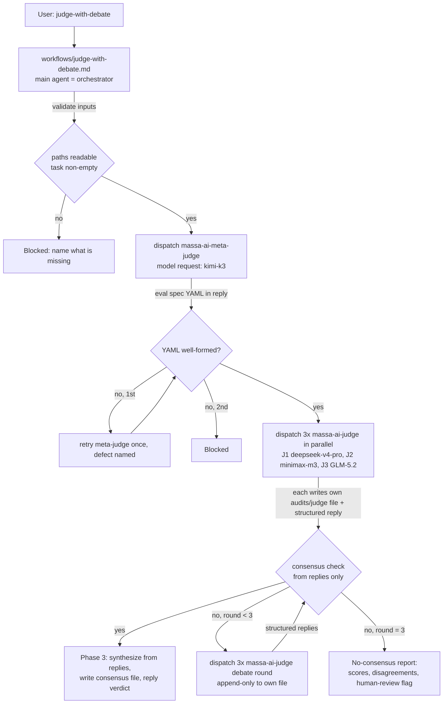

# Judge With Debate Design

**Spec**: `.specs/features/judge-with-debate/spec.md`
**Status**: Draft (awaiting user confirmation)

---

## Architecture Overview

Approach A (user-confirmed): workflow-orchestrated debate. One workflow file carries the full
orchestration; two charters carry behavior contracts; judges communicate peer-to-peer through the
filesystem only; the orchestrator receives compact structured replies and never opens judge files.



**Channel discipline (A3):** orchestrator → judges: capability packet + verbatim eval YAML.
Judges → orchestrator: structured reply block only. Judges ↔ judges: report files on disk.
The orchestrator never opens `audits/judge/*.md`.

## Code Reuse Analysis

| Component | Location | How to Use |
| --- | --- | --- |
| Charter template | `skills/agents/plan-critic/SKILL.md` | Section shape, persona-boundary lines (verbatim, gate-enforced), `metadata.model_hint` + `permission`, Model Hint section pattern |
| Add-an-agent recipe | `skills/AGENTS.md` → *How to Add an Agent* | 5-step registration, enforced by parity + integrity gates |
| Dispatch contract | `references/agent-orchestration.md` | Capability packet, output contract, Name Resolution fallback, feedback labels |
| Report conventions | `references/audit-report-io.md` | Path shape, collision suffix, freshness metadata, Verification/Test Fidelity Checklist |
| Feedback policy | `skills/AGENTS.md` bootstrap block | `Agent Started/Running/Done/Blocked` labels per phase |
| Base protocol | NeoLabHQ SKILL.md @ `555b952` | Phase structure, consensus thresholds, documented pitfalls (context only — repo contracts win) |

## Components

### 1. `skills/agents/meta-judge/SKILL.md`

- **Purpose**: Generate a tailored evaluation specification YAML (criteria, weights, rubrics, checklists, scoring scale) for one evaluation task. Runs exactly once per evaluation.
- **Charter shape**: follows plan-critic template. `metadata.permission: read-only`, `metadata.model_hint: kimi-k3`.
- **Inputs**: task description, artifact type, context, artifact paths (never content).
- **Outputs**: evaluation specification YAML only (no prose), plus standard Status/Evidence/Risks/Next-step wrapper. YAML is the artifact; it is passed verbatim to all judges all rounds.
- **Restrictions**: never score the artifact itself; never modify YAML after emission; persona-boundary lines verbatim; never open routers/personas.
- **Model Hint section**: `kimi-k3` (advisory) — fallback to workflow default if unavailable.

### 2. `skills/agents/judge/SKILL.md`

- **Purpose**: Score one artifact against the meta-judge's evaluation specification with quoted evidence, then defend/revise scores across debate rounds.
- **Charter shape**: same template. `metadata.permission: read-only` (report-file write is granted per-dispatch by the workflow, disjoint per judge-N file — same pattern as `documentation-agent`'s scoped doc-write).
- **Inputs**: eval spec YAML (verbatim), task description, artifact paths, own report path, peer report paths (debate rounds only), round number.
- **Outputs**: (a) own report file — per-criterion scores with quoted evidence, weighted overall, strengths/weaknesses; appended `## Debate Round {R}` sections per round; (b) structured reply block (schema below).
- **Restrictions**: append-only after first write; revisions require quoted evidence (anti-sycophancy); never create a fresh file in debate rounds; never read/relay main-context conversation; persona-boundary lines verbatim.
- **Model Hint section (body prose)**: per-slot diversity is assigned by the workflow at dispatch (J1 `deepseek-v4-pro`, J2 `minimax-m3`, J3 `GLM-5.2`); charter default when the host cannot honor dispatch-time selection.
- **`metadata.model_hint` is a single token: `deepseek-v4-pro`** (J1 slot = charter default). Plan Challenge C2: the generator's Cursor emitter writes `metadata.model_hint` verbatim into `model:` and the parity test asserts `fm.model === CHARTER_MODEL_HINTS[name]` — a multi-slot descriptive string would break the Cursor artifact and force a parity special case. Per-slot diversity text lives in the body, never in frontmatter. Same rule for `meta-judge`: `metadata.model_hint: kimi-k3` (single token).

### 3. `skills/massa-ai/workflows/judge-with-debate.md`

- **Purpose**: Orchestrate the full protocol. Loaded only on explicit invocation (router row, precedence tier 1 — explicit route).
- **Content**: input validation; host capability probe (JD-08 AC-4: check dispatch-time model-selection support on every invocation — reactivation is automatic, never a standing state); meta-judge dispatch + two-stage YAML validation/retry (below); Phase 1 parallel dispatches with per-slot model requests; consensus arithmetic (stepwise: extract overalls → max-min ≤ 0.5; per-criterion max-min ≤ 1.0; all explicit accepts); debate-round loop ≤ 3; Phase 3 synthesis from replies; no-consensus path; report naming + collision suffix; feedback lines per phase; Name Resolution fallback per `agent-orchestration.md` (local run against same output contract, marked in consensus file; `Blocked` when a full marked panel still cannot complete).
- **Model requests in dispatch text**: meta `kimi-k3`; J1 `deepseek-v4-pro`; J2 `minimax-m3`; J3 `GLM-5.2`. Honest degradation rule: when the host has no dispatch-time model selection (**all four hosts today**), the dispatch names the request, records it unmet, and the consensus file/reply carries `DIVERSITY DEGRADED` naming the actual model state.

### Meta-judge YAML validation (Plan Challenge C5)

Two stages, in order; the retry names the **first failed check** from this enumerated list
(defect-naming is the orchestrator's job and uses only these names):

1. **Syntactic**: output parses as YAML (common failure: JSON-style braces or prose wrapper).
2. **Weights**: all `criteria[].weight` present and summing to 1.0 ± 0.001.
3. **Semantic shape**: every criterion has `id`, `name`, `weight`, `scale` (min 1, max 5), `rubric` with anchors for scores 1, 3, 5, and `checklist` (≥1 item).

Parseable-but-invalid specs (e.g. `scale.max: 7`) fail stage 3, not stage 1. Retry once with the
failed stage + check name; second failure → `Blocked`.

### 4. Registration surface

- `skills/massa-ai/SKILL.md`: router table row — `judge-with-debate | standalone multi-judge debate evaluation of user-supplied artifacts | workflows/judge-with-debate.md`.
- `skills/AGENTS.md`: Agent Table +2 rows; Mapping table +2 rows (both new capabilities); "15" → "17" in prose; validator anchors line updated.
- `scripts/generate-subagent-artifacts.ts`: `SPECIALIST_NAMES` + `meta-judge`, `judge`; model tables:
  - `AGENT_MODELS_CLAUDE`: meta-judge `opus`, judge `opus` (base used Opus for rigor)
  - `AGENT_MODELS_CODEX`: meta-judge `gpt-5.6-sol`, judge `gpt-5.6-sol` (existing reasoning-tier vocabulary)
  - `AGENT_MODELS_OPENCODE`: meta-judge `opencode-go/kimi-k3`, judge `opencode-go/deepseek-v4-pro` (charter default = J1 slot model; diversity is dispatch-time, per D-models below)
- `scripts/__tests__/subagent-parity.test.ts`: roster + mirrored model tables +2 each; neither agent enters `WRITE_AGENTS` (read-only).
- `scripts/__tests__/skills-harness-integrity.test.ts`: "15" count references → 17.
- Regenerate: `bun scripts/generate-subagent-artifacts.ts` (4 host bundles), verify both generators `--check` no drift.
- `references/audit-report-io.md`: add `audits/judge/` family + the two report contracts (below).
- `CHANGELOG.md`: `[Unreleased]` entry — harness contract text is shipped product (PAB D5 precedent).

## Data Models

### Evaluation specification YAML (meta-judge output)

```yaml
criteria:
  - id: <kebab-id>
    name: <string>
    weight: <0..1, weights sum to 1.0>
    scale: { min: 1, max: 5 }
    rubric: { "5": <anchor>, "3": <anchor>, "1": <anchor> }
    checklist: [<verifiable items>]
overall: weighted-mean
```

### Judge reply block (orchestrator's only per-judge input)

```yaml
status: Complete | Partial | Blocked
judge: 1 | 2 | 3
round: 0 | 1 | 2 | 3
scores:
  overall: <number>
  criteria: { <id>: <number>, ... }
agreement: accept-consensus | contest
strengths: [<≤3 items>]
weaknesses: [<≤3 items>]
revisions: [<criterion: old→new, evidence pointer>]   # debate rounds only
risks_and_skips: <string>
next_step: <string>
```

Malformed/missing `scores` → that judge's round counts as contest; malformed twice → workflow `Blocked`.

### Judge report file — `audits/judge/<YYYY-MM-DD judge-with-debate judge-N.md>` (Plan Challenge C4)

New `audit-report-io.md` section: **`## Judge With Debate Report Contracts`** (canonical home for
both contracts below). This family is **evaluation-scored, not findings-shaped**: no `Findings`
section, no severity/confidence finding IDs — the existing finding-prefix table does not apply and
the new section states that explicitly. Path shape deviates from the `<...-audit>` suffix
convention (`audits/judge/<YYYY-MM-DD judge-with-debate ...>`); the deviation is recorded in the
new section. No downstream fix-workflow consumes these reports today; execution-input selection
rules are therefore N/A and stated as such.

Required fields, per-judge file:

```md
# Judge N Evaluation — <target>

Date / Workflow: judge-with-debate / ProjectId / WorkflowSessionId / Target / Target Focus /
Scope / Git Base|Head or n/a / Source Evidence Timestamp   (audit-report-io freshness header)
Judge: N (1|2|3) · Model requested: <slot pin> · Model note: <fallback state or n/a>
Evaluation Specification: <meta-judge YAML, embedded verbatim once>

## Criterion Scores
### <criterion id> — <score>/<scale.max> (weight <w>)
Evidence: <exact quotes from the artifact>
Justification: <text>
... (one per criterion)

## Weighted Overall: <score>

## Strengths / ## Weaknesses

## Verification/Test Fidelity Checklist
| Item | Evidence |
| Deterministic sensor | eval-spec YAML + artifact paths + quoted evidence, or not available |
| Result | pass | fail | not run | not applicable |
| Coverage target | criterion IDs scored |
| Validation assets protected | none |
| Skipped-check reason | <none or allowed reason> |
| Execution handoff | own file path + consensus file path |

## Debate Round {R}   (appended per round, append-only)
Disagreements (>1.0 gap): <criterion, own score, peer score>
Defense: <quoted evidence> · Challenges: <quoted counter-evidence>
Revision decision: <held | revised old→new + why the evidence was compelling>
```

### Consensus report — `audits/judge/<YYYY-MM-DD judge-with-debate consensus.md>`

Required fields:

```md
# Judge With Debate Consensus — <target>

<same freshness header> · Rounds to consensus: <0..3> · Diversity: <OK | DIVERSITY DEGRADED: slots>
Local fallbacks: <none | judge-N local, reason>

## Consensus Scores
| Criterion | Judge 1 | Judge 2 | Judge 3 | Final (mean) |   (+ overall row)

## Consensus Strengths / ## Consensus Weaknesses   (intersection of judge replies)

## Debate Summary   (initial disagreements + how each resolved, from reply `revisions`)

## Final Recommendation   Pass | Fail | Needs Revision — justification tied to scores

## Verification/Test Fidelity Checklist
| Deterministic sensor | protocol artifacts on disk (3 judge files) + reply blocks |
| Result | pass | fail |
| Coverage target | spec JD-01..09 behavior executed |
| Validation assets protected | none |
| Skipped-check reason | <none or reason> |
| Execution handoff | all report paths |
```

A **no-consensus report** uses the same consensus-file shape with `Final Recommendation: NO
CONSENSUS — human review required`, the per-judge score table showing unresolved gaps, and the
`Debate Summary` listing the criteria that never converged.

## Error Handling Strategy

| Error | Handling | User impact |
| --- | --- | --- |
| Missing/unreadable artifact path, empty task | Refuse before any dispatch | Named missing input, zero cost |
| Meta-judge YAML malformed | 1 retry with defect named → `Blocked` | Clear stop, no half-protocol |
| Judge agent unavailable | Name Resolution local fallback, marked in consensus file; `Blocked` if panel still incomplete | Transparent mark, never silent reduced panel |
| Judge reply missing scores | Counts as contest that round; twice → `Blocked` | Protocol integrity preserved |
| No consensus after 3 rounds | No-consensus report (scores, criteria, why, human-review flag) | Honest disagreement, no forced verdict |
| Same-day same-target collision | `-2`, `-3` suffix + stated deviation | No clobbering |
| Host lacks dispatch-time model selection | Charter default + `DIVERSITY DEGRADED` mark | Loud, recorded in file + reply |

## Requirements Traceability

| Req | Components |
| --- | --- |
| JD-01 | C1 meta-judge charter; C3 workflow (once, verbatim, retry) |
| JD-02 | C2 judge charter; C3 Phase 1; reply block schema |
| JD-03 | C2 (append-only, peer-read); C3 debate loop |
| JD-04 | C3 consensus arithmetic; reply `agreement` field |
| JD-05 | Consensus report schema; C3 Phase 3 |
| JD-06 | No-consensus report; C3 no-consensus path |
| JD-07 | C3 input validation, Name Resolution fallback, YAML retry |
| JD-08 | Dispatch model requests; `DIVERSITY DEGRADED`; generator model tables |
| JD-09 | `audits/judge/` family; collision suffix; disjoint judge-N writes |
| JD-10 | C1, C2 charters (persona lines, model_hint, permission) |
| JD-11 | C4 registration surface (all five edit points + regeneration) |
| JD-12 | C3 workflow + router row + feedback lines |

## Active Decision Handling

AD-001..013 reviewed — runtime/parser/API decisions, none constrain harness-skill authoring.
Conform; no supersession. New project-level decision: **none required** — `audits/judge/` extends
an existing convention rather than creating a policy.

## Risks & Concerns

| Concern | Location | Impact | Mitigation |
| --- | --- | --- | --- |
| Model diversity unrealizable on all 4 hosts today (no dispatch-time model param; verified in OpenCode Task schema) | workflow dispatch text | Every panel single-model unless user arranges diversity externally; correlated-bias protection lost; constant mark risks normalization-of-deviance (Plan Challenge C1) | `DIVERSITY DEGRADED` mark mandatory in file + reply; **per-invocation capability probe** makes reactivation automatic when any host gains dispatch-time selection — the mark is per-run, never standing state; user accepted (A2 amended) |
| Judge charter `model_hint` multi-slot text would break Cursor artifact + parity verbatim assertion (verified: `CHARTER_MODEL_HINTS` + `fm.model ===` check) | T1/T2 charters | Parity red at T4; Cursor plugin ships unresolvable `model:` field | `metadata.model_hint` single token (`deepseek-v4-pro` / `kimi-k3`); per-slot text in body only (Plan Challenge C2, closed) |
| Judge reply blocks are model text; arithmetic on parsed YAML | C3 | Malformed block could force wrong consensus path | Missing scores = contest; twice = Blocked; consensus math done stepwise in workflow (base-skill proven) |
| Base-skill documented pitfalls (append-vs-overwrite, YAML mutation, sycophancy, >3 rounds) | C2/C3 | Silent protocol breakage | Each pitfall is a charter Restriction or dispatch-text rule, echoed in the workflow's own pitfalls section |
| `audits/` absent in target workspace | C3 | Report write failure | Create directory per audit-report-io; write failure → Blocked |
| Registry count drift ("15" hardcoded in tests/anchors) | C4 | Gates red after adding 2 agents | Enumerated edit points; integrity + parity suites are the sensor |

## Verification Design

- Charter gates: `skills-harness-integrity` (section-scoped, persona lines, count 17), `subagent-parity` (17 × 4 hosts, model tables mirrored).
- Generator gates: `generate-subagent-artifacts.ts --check` and `generate-skill-artifacts.ts --check` = No drift.
- Workflow gates: (a) integrity suite fails on a dispatch to an agent with no shipped artifact (existing enforcement) — covers the router row + workflow dispatch names; (b) **new co-located content test** `scripts/__tests__/judge-with-debate-workflow.test.ts` (Plan Challenge C3) asserting the prose contract's load-bearing markers exist in `workflows/judge-with-debate.md`: consensus thresholds (`0.5` overall / `1.0` criterion), max 3 debate rounds, `accept-consensus` agreement semantics, `DIVERSITY DEGRADED` rule + per-invocation capability probe, two-stage meta-YAML validation with the enumerated defect names, reply-block schema fields (`status/judge/round/scores/agreement/revisions`), orchestrator-never-opens-judge-files, append-only debate sections, no-consensus path, `audits/judge/` naming + collision suffix, prefixed dispatch names. This is the deterministic, mutation-killable sensor for a prose contract; it regresses the *new* defect class, not just past ones.
- Aggregate: `bun run test:scripts` zero new failures vs pre-feature baseline.
- Validation discrimination sensors (independent verifier): (a) remove `judge` from parity roster → parity red; (b) strip a persona-boundary line from a new charter → integrity red; (c) remove router row → integrity dispatch-resolution red; (d) delete or corrupt a load-bearing marker (e.g. change `≤ 0.5` to `< 0.5` or delete `DIVERSITY DEGRADED`) in the workflow → new content test red.
- Live protocol smoke (user-gated, not CI): run the real debate on a small sample artifact post-Execute; evidence = `audits/judge/` files + verdict. Accepted residual: end-to-end LLM-judge behavior has no deterministic CI sensor — workflows are prose contracts for agents, and no harness executes them mechanically. Recorded as a candidate lesson at validation if the user declines the smoke run.

## Tech Decisions

| Decision | Choice | Rationale |
| --- | --- | --- |
| Approach | A: workflow-orchestrated | User-confirmed; single consumer, no indirection |
| Orchestrator never opens judge files | Reply-block channel only | Resolves base skill's internal contradiction; Context Firewall across ≤13 dispatches |
| Judge charter default model (OpenCode) | `opencode-go/deepseek-v4-pro` | J1 slot model as the single-file default; diversity is dispatch-time by user decision |
| Claude/Codex judge tiers | `opus` / `gpt-5.6-sol` | Base used Opus for judging rigor; matches existing table vocabulary |
| Consensus arithmetic location | In workflow, stepwise | Base-proven; script parsing of model text rejected (Approach C) |
| Name Resolution vs JD-07 | Local fallback counts as a marked panel member | JD-07 bans *silently* reduced panels; marked local fallback is full panel, honestly labeled |
| Charter `model_hint` shape | Single token in frontmatter; per-slot text in body | Cursor emitter + parity assert hint verbatim (Plan Challenge C2, verified) |
| Meta-YAML defect naming | Orchestrator names first failed check from enumerated 3-stage list | Prevents misdirected retries and Blocked-for-wrong-reason (Plan Challenge C5) |
| Protocol behavior sensor | Workflow-content test with load-bearing markers | Prose contracts cannot run in CI; content markers are the deterministic, mutation-killable sensor (Plan Challenge C3) |
