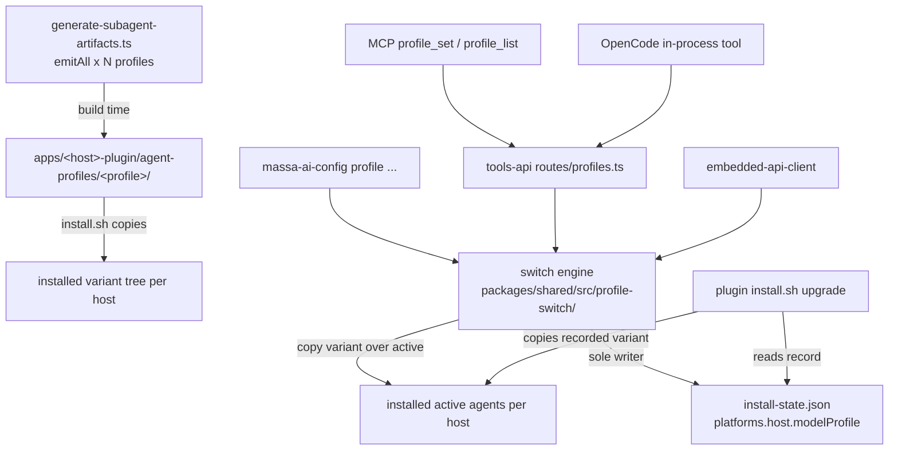

# Model Profile Switching — Design

**Spec**: `.specs/features/model-profile-switching/spec.md`
**Status**: Draft (approach pre-confirmed by the requesting conversation's explicit "implement your final recommendation")

---

## Design Summary

Ship every registry profile pre-rendered per host inside the plugin bundles (`agent-profiles/<profile>/`, sibling of `agents/`), install those variant trees onto the target machine, and add a single switch engine in `@massa-ai/shared` that copies a chosen variant over the active installed agent files and records `{profile, switchedAt}` per host in `install-state.json`. MCP tools, both config-CLIs, and the OpenCode in-process tool are thin fronts over that one engine; the bash installers only *read* the record (re-apply on upgrade) and never write it.

## Active-Decision Handling

| Decision | Conformance |
| --- | --- |
| AD-010 (single `MASSA_AI_` env prefix; passThroughEnv tax) | No new env var introduced by this design. `MASSA_AI_MODEL_PROFILE` stays build-time-only. Runtime profile selection is an explicit argument, never an env read — avoids a second resolution surface and the passThroughEnv tax. |
| AD-011 (no anonymous tools-api route) | `/api/v1/profiles*` routes sit behind the standard auth middleware; not added to `PUBLIC_PATHS`. |
| AD-012 (core layering) | Engine lives in `packages/shared` (not core), used by transports; no `data → services` style inversion is possible — core is untouched except nothing (engine deliberately outside core: it manages host files, not the product's domain). |
| AD-014 (kernel credential scrub) | Not touched; engine logs no secrets (state file contains none). |

New proposed decision (append to STATE.md `## Decisions` at Execute close-out, next free ID re-checked at append time per AD-014's lesson — currently AD-015): **"Installed model-profile state is `platforms[host].modelProfile` in `install-state.json`; the switch engine is its only writer; installers read it to re-apply, never invent or edit it."**

## Spec Corrections Found While Designing

- **C1 (MPS-03 / P1-3 AC1):** the spec's record `{profile, bundleVersion, switchedAt}` duplicates `platforms[host].plugin.version`, which the plugin installers already own — two sources for one fact, the exact defect the registry feature exists to remove. Record becomes `{profile, switchedAt}`; `profile_list` reports bundle version from the existing `plugin.version` field. spec.md amended in place with this reason.

## Approach Exploration (Large — 3 candidates, same scope)

**Recommended — A. Engine as published TS in `@massa-ai/shared`; installers read-only.**
All three runtime consumers (tools-api, mcp-client, opencode-plugin) already declare `@massa-ai/shared` (`apps/*/package.json` dependencies, verified this session), so the engine ships everywhere with zero new dependency edges. Bash installers don't invoke the engine at all: their existing copy loops gain "if a recorded profile exists and the bundle has that variant dir, copy from it instead of `agents/`" — a read-side change in each `install.sh`, preserving the single-writer rule literally.
*Trade-off*: switch logic exists once in TS + a small read-side convention duplicated across four bash installers (guarded by installer tests).

**B. Dependency-free CJS engine mirrored into every plugin bundle (the `opencode-config.cjs` D1 pattern), installers execute it via heredoc.**
Keeps even the re-apply path on the engine binary. *Rejected*: five generated mirrors + parity guards for logic that, on the installer side, reduces to "choose source dir" — the mirror machinery outweighs the duplication it removes; and mcp-client/tools-api would either import a `.cjs` mirror (odd in the ESM-strict workspace) or still need a shared TS copy, reintroducing two sources.

**C. Resolve-at-switch-time (ship registry + resolver + emitters in a published package; no variants).**
*Rejected* (already rejected in the requesting conversation): moves three repo-only pieces into the publish surface, puts the resolver in the offline path, and makes install `--check` semantics depend on runtime resolution. Variants make npm the easy case.

## Architecture Overview



## Code Reuse Analysis

| Component | Location | How used |
| --- | --- | --- |
| Registry resolution + emitters | `scripts/lib/model-profiles.ts`, `scripts/generate-subagent-artifacts.ts` (`emitAll`, `EMIT_BY_HOST`, `HOST_DIRS`, `runCheck`/`diffHost`) | Extended, not duplicated: `emitAll` gains a per-profile loop writing `agent-profiles/<p>/`; `runCheck` diffs variants with the same full-inventory semantics. Resolution itself unchanged. |
| `hostsSupportedBy` | `scripts/lib/model-profiles.ts` | Drives which (host, profile) variant dirs exist — absence encodes "unsupported by profile". |
| install-state read/replace | `scripts/install-skills.sh` `state_replace`, per-plugin `record_plugin_version()` | Pattern for the engine's read-modify-write (preserve unknown fields); installers' read-side follows their existing heredoc convention. |
| Single-flight guard | installer race-safety (M19) locking **semantics** (`scripts/lib/installer-env-transaction.sh` is bash-only — not importable; this is a TS port of the protocol, not code reuse — Plan Challenge F2) | Engine takes an exclusive lock file beside `install-state.json` for the whole switch, carrying owner PID + process start identity; a lock whose owner is provably dead is reclaimed. Without reclaim, one SIGKILL mid-switch would deadlock every future switch — contradicting the crash-converges claim. Discrimination test: kill mid-switch, next switch succeeds. |
| Three-place MCP contract | `tool-defs-project.ts`, `apps/tools-api/src/routes/*`, `embedded-api-client.ts` switch-on-endpoint | `profile_list`/`profile_set` follow the admin-tool shapes already in `tool-defs-project.ts`. |
| Parity/package guards | `subagent-parity.test.ts`, `verify-package-contents.ts`, `install-state-plugin-version.test.ts` | Each extended over the new surface; each new assertion observed red first. |

## Components

### 1. Variant emission (generator)

- **Location**: `scripts/generate-subagent-artifacts.ts` (+ `scripts/lib/model-profiles.ts` untouched).
- **Behavior**: for each host, for each profile in `hostsSupportedBy`-order that supports the host: emit the full agent set to `apps/<host>-plugin/agent-profiles/<profile>/` using the existing per-host emitter. Active `agents/` remains emitted from the selected (default) profile and must byte-equal `agent-profiles/<default>/`.
- **`--check`**: extends `runCheck` to diff every variant dir with full-inventory semantics (stale-entry detection included — same reason the skill-artifact checker diffs inventories).
- **Cursor**: emits variants like every host (all `inherit`) so the bundle shape is uniform; the *switch layer*, not the generator, is what skips Cursor. Uniform shape keeps parity tests table-driven.

### 2. Switch engine

- **Location**: `packages/shared/src/profile-switch/` (`engine.ts`, `hosts.ts`, `state.ts`, `report.ts`).
- **Interfaces** (exact signatures fixed at Tasks):
  - `listProfiles(opts): ProfileInventory` — enumerates installed variant dirs per detected host + reads state; no registry access.
  - `switchProfile({profile, host?, dryRun?}): SwitchReport` — per-host: validate → plan → copy → record; deterministic `HOSTS` order.
- **Host path table** (engine-owned, documented in the module):
  - claude file-route: active `~/.claude/agents/massa-ai-*.md`, variants `~/.claude/massa-ai/agent-profiles/<p>/`
  - codex file-route: active `~/.codex/agents/massa-ai-*.toml`, variants `~/.codex/massa-ai/agent-profiles/<p>/`
  - cursor: always reported `skipped (all tiers inherit)` — no paths consulted
  - opencode: active `~/.config/opencode/agents/massa-ai-*.md`, variants `~/.config/opencode/plugins/massa-ai/agent-profiles/<p>/`
  - Roots honor the same project-local overrides the installers honor (`./.codex`, `./.opencode`, `$TARGET_HOME`).
- **Topology rules** (revised at Plan Challenge — F1, F3):
  - File-route: overwrite only `massa-ai-*` files present in the variant; never delete non-massa-ai files.
  - OpenCode: actives stay **symlinks** — the switch *repoints* each `massa-ai-*` symlink at the recorded variant file under `$PLUGINS_DIR/agent-profiles/<p>/`. No normalize-to-copy: the installer's agent pre-flight treats any regular file where a symlink is expected as user content and skips it forever (`apps/opencode-plugin/install.sh` symlink-vs-file guard), so a normalized copy would silently freeze that agent on every future upgrade (Plan Challenge F3). Repointing keeps "symlink = massa-ai-owned" true for both writers.
  - Marketplace-route claude/codex (agents read in place from the bundle source root): **switching is refused, fail-loud**, with guidance to use the dev path (`MASSA_AI_MODEL_PROFILE` + regenerate) — rewriting an in-place bundle would dirty a checkout and break the drift gate (spec A6's safe path).
  - **Route detection (F1 — the prior draft inferred a signal that does not exist):** plugin installers start writing `platforms[host].installRoute: "file" | "marketplace"` at install time (they are the only party that knows which route they took; field is installer-owned like `plugin`, engine-read). Engine rule: `"marketplace"` → refuse with dev-path guidance; `"file"` → proceed; **absent** (install predating this feature) → refuse with "re-run the installer to record the install route" — never guess from file absence, because an empty active dir on the marketplace route is indistinguishable from "not installed", and guessing wrong yields a switched-but-never-read report (silent wrong models). The marketplace-detection unit test is written first, red, against a fixture state with no route field.
- **Failure ordering** (P1-3 AC5): validate everything (state readable+writable, variant dir exists and complete, lock acquired) → copy files → write state. A copy failure after partial copy retries idempotently (same bytes); state is written only after a host's copies complete, so a crash leaves active files at the *new* profile with the *old* record — re-running the switch converges. Never the reverse (record claiming a profile whose files aren't there).

### 3. Installer read-side re-apply

- **Location**: each `apps/<host>-plugin/install.sh` (+ `scripts/install-harness.sh` untouched in policy, only plumbing if needed).
- **Behavior**: after resolving the copy source, read `platforms[<host>].modelProfile.profile` (existing heredoc state-read convention); if set and `agent-profiles/<profile>/` exists in the incoming bundle, copy the active agent set from it; if set and missing → print loud fallback line, copy default. Also install/refresh the variant tree to the host's variant path (table above). Never write `modelProfile`.

### 4. MCP surface (three places)

- `tool-defs-project.ts`: `profile_list` (no args → GET `/api/v1/profiles`), `profile_set` (`{profile, host?, dryRun?}` → POST `/api/v1/profiles/switch`). Tool count assertions 52 → 54 in both files that pin it (`tool-definitions.characterization.test.ts`, `tool-definitions-identity.test.ts` — re-measure both before editing).
- `apps/tools-api/src/routes/profiles.ts` + sibling `profiles.test.ts`: thin Elysia routes delegating to the engine; behind auth (AD-011); JSON responses (never bare strings — the text/plain trap).
- `embedded-api-client.ts`: two new endpoint `case`s calling the engine directly; parity suites extended (`embedded-mode-parity.test.ts`, `embedded-api-client-endpoints.test.ts`).
- **Trust model**: profile_set mutates the machine the server runs on — same local-dev trust note as the code-execution tools; documented in the tool description.

### 5. CLI fronts

- Both `config-cli.ts` files (mcp-client + opencode-plugin) gain `profile list|show|set <name> [--host h] [--dry-run]`, each ≤ ~30 lines delegating to `@massa-ai/shared` (already a dependency of both packages — verified). No logic in either CLI.

### 6. OpenCode in-process tool + Claude skill

- One `profile` entry in the opencode plugin's `tool({...})` block (count 13 → 14 — the 13-vs-CLAUDE.md-14 discrepancy gets reconciled by the same commit that touches the block; re-measure first).
- `skills/` gains a small profile skill (hand-authored once, bundled by `generate-skill-artifacts.ts` like every skill); instructs running the CLI and relaying the report.

## Data Model

```typescript
// install-state.json v2 extension (backward-compatible optional field)
platforms: {
  [host: string]: {
    root: string
    skills: string[]
    skillsOwner: "repo" | "plugin"
    plugin?: { version: string, installedAt: string }
    installRoute?: "file" | "marketplace"                    // NEW — installer-owned (F1); engine reads, refuses on "marketplace" or absent
    modelProfile?: { profile: string, switchedAt: string }   // NEW — engine-only writer
  }
}
```

Round-trip obligation: `install-skills.sh` `state_replace` and every `record_plugin_version()` must preserve `modelProfile` untouched, and every non-installer writer must preserve `installRoute` (extend `install-state-plugin-version.test.ts` with round-trip cases for both fields, observed red first).

## Error Handling Strategy

| Scenario | Handling | User sees |
| --- | --- | --- |
| Unknown profile | Named error, lists on-disk variant dirs, exit non-zero, no writes | `unknown profile 'x' — installed: balanced, cheap, work, ...` |
| Profile unsupported on host | Per-host `unsupported` row (variant dir absent by construction) | `codex: profile 'open_models' not supported` |
| Bundle predates variants | Per-host `no variants — upgrade plugin` | actionable skip line |
| Cursor | Always `skipped — all tiers inherit` | explicit reason |
| Marketplace-route install | Per-host refusal + dev-path guidance | explicit reason, no writes |
| Corrupt/unwritable state | Global fail before any copy | named error |
| Concurrent switch | Lock held → fail loud (no queueing) | `another switch is running` |
| Partial multi-host failure | Completed hosts stand; per-host rows; non-zero exit | mixed report |
| No hosts detected | Non-zero, explicit | `no installed hosts found` |

## Risks & Concerns

| Concern | Location | Impact | Mitigation |
| --- | --- | --- | --- |
| Host scan behavior of a sibling dir is convention, not documented contract (claude manifest names no agents path) | `apps/claude-plugin/.claude-plugin/plugin.json` (verified: no agents key) | If a host recursively scanned bundle dirs, variants would register as duplicate agents | Variants under host roots live *outside* the hosts' agent dirs entirely (path table); in-bundle `agent-profiles/` is only a shipping location. Execute includes a smoke check on each locally installed host CLI where available (advisory, like `verify:model-ids`). |
| Two `config-cli.ts` implementations drift | `apps/mcp-client/src/config-cli.ts`, `apps/opencode-plugin/src/config-cli.ts` | Diverging `profile` UX | Both delegate to the shared engine; a parity test asserts both surface the same subcommand set. |
| `verify-package-contents.ts` exists because agent globs already shipped-missing once | `scripts/verify-package-contents.ts` | Variants silently absent from tarballs | Extend `requiredTopLevel` with `agent-profiles`; test observed red by removing an entry in a scratch copy. |
| Exactly-17-files parity assertions | `scripts/__tests__/subagent-parity.test.ts` | Break on variant introduction, or worse, get widened wrongly | Table-driven extension: 17 files per (host, profile) × supported profiles + active-equals-default byte assertion. |
| tools-api in Docker switching container files | `Dockerfile` api target | Confusing no-op for remote callers | Tool description states local trust model; report shows per-host `no installed hosts found` inside a container — accurate, loud. |
| Investigator figures (52, 17, 13-vs-14) are subagent-measured | packet | Editing tests against stale counts | Re-measure each in-session before the edit (standing lesson). |
| Marketplace-route detection had no data source in the pre-revision draft (F1 — critical) | `install-state.json` schema | Engine "refusal" could never fire; switched-but-never-read reports | `installRoute` field written by installers; absent → refuse loud; detection test written red-first against a route-less fixture. |
| OpenCode upgrade pre-flight vs switch-produced files (F3) | `apps/opencode-plugin/install.sh` symlink-vs-file guard | Normalized copies freeze agent updates permanently | Switch repoints symlinks, never normalizes; shell-suite case: switch → re-run install.sh → agent still updates. |
| TS lock without stale-owner reclaim (F2) | new engine lock | One SIGKILL deadlocks all future switches | Port M19 owner-identity + proven-dead reclaim; kill-mid-switch discrimination test. |

## Verification Design

- Every MPS-09 error path: one test each asserting the named error (engine unit tests, no host CLIs needed — pure fs against temp dirs).
- MPS-01: generator round-trip test — variant emission byte-equals single-profile emission for sampled (host, profile) pairs; `--check` red on a deleted variant file *and* on a stale extra file.
- MPS-03: state round-trip red-first tests in the two writer suites.
- MPS-04: installer re-apply exercised by the existing shell-suite harness (`scripts/tests/`) with a scratch `$TARGET_HOME` — recorded profile honored, missing-profile fallback loud.
- MPS-05: parity suites + tool-count pins updated by re-measured values; embedded/HTTP behavior parity for both endpoints.
- Independent validation: verification-agent re-derives coverage from spec ACs; discrimination mutations candidate set includes: installer ignores record (re-apply dead), engine writes state before copy, variant diff skips stale entries, Cursor silently dropped from report, lock left stale after kill-mid-switch (next switch must succeed — F2), engine guesses route when `installRoute` absent (must refuse — F1), switch normalizes an OpenCode symlink to a copy (upgrade must still update the agent — F3).

## Tech Decisions (non-obvious only)

| Decision | Choice | Rationale |
| --- | --- | --- |
| Engine location | `packages/shared` | Only package all three consumers already depend on; layering-safe (AD-012); publishable |
| Runtime profile input | explicit arg only, no env | AD-010 passThroughEnv tax; two resolution surfaces is the registry's named defect |
| Record shape | `{profile, switchedAt}` | C1 — bundle version already lives in `plugin.version` |
| Installer role | read + copy only, never write record | single-writer invariant testable as "only engine code path mutates `modelProfile`" |
| Copy-vs-state order | copies first, state last, idempotent re-run | crash converges by re-running; record never claims un-copied files |
| OpenCode symlink handling | repoint symlinks at installed variant files (revised from normalize-to-copy at Plan Challenge F3) | installer pre-flight reads symlink-ness as ownership; a copy freezes future upgrades of that agent |
| Marketplace route | refuse + guide to dev path | in-place bundle rewrite dirties checkouts and breaks the drift gate |
| Cursor in generator vs switch | generator uniform, switch skips | keeps parity tables uniform; skip lives where the reason lives |
| Variant dir name | `agent-profiles/` | sibling of `agents/`, never inside it (A5); host-neutral name |
| Route recording | `installRoute` written by installers (installer-owned field, like `plugin`) | the engine cannot infer route from file absence (F1); absent field refuses loud |

---

## Plan Challenge Record

Full gate, mode `pre_mortem`, dispatched to `massa-ai-plan-critic` (read-only) 2026-08-04. Four findings, all folded before Tasks:

- **F1 (critical)**: marketplace-route refusal had no data source — the draft's "detection" described a signal absent from the install-state schema, and inferring from file absence produces switched-but-never-read reports. → `installRoute` field (installer-owned), absent-refuses-loud rule, red-first detection test. Sections revised: Component 2 topology rules, Data Model, Risks.
- **F2 (high)**: "reuse M19 lock" was a bash-only pattern miscast as code reuse; a TS lock without stale-owner reclaim deadlocks permanently after one SIGKILL, contradicting crash-convergence. → M19 semantics ported (owner PID + start identity + proven-dead reclaim); kill-mid-switch discrimination mutation added.
- **F3 (high)**: normalize-to-copy on OpenCode trips `install.sh`'s symlink-vs-file pre-flight, permanently freezing that agent's upgrades — silent recorded-vs-dispatched drift. → switch repoints symlinks; shell-suite switch→upgrade case added.
- **F4 (medium)**: spec P1-3 AC5 (corrupt state fails before any copy) contradicted the per-host-atomicity edge case — a shared single state file makes corruption inherently global. → spec.md AC5 amended in place: state corruption is a global-fail precondition, exempt from per-host atomicity.
