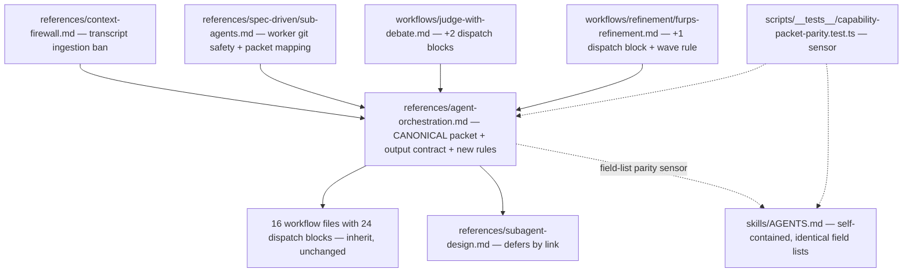

# Sub-Agent Orchestration I/O Design

**Spec**: `.specs/features/subagent-orchestration-io/spec.md`
**Status**: Approved (autonomous session — approach confirmed by recorded assumption, user absent)

---

## Architecture Overview

All new normative text lands in the existing dispatch-mechanics references; workflows
inherit by their existing pointers. Only the two prose-dispatch workflows and the two
packet-restating files get direct edits. A scripted parity sensor replaces the
impossible deduplication between `skills/AGENTS.md` (self-contained bootstrap copy)
and `references/agent-orchestration.md` (canonical).

## Requirements Traceability

| Req | Design element |
| --- | --- |
| ORC-01 | D2 (Guardrails: polling/transcript ban), D3 (context-firewall), D4 (sub-agents.md orchestrator rule) |
| ORC-02 | D2 (wave cap ≤4 + consolidation check), D6 (furps waves) |
| ORC-03 | D2 (cognitive-locality consolidation signal, read-only included) |
| ORC-04 | D2 (git-op prohibition, disjoint worktrees), D4 (worker copy) |
| ORC-05 | D1 (non-inheritance preamble in canonical packet) |
| ORC-06 | D1 (canonical + `lens`), D5/D6 (bespoke packets declared specializations), D7 (AGENTS.md alignment) |
| ORC-07 | D2 (≤40-line default return bound in Output Contract; dual-channel rule) |
| ORC-08 | D8 (parity sensor, red-then-green) |
| ORC-09 | D5 (judge blocks), D6 (furps block), census ≥27 |

## Current Codebase Evidence

- 24 dispatch blocks / 16 files, 9 fields ×24 — re-measured this session (commands in
  spec baseline).
- Packet restatements: `agent-orchestration.md:108-122` (12 bullets incl. `exact next
  step`), `subagent-design.md:92-106` (11, backticked), `skills/AGENTS.md:305-321`
  (11 + `lens` addendum). Output contract: `agent-orchestration.md:144-151`,
  `skills/AGENTS.md:327-334`.
- Prose dispatch: `judge-with-debate.md` (:63,:84,:125), `furps-refinement.md`
  (:28-36,:67); both point at `agent-orchestration.md` for packet/output contract.
- Precedent for scripted parity: `scripts/__tests__/skill-artifact-parity.test.ts`,
  `scripts/__tests__/subagent-parity.test.ts` (both run in `bun run test:scripts`, CI).
- Generators: `scripts/generate-skill-artifacts.ts --check` diffs full inventories of
  the managed subtrees (bundled copies of `skills/massa-ai`, `skills/persona-router`,
  `skills/agents` charters); every source edit regenerates bundles in the same commit.

## Approach Exploration (Large)

**A — Canonical in `agent-orchestration.md`, parity sensor to `skills/AGENTS.md`
(recommended, chosen).** The references are the dispatch-mechanics home every
workflow already links; AGENTS.md stays self-contained for the installer copy and is
held identical by a CI sensor instead of a link it cannot carry.

**B — Canonical in `skills/AGENTS.md`, reference defers.** Rejected: workflows and
charters link to `references/agent-orchestration.md` today (24 blocks, judge/furps
prose); AGENTS.md is a bootstrap block hosts may trim, and its audience is startup
policy, not per-dispatch mechanics.

**C — New third shared reference included by both.** Rejected: the installer-copied
AGENTS.md cannot include at runtime, so the parity sensor is needed anyway; a third
file adds an indirection layer with zero dedup gain.

## Design Elements

### D1 — Canonical Capability Packet (`references/agent-orchestration.md`)

- Rewrite the §Capability Packet bullet list with backticked field names, one field
  per line, shape `- \`field\`: description` — machine-extractable for the sensor.
- Field set (order fixed): `role`, `purpose`, `trigger`, `scope`, `permissions`,
  `inputs`, `sensors`, `output`, `firewall`, `memory`, `persona`, `next_use`,
  plus conditional `lens` (audit-specialist only; promoted from `skills/AGENTS.md`).
  `next_use` is the renamed `exact next step` input-side field: "what the main agent
  will do with the result" — renaming kills the input/output name collision while
  keeping the semantics (spec assumption row).
- Preamble sentence (ORC-05): a subagent inherits nothing from the parent session —
  no skills, no personas, no loaded references, no conversation history; everything
  it needs is named in the packet (reference paths included).
- The in-workflow 9-field dispatch-block shape is documented as the block projection
  of this packet (role/purpose live in the block header; `next_use` defaults to "main
  agent synthesizes and continues the workflow" when absent) — so the 24 shipped
  blocks stay valid without edits.

### D2 — Orchestrator Working Memory rules (`references/agent-orchestration.md`)

New section after §Principle plus Guardrails additions:

- **No transcript ingestion / no polling** (ORC-01): never poll a running subagent
  for status; never read a subagent's transcript, JSONL, or intermediate reasoning —
  consume only the returned output contract. Rationale line: tokens are spent once,
  context shapes every later decision.
- **Wave cap** (ORC-02): at most 4 concurrent subagents per wave. Planning ≥5
  requires a recorded consolidation check first; then dispatch in waves of ≤4.
- **Consolidation signal** (ORC-03): overlapping file/module ownership or a shared
  knowledge domain between planned subagents — including read-only ones — means
  consolidate into one agent before spawning.
- **Git safety** (ORC-04): no repository-wide git operations (`git stash`,
  `git checkout`/`switch` of shared state, `git reset`, `git clean`) inside any
  concurrently-dispatched subagent's scope; concurrent writers require disjoint
  worktrees. The Verifier's scratch-worktree sensor rule is unchanged.
- **Output bound** (ORC-07, in §Output Contract): default ≤40 lines of returned chat
  text; a dispatch block's `output:` field may override with a stated reason;
  file-writing dispatches return the compact verdict only, never the file body.

### D3 — `references/context-firewall.md`

- §Thresholds: add "running or completed subagent transcripts and JSONL" to the raw
  artifacts list.
- §Subagent Firewall: add the no-polling/no-transcript sentence and point to the
  canonical rules in `agent-orchestration.md`.

### D4 — `references/spec-driven/sub-agents.md`

- Batch-worker packet paragraph: declare it a specialization of the canonical
  Capability Packet and map its bullets onto `inputs`/`sensors`/`output` fields.
- Orchestrator role list: consume the compact summary only — never read a worker's
  transcript (ORC-01 restated at the point of use, one line + link).
- Worker rules: repository-wide git operations prohibited inside workers (they
  operate in the feature worktree; commits only via the defined task cycle).
- Verifier section: one line mapping its received artifacts onto the canonical
  packet fields.

### D5 — `workflows/judge-with-debate.md`

- Add standard 9-field dispatch block for `massa-ai-meta-judge` (Step 1) and one for
  `massa-ai-judge` (Steps 2/4, covering round-0 and debate rounds; `inputs:` names
  the per-round additions). Protocol prose (exactly 3 judges, ≤3 rounds, parallel)
  stays; blocks note the panel of 3 is within the wave cap of 4.
- Judge packet declared a specialization of the canonical packet.

### D6 — `workflows/refinement/furps-refinement.md`

- Add standard 9-field dispatch block for `massa-ai-furps-analyst`.
- Fan-out instruction: dispatch the 6 dimensions in waves of at most 4 concurrent
  analysts (e.g. 4 then 2), order-independent; replaces "batch if a concurrency cap
  applies" with the concrete cap.
- FURPS packet declared a specialization of the canonical packet.

### D7 — `skills/AGENTS.md`

- Packet field list rewritten to the identical backticked shape/order as D1
  (including `lens` and `next_use`); output contract list identical to D2's.
- No linking (stays self-contained); the parity sensor is the drift guard.

### D8 — Parity sensor (`scripts/__tests__/capability-packet-parity.test.ts`)

- Extracts `- \`field\`:` bullets from the Capability Packet section and the Output
  Contract section of both files (section located by heading anchor), compares the
  ordered lists, and **prints both extracted populations beside the verdict** (a
  mutation that resolves to nothing must not read as a pass — empty extraction is a
  hard fail).
- Runs under `bun run test:scripts` (existing glob `scripts/__tests__`), so CI covers
  it with no workflow edits.
- Observed-red protocol: before first green, mutate one field name in a scratch copy
  of each file and confirm the test fails with the diverging names in the message.
- **Accepted risk (Plan Challenge F3):** the sensor guards exactly the two known
  restatement sites. A future third restatement elsewhere is not structurally
  prevented — accepted on cost; the canonical-ownership sentence in
  `agent-orchestration.md` is the (non-mechanized) guard for that case.

## Error Handling Strategy

| Error scenario | Handling | Impact |
| --- | --- | --- |
| Parity sensor section heading renamed later | Extraction returns empty → hard fail with "section not found" | Drift cannot pass silently |
| Generator `--check` red after an edit | Task gate red; regenerate bundles in the same commit | No stale bundle ships |
| Census count regression (<27 blocks or field mismatch) | Close-out sensor prints population beside verdict | Missing block visible |
| Host cannot spawn subagents | Existing standalone fallbacks unchanged | No new degradation path |

## Risks & Concerns

| Concern | Location | Impact | Mitigation |
| --- | --- | --- | --- |
| `skills/AGENTS.md` bootstrap block is a public compat surface (installer copies it) | `scripts/install-skills.sh` | A malformed edit ships to every host's AGENTS.md | Field-list-only change; run `generate-skill-artifacts.ts --check` + skills validation; no structural reshaping |
| Bundled copies drift if a commit forgets regen | `apps/*/skills/**` | Parity test red in CI | Same-commit regen rule; `--check` in every task gate |
| Fresh worktree unprovisioned (no `node_modules`) | worktree root | Test gate fails as environment failure | `bun install` before first gate; grammar suites not needed by this feature's gates |
| Renaming `exact next step` → `next_use` could orphan references elsewhere | repo-wide | Stale contract text | Repo-wide grep for `exact next step` in the edit's task; update or exempt each hit with reason |
| Wave cap could contradict `figma-pre-analysis.md` strictly-sequential rule | that reference | Rule collision confusion | Cap is a maximum; sequential (=1) satisfies it — add no text there |

## Tech Decisions (feature-local)

| Decision | Choice | Rationale |
| --- | --- | --- |
| Sensor comparison basis | Ordered exact list equality of backticked field names | Order drift is real drift; sets would hide reordering |
| Judge panel blocks | 2 blocks (meta-judge, judge) not 4 (per round) | Rounds are the same dispatch shape with per-round inputs; one block documents both, protocol prose owns the loop |
| Output bound value | 40 lines | Below context-firewall's 200-line ingestion threshold by 5×; fits every existing compact return contract observed (verifier verdict, batch summary, judge YAML) |

## Plan Challenge Record

Full gate, mode `pre_mortem`, `massa-ai-plan-critic` dispatched 2026-08-04. 4 findings,
all folded before Execute: **F1 (critical→refined)** — the critic's 203-hit rename
population conflated the input-side packet bullet with the output contract's `Exact
next step` return field; re-measured: input-side phrase exists exactly once
(`agent-orchestration.md:122`); T1 now carries a counted 1→0 sensor with the
output-side class exempted (251 total occurrences, reason recorded). **F2 (high)** —
verifier dispatch + traceability flip had no owning task; added to T8. **F3 (medium)**
— parity sensor guards only the two known sites; recorded as accepted risk in D8.
**F4 (medium)** — uniform green self-check tables flagged as groupthink signal; T1
blast radius now an explicit accepted-risk row. Severity of F1 revised down after
measurement (verify-the-mechanism rule); the counted-sensor revision was adopted
regardless.

## Verification Design

- ORC-01..05, 07: literal grep sensors per file (exact new phrases), recorded in
  tasks.md with expected counts.
- ORC-06/08: parity test red (scratch mutation) → green; extracted lists printed.
- ORC-09: census `grep -rc '\*\*Dispatch:' skills/massa-ai/` ≥27; per-field counts
  equal block count.
- Per task: `bun scripts/generate-skill-artifacts.ts --check`, `bun run lint`.
- Final: independent `massa-ai-verification-agent` (author ≠ verifier) per the
  spec-driven dispatch block; writes `validation.md`.
