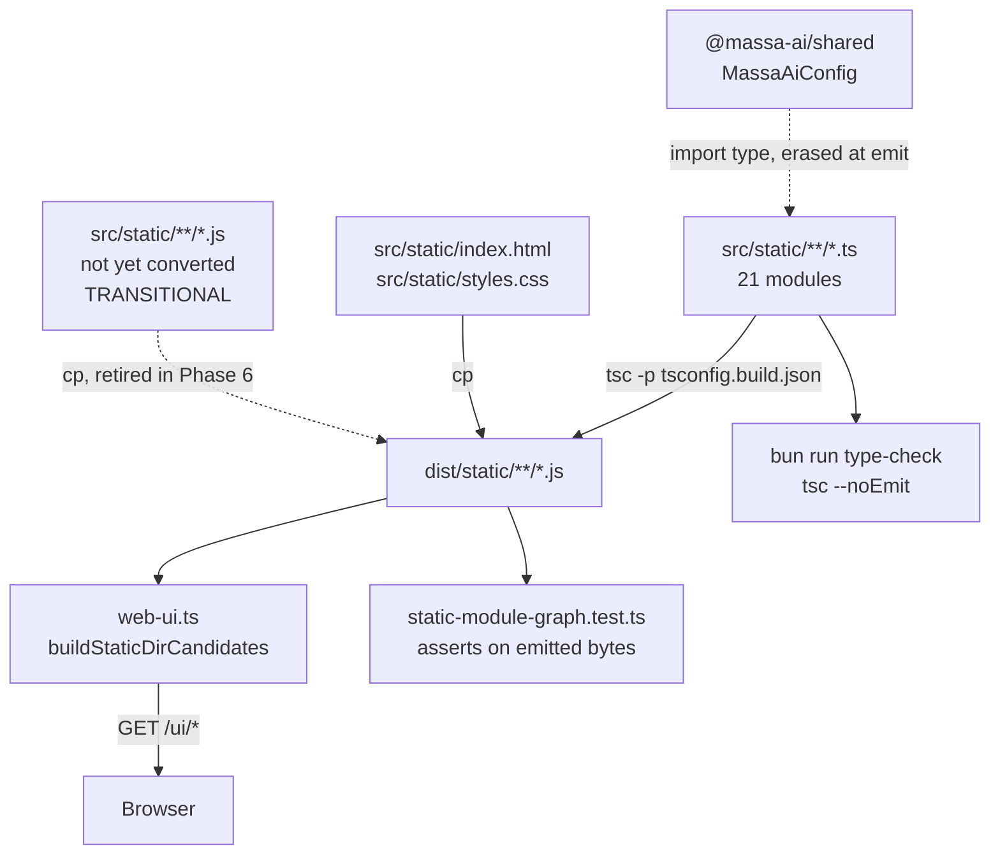

# Web UI TypeScript Conversion Design

**Spec**: `.specs/features/web-ui-typescript/spec.md`
**Status**: Draft

---

## Design Summary

Add a `tsc` emit seam to `apps/web-ui` that compiles `src/static/**/*.ts` to
`dist/static/**/*.js` and copies the non-TypeScript assets alongside, repoint the
Tools API's static-dir resolution at `dist/static`, and convert the 21 modules in
dependency order behind a copy-through that keeps the served graph complete at
every commit.

Nothing about the browser's view changes: the same 21 unbundled ES modules, the
same relative `.js` specifiers, the same `/ui/app.js` entry. What changes is that
the files the browser receives are now emitted from typed sources, and the
module-graph guard inspects those emitted files rather than the hand-written ones.

The emit configuration is not invented — `packages/core` and `packages/shared`
already compile with `rootDir: ./src`, `outDir: ./dist`, `module: ESNext`,
`moduleResolution: bundler`, and `packages/core` already pairs `tsc` with an asset
copy in the same build script. This feature applies that established shape to a
fifth package.

---

## Architecture Overview



The dotted edges are the two that carry the design's risk. `D → B` exists only
while the conversion is partial and is deleted in Phase 6, its removal proven by
an empty-glob assertion. `I → A` must leave no trace in `B` — that is WUT-11 AC3.

---

## Requirements Traceability

| Requirement | Design element | Verification |
| --- | --- | --- |
| WUT-01 emit to `dist/static` | `tsconfig.build.json`, `build` script | build artifact inspection |
| WUT-02 `/ui/app.js` served | `buildStaticDirCandidates` repoint | `curl` + `web-ui-static-dir.test.ts` |
| WUT-03 `/ui` shell served | unchanged route logic | `curl` + CI Docker smoke |
| WUT-04 zero bare specifiers in emit | `verbatimModuleSyntax` + explicit `.js` specifiers | rewritten module-graph guard |
| WUT-05 guard fails loudly on absent `dist` | `beforeAll` sentinel | scratch `rm -rf dist` |
| WUT-06 copy-through keeps graph complete | `build` script copy step | per-phase `curl` |
| WUT-07 zero `.js` under `src/static` | Phase 6 | `git ls-files` glob |
| WUT-08 `type-check` covers 21 modules strict | `tsconfig.json` include | `bun run type-check` |
| WUT-09 no `allowJs`/`checkJs` | `tsconfig.json` edit | file inspection |
| WUT-10 `verbatimModuleSyntax` in both configs | both tsconfigs | file inspection |
| WUT-11 no module over 600 lines | `config.ts` split | module-graph guard assertion 7 |
| WUT-12 CDN globals typed without bare specifier | minimal-shape types + cast | guard + emit grep |
| WUT-13 `render-golden.json` byte-identical | no renderer edits | `shasum -a 256` |
| WUT-14 frozen public-surface lists unedited | `app.ts` re-export set preserved | `git diff` empty |
| WUT-15 787 tests green | — | three baselines |
| WUT-16 stale claims corrected | Phase 6 | `git grep 'no build step'` |

(Spec IDs WUT-01..16 map across stories; the table above is by design element,
so several spec ACs collapse onto one row.)

---

## Approach Tradeoffs

The output-location decision (Shape A / B / C) was explored in `PLAN.md`, put to
the user with a measured cost table after a Plan Challenge falsified the original
technical case against Shape C, and **confirmed as Shape A on 2026-08-11**. It is
not reopened here. Two decisions remain open at design time and are settled below:
the copy-through mechanism, and the `config.ts` split shape.

### Copy-through mechanism

| Approach | Trade-off |
| --- | --- |
| **A. `cp` in the build script (chosen)** | Verbatim `packages/core` precedent (`tsc && cp -r src/generated dist/`). Zero new machinery. Cost: `cp` flags differ between BSD and GNU, and the transitional `.js` copy needs a glob that excludes nothing during Phase 1 but everything by Phase 6. |
| B. A `bun` copy script | Cross-platform, testable, expressible as "copy every non-`.ts` file". Cost: a new script file and a new thing to maintain for a step that is three `cp` invocations. |
| C. `tsc` `allowJs` + `outDir` for the transitional `.js` | No copy step at all — `tsc` would emit the unconverted `.js` through to `dist`. Cost: re-enables `allowJs` exactly when WUT-09 wants it gone, and `tsc` would rewrite those files rather than copy them verbatim. **Rejected.** |

**Chosen: A**, with the transitional `.js` copy expressed as its own `cp` line so
that Phase 6's deletion is a one-line diff and the empty-glob assertion has an
obvious subject. `index.html` and `styles.css` are copied by a separate,
permanent line.

### `config.ts` split shape

| Approach | Trade-off |
| --- | --- |
| **A. `config-sections.ts` (data) + `config.ts` (renderer + handlers) (chosen)** | The 15-section `CONFIG_SECTIONS` array is the part that gains the `MassaAiConfig` coupling and the part the two external suites parse as text. Isolating it makes both the type coupling and the repoint targets obvious. |
| B. Split by section group (e.g. `config-core.ts` / `config-llm.ts`) | Keeps each file small as sections grow. Cost: the external text-scanning suites would need to scan N files instead of 1, multiplying the vacuous-scan risk in WUT-14. **Rejected.** |
| C. No split — raise the 600-line cap | **Rejected.** The cap is a documented regression guard that already forced `registry.js` to split at 948; raising it in a commit that reddens it is the anti-pattern the Plan Challenge named. |

---

## Code Reuse Analysis

Scan run **inline in the main agent**, not through `massa-ai-investigator`.
Skipped-delegation reason, verbatim: *the session's operating instruction is "Do
not call the AgentTool unless the user requested it"* — a request gate; the
consolidated sub-agent offer for Execute fires at the workflow's own gate before
implementation begins.

### Existing components to leverage

| Candidate element | Location | Decision |
| --- | --- | --- |
| `tsc` emit config (`rootDir: ./src`, `outDir: ./dist`, `module: ESNext`, `moduleResolution: bundler`) | `packages/core/tsconfig.json`, `packages/shared/tsconfig.json` | **use** — copy the shape verbatim; it is the repo's established emit contract |
| `tsc` + asset-copy build script | `packages/core/package.json` `build`: `rm -f tsconfig.tsbuildinfo && tsc && cp -r src/generated dist/` | **use** — same shape, different copy sources |
| `tsc --watch` dev script | `packages/core/package.json` `dev`: `bunx tsc --watch` | **use** — verbatim |
| Turbo multi-persistent-task dev run | `turbo.json` `dev` (`cache: false`, `persistent: true`); `@massa-ai/core#dev` already runs beside `@massa-ai/tools-api#dev` | **use** — extend the `dev:api` filter, no new mechanism |
| `beforeAll` sentinel guard for absent generated output | `scripts/__tests__/skill-artifact-parity.test.ts:35-40` | **use** — same pattern for absent `dist/static` (WUT-05) |
| Minimal-shape local type + cast for an untyped third-party surface | `packages/core/src/services/web/html-to-md.ts:18-26` | **use** — the repo's answer to untyped libs is a local minimal type, not a `.d.ts`; the repo ships **zero** `.d.ts` files |
| `turbo.json` `build.outputs: ["dist/**"]` | `turbo.json` | **use** — already correct for a new `dist/` producer, no edit needed |
| `isMeasuredSource` `/dist/` exclusion | `scripts/check-coverage.ts:408` | **use** — emitting under `dist/` needs no coverage-gate edit |
| `bun build` bundler (tools-api, mcp-client, opencode-plugin) | those packages' `build` scripts | **new/rejected** — those bundle to a single file. web-ui must ship 21 separate ES modules with intact relative specifiers, which a bundler destroys |
| An existing copy-through / partial-migration harness | — | **new** — no reusable element found; the transitional `.js` copy is specific to this migration and is deleted at Phase 6 |
| An existing `.d.ts` or ambient-declaration file | — | **new** — evidence-or-zero: `git ls-files '*.d.ts'` returns **zero** rows. Only 2 files use `declare` at all, both inline |

### Integration points

| System | Integration method |
| --- | --- |
| Tools API static serving | `buildStaticDirCandidates(moduleDir, cwd)` candidate strings change from `apps/web-ui/src/static` + `web-ui/src/static` to their `dist/static` equivalents. The walk-up algorithm is untouched. |
| Turbo build graph | `apps/web-ui` gains a `build` script; `turbo.json` `build.outputs: ["dist/**"]` already covers it. `test dependsOn build` then protects `bun run test` automatically. |
| Docker | No `COPY` change. Base runs `bun run build` at `:50`, **after** `COPY apps/web-ui` at `:42`; api copies the built tree at `:62`. Only the stale comment at `:38-39` changes. |
| `@massa-ai/shared` | `import type` only, erased at emit. Declared as a real `dependencies` edge in `apps/web-ui/package.json` (WUT-12). |

---

## Components

### `apps/web-ui/tsconfig.build.json` (new)

- **Purpose**: the emit configuration, separate from the `noEmit` type-check config.
- **Location**: `apps/web-ui/tsconfig.build.json`
- **Shape**: `extends` the existing `tsconfig.json`; overrides `noEmit: false`, `rootDir: "./src"`, `outDir: "./dist"`, `sourceMap: true`, `inlineSources: true`; `include: ["src/static/**/*"]` so tests are not emitted.
- **Reuses**: `packages/core/tsconfig.json` shape.

### `apps/web-ui/package.json` scripts (changed)

- `build`: `rm -f tsconfig.tsbuildinfo && tsc -p tsconfig.build.json && cp src/static/index.html src/static/styles.css dist/static/` plus the transitional `.js` copy line.
- `dev`: `bunx tsc -p tsconfig.build.json --watch`
- `dependencies`: gains `"@massa-ai/shared": "workspace:*"` (WUT-12).
- **Reuses**: `packages/core` build/dev script shapes verbatim.

### `apps/tools-api/src/routes/web-ui.ts` (changed)

- **Purpose**: serve the emitted bundle instead of the sources.
- **Interface**: `buildStaticDirCandidates(moduleDir: string, cwd: string): string[]` — signature unchanged, candidate strings changed.
- **Dependencies**: none new.
- **Reuses**: the existing 10-level walk-up, unchanged.

### `apps/web-ui/src/__tests__/static-module-graph.test.ts` (rewritten)

- **Purpose**: assert the browser can resolve the emitted graph.
- **Change**: `STATIC_DIR` resolves to `../../dist/static`; `listJsFiles` still filters `.js` (now the emitted files); a `beforeAll` sentinel fails naming `bun run --filter @massa-ai/web-ui build`.
- **Preserved**: all 7 assertions, including the 600-line cap and the reachability walk. No threshold changed, no exemption added.
- **Reuses**: `skill-artifact-parity.test.ts`'s sentinel pattern.

### `apps/web-ui/src/static/views/config-sections.ts` (new, split from `config.ts`)

- **Purpose**: the declarative 15-section schema, typed against `MassaAiConfig`.
- **Interfaces**: `CONFIG_SECTIONS: ConfigSection[]`, `ConfigSection` (key, label, restartNeeded, fields).
- **Dependencies**: `import type { MassaAiConfig } from "@massa-ai/shared"`.
- **Reuses**: the existing `CONFIG_SECTIONS` literal, moved unchanged apart from annotation.

### CDN global typing in `lib/markdown.ts`

- **Purpose**: type `globalThis.marked` and `globalThis.DOMPurify` without emitting a bare specifier.
- **Approach**: a minimal local interface for the surface actually used (`marked.parse(string): string`, `DOMPurify.sanitize(string): string`) plus a cast at the two access points (`markdown.js:26-27`).
- **Why not `declare global`**: it would type the globals as unconditionally present, which contradicts the existing `if (markedLib && purifyLib)` guard and its rule-based fallback path. The guard is load-bearing — the CDN can be unreachable.
- **Reuses**: `html-to-md.ts:18-26`'s minimal-shape-plus-cast convention.

---

## Data Models

No persisted data. The one new compile-time type:

```typescript
// apps/web-ui/src/static/views/config-sections.ts
import type { MassaAiConfig } from "@massa-ai/shared";

type ConfigSectionKey = keyof MassaAiConfig;

interface ConfigField {
  key: string;
  label: string;
  kind: "string" | "number" | "boolean" | "secret";
}

interface ConfigSection {
  key: ConfigSectionKey;   // <- the coupling: a section key that is not a
  label: string;           //    MassaAiConfig key fails `bun run type-check`
  restartNeeded: boolean;
  fields: ConfigField[];
}
```

`ConfigSectionKey = keyof MassaAiConfig` is the whole payoff in one line: it makes
WUT-11 AC4 (adding a config section server-side without a UI entry fails
`type-check`) a compiler guarantee rather than a test someone remembers to write.

---

## Error Handling Strategy

| Error scenario | Handling | Impact |
| --- | --- | --- |
| `dist/static/` absent when the guard runs | `beforeAll` throws naming the build command | Test fails loudly; never a vacuous zero-file pass (WUT-05) |
| `dist/static/` absent at request time | Existing `resolveStaticDir()` returns null → `500 web ui static dir not found` | Loud, already-tested behaviour, unchanged |
| A specifier that does not resolve in the browser | SPA fallback returns `index.html` as `text/html`; browser refuses the module | **Silent** — blank tab, all tests green. This is why the guard moved to `dist` |
| `tsc` emit failure | Turbo task fails; CI `build` job fails | Loud |
| CDN unreachable (`marked`/`DOMPurify` absent) | Existing truthiness guard falls back to the escaping renderer | Unchanged; preserved by the cast-not-`declare global` choice |

---

## Verification Design

| Requirement class | How it is proven | Why this discriminates |
| --- | --- | --- |
| Emitted graph is browser-resolvable (WUT-01..06) | Rewritten module-graph guard against `dist/static`, plus `curl` against a live `dev:api` and the CI Docker `/ui` + `/ui/app.js` smoke | The guard reads the shipped bytes; `curl` and Docker exercise the real serving path, which in-process tests provably do not (CHANGELOG records both defects that mocked `fs` hid) |
| Behaviour unchanged (WUT-13..15) | `render-golden.json` sha256 `27195c2e…` unchanged; `public-surface.test.ts` `git diff` empty; three baselines at 700/56/31 | A renderer change moves the golden fixture; a dropped barrel export moves the frozen list |
| Type coupling is real (WUT-11..12) | Scratch mutation: add a key to `MassaAiConfig`, confirm `bun run type-check` goes red, revert. Grep the emitted config `.js` for `massa-ai/shared` → zero hits | A coupling that cannot fail is not a coupling — this is the discrimination sensor for the feature's stated payoff |
| Text-scanning suites still assert (WUT-14) | Empty each suite's population in scratch; each must fail | Per lesson L-001 and the repo's own vacuous-scan history, a scan whose subject moved passes on zero matches |
| Per-phase behaviour preservation | Discrimination sensor per `references/discrimination-sensor.md`: mutate the **moved** code in scratch, confirm the characterization tests kill it | A green suite after a move proves nothing unless it can fail on that move |

---

## Risks & Concerns

| Concern | Location (file:line) | Impact | Mitigation |
| --- | --- | --- | --- |
| Build-order coupling: `test:coverage` and the literal characterization command are **not** turbo-mediated | `package.json` `test:coverage` → `scripts/check-coverage.ts:261-265` (bare `bun test` at `cwd: apps/web-ui`) | After the guard moves, both fail on a clean tree with no prior build; CI is safe (`coverage.yml:169` builds first) but the documented local recipe is not | `beforeAll` sentinel names the exact build command (WUT-05); Phase 6 restates `CHARACTERIZATION.md`'s canonical baseline as the turbo-mediated form; a task explicitly runs `rm -rf apps/web-ui/dist && bun test apps/web-ui/src/__tests__/` to observe the intended red |
| `config.ts` crosses the 600-line cap once annotated | `apps/web-ui/src/static/views/config.js` (572 lines today) | The cap reddens mid-conversion; the cheap repair is raising it, which retires the only guard against `app.js` regrowing from 220 to 3,832 | Split budgeted as its own task **before** annotation (chosen approach A above); standing rule: neither the 600-line cap nor the bare-specifier assertion may be relaxed in the commit that reddens it |
| Two external suites parse `views/config.js` as **source text** | `apps/tools-api/src/routes/config-section-coverage.test.ts:30`, `scripts/__tests__/installer-config-template.test.ts:31` | If the schema moves to `config-sections.ts` and these are not repointed, they pass **vacuously** on zero matches — reads as success | Repoint in the same commit that moves the keys (WUT-14 AC3); add a non-zero population assertion to each (AC2); scratch-empty each population and confirm it fails |
| Three more suites parse module sources as text | `app-renderers.test.ts:1649`, `registry-editor.test.ts:726-734` | Same vacuous-pass class | Same mitigation; all five enumerated in `CHARACTERIZATION.md` |
| Developer edits `dist/` and loses the change | `apps/web-ui/dist/` (gitignored via bare `dist/` at `.gitignore:8`) | Fix disappears on next build, invisible in `git status` | `sourceMap: true` + `inlineSources` so devtools opens the `.ts`; `tsc --watch` in `dev:api` keeps the loop as tight as today's |
| `tsc --watch` emit can lose a race with a fast browser refresh | — | Stale render for one refresh | Accepted (ASM-05). Mitigating needs a serve-time build barrier, which reintroduces the latency watch mode removes |
| Adding `@massa-ai/web-ui` to tools-api `dependencies` would be install-breaking | `apps/tools-api/package.json`, `apps/web-ui/package.json` (`private: true`) | `publish.yml` rewrites `workspace:*` → `^X.Y.Z`; published tools-api would depend on a package absent from npm | Extend the `dev:api` **filter** instead (ASM-04); verified `turbo run dev --filter @massa-ai/tools-api... --filter @massa-ai/web-ui` resolves all 4 packages |
| 21 `.ts` files enter `check-security-allowlist.ts`'s population | `scripts/check-security-allowlist.ts:85` (`apps/web-ui/src/` root, tracked `.ts` only) | Population goes from 1 file to 22; an unexpected hit blocks the gate | Run the checker as its own task and record the measured hit count, rather than assuming browser code produces none |
| Existing test suites are excluded from `tsc` structurally in some packages | — | Not applicable here — `apps/web-ui/tsconfig.json` `include: ["src/**/*"]` covers `src/__tests__` | No mitigation needed; recorded because the repo has this trap elsewhere (`packages/core/tsconfig.json` excludes `src/__tests__`) |

---

## Tech Decisions

| Decision | Choice | Rationale |
| --- | --- | --- |
| Emit target | `apps/web-ui/dist/static/` | Keeps the 21 `.ts` sources in the coverage-measured population at the 90% floor while the emitted JS is excluded by `isMeasuredSource`'s `/dist/` rule; matches `turbo.json` `build.outputs: ["dist/**"]` so turbo cache stays correct. User-confirmed as Shape A |
| Compiler, not bundler | `tsc -p tsconfig.build.json` | The browser loads 21 separate ES modules with relative specifiers; `bun build` (used by the other three apps) bundles to one file and destroys that. `packages/core`/`shared` already use plain `tsc` |
| Two tsconfigs, both with `verbatimModuleSyntax` | `tsconfig.json` (noEmit) + `tsconfig.build.json` (emit) | A flag on the build config only means local `type-check` is green on code the build rejects. Plan Challenge C4 |
| CDN globals | Minimal local interface + cast, not `declare global`, not `.d.ts` | `declare global` types them as unconditionally present, contradicting the load-bearing `if (markedLib && purifyLib)` fallback guard. The repo ships zero `.d.ts` files; `html-to-md.ts:18-26` is the established precedent |
| Module-graph guard subject | Emitted `dist/static/*.js` only | User-selected. A source-side guard cannot see emitter behaviour, and `import type` would force a bare-specifier exemption that blinds it permanently |
| Transitional `.js` copy-through | Its own `cp` line in the build script | Makes Phase 6's deletion a one-line diff with an empty-glob assertion as its completion proof |
| No tools-api → web-ui dependency edge | Extend the `dev:api` turbo filter | tools-api is published, web-ui is `private: true`; the edge would publish a broken dependency |

> **Project-level decision proposed — AD-021.** `apps/web-ui/dist/` is a new class
> of untracked build output with new consumers (the module-graph guard,
> `test:coverage`, the serving route). AD-016 states the same principle for
> `apps/*-plugin` bundles — "any new consumer must chain the generation ahead of
> itself" — but is scoped to plugin bundles and does not cover this. Rather than
> conform by silent analogy, append AD-021 at close-out extending the principle to
> **every** untracked generated root in the repo, naming `apps/web-ui/dist/` as the
> second instance and the `beforeAll` sentinel as the enforcement pattern when a
> consumer cannot chain the build itself.
>
> **Highest existing decision is AD-020** (checked at design time, per AD-014's
> recorded warning that a pre-assigned number was already taken at close-out —
> re-check before appending).

### Active decisions conformed to

| Decision | Conformance |
| --- | --- |
| AD-010 (one env prefix; a new knob costs a `turbo.json` `passThroughEnv` edit) | Conform — this feature introduces **no** environment variable |
| AD-011 (Tools API never serves anonymous; `/ui` and `/ui/` are fixed public paths) | Conform — auth behaviour untouched; the API-key `<meta>` injection path is preserved through `api-client.ts`'s conversion |
| AD-016 (generated bundles untracked; consumers chain generation) | Conform by analogy, then extend via AD-021 above |
| AD-017 (plugins deliver, MCP serves tools, hooks observe) | Not applicable — no plugin, MCP, or hook surface is touched |

---

## Artifact-Store Evidence

Active artifact key `.specs/features/web-ui-typescript/design.md`.
Version 1 (initial write, 2026-08-11). Checksum recorded on commit.
