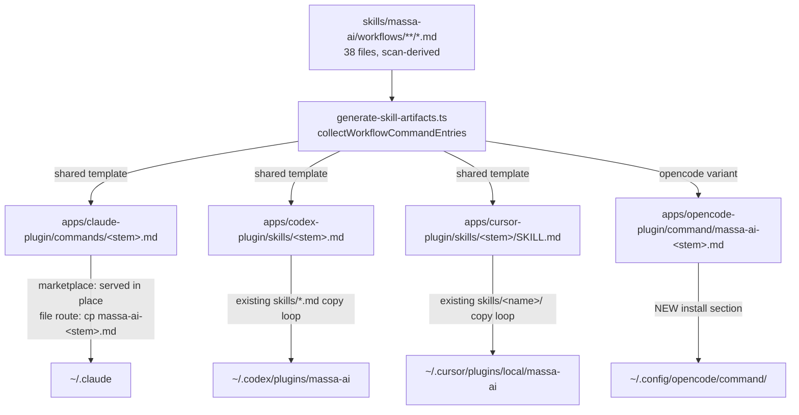

# Workflow Commands Design

**Spec**: `.specs/features/workflow-commands/spec.md`
**Status**: Approved (Approach A user-confirmed 2026-08-05)

## Design Summary

Extend `scripts/generate-skill-artifacts.ts` to emit one command artifact per
workflow (scan of `skills/massa-ai/workflows/**/*.md`, 38 at base) into each
host plugin, using each host's verified invocation surface: Claude flat
`commands/<stem>.md`, Codex flat `skills/<stem>.md`, Cursor
`skills/<stem>/SKILL.md`, OpenCode `command/massa-ai-<stem>.md` (new managed
root). Claude/Codex/Cursor share one byte-identical template; OpenCode gets a
minimal-frontmatter variant (its `$ARGUMENTS` is a real placeholder and
unknown frontmatter is a risk class there). Generated files carry a body
ownership marker (`<!-- massa-ai:generated workflow-command -->`); prune and
`--check` for the three shared-directory hosts are **marker-scoped** (a stale
artifact from a deleted workflow still bears the marker, so it is pruned and
detected), while OpenCode's `command/` is a wholly-generated directory root
using the existing `extraManagedRoots` machinery. Delivery rides the existing
installer copy loops on Claude/Codex/Cursor; OpenCode's installer gains a
command-delivery + prefix-owned uninstall section. Conforms to AD-016
(generated = untracked, generation-on-demand via the existing
`generate:artifacts` entrypoints; gitignore star + 6 static quick-file
negations per shared dir).

## Approach Tradeoffs (Large — recommendation first)

Same scope for all three: 38 generated commands, 4 hosts, AD-016 contract.

**A — Flat host-native files + body ownership marker (RECOMMENDED).**
Emit into the same flat surfaces the 6 quick commands already prove each host
reads. Ownership = body marker; prune/`--check` marker-scoped; gitignore
star+negation. Pros: every emitted path is a *verified-read* host surface
(host-discovery lesson); exact `/massa-ai:debug` on Claude marketplace route;
installers mostly already deliver these globs. Cons: new marker-scoped
prune/check mechanism beside the directory-root mechanism; gitignore
negation list (6 static names per host, sensor-locked).

**B — Nested managed subdirectories** (`commands/workflows/`,
`skills/workflows/`). Pros: pure directory-root prune/check, zero new
mechanism, one gitignore line per host. Cons: Claude loader documents flat
`.md` or `<dir>/SKILL.md` only — `commands/workflows/debug.md` is an
unspecified shape; Codex manifest auto-loads `skills/*.md` (flat glob).
Dead-command risk on 2 of 4 hosts. Rejected: emitting to a path the host is
not documented to read violates the host-discovery lesson.

**C — Claude via `skills/<stem>/SKILL.md` dirs** (Anthropic's "use skills/
for new plugins" recommendation), Codex/Cursor/OpenCode as in A. Pros:
documented naming guarantee, future-proof vs `commands/`. Cons: same
dynamic-name-beside-static-content ownership problem as A but without A's
precedent-match to the quick surface; splits Claude's command catalog across
two surfaces (6 in `commands/`, 38 in `skills/`); still needs the marker
mechanism for Codex/Cursor. Viable fallback if `commands/` deprecates.

## Architecture Overview



Runtime flow (all hosts): user invokes command → template body instructs:
load massa-ai router (dedupe-guarded), route to the named workflow under
precedence 1 (explicit route), pass `$ARGUMENTS` verbatim as task
description. No second routing path (WFC-01).

## Code Reuse Analysis

| Component | Location | How to Use |
| --- | --- | --- |
| Host capability table | `scripts/lib/host-capabilities.ts:89-159` | Add `"command"` to opencode `extraManagedRoots` (precedent: `"lib"` at :154) |
| `managedRootsFor` / `pruneManagedRoots` / `runCheck` | `scripts/generate-skill-artifacts.ts:210,251,355` | OpenCode `command/` root flows through unchanged; add marker-scoped prune/check branch beside the existing hook-binary single-file pattern (:386-405) |
| Emit conditional pattern | `generate-skill-artifacts.ts:297-304` (`includes("lib")` block) | Mirror: per-host workflow-command emit branch |
| Workflow frontmatter parsing | Existing frontmatter reads in generators/WMH gate | Reuse `description:` extraction; fail loud on absence |
| Claude installer command loops | `apps/claude-plugin/install.sh:583-589,634-641` | Generated files ride the existing globs; uninstall hardened to prefix-glob |
| Codex flat-copy loop | `apps/codex-plugin/install.sh:606-613` | Rides unchanged |
| Cursor skills copy loop | `apps/cursor-plugin/install.sh:461-476` | Rides; audit its `massa-ai\|persona-router\|agents` exclusion (profile absent — pre-existing concern) |
| OpenCode installer idiom | `apps/opencode-plugin/install.sh:545-586` (agents section) | Model for new command-delivery + prefix uninstall section |
| Quick-command template shape | `apps/claude-plugin/commands/def.md` (byte-identical ×3 hosts) | Template precedent: frontmatter `description`/`argument-hint`, prose body |
| Gitignore root-precise idiom + `--check` inventory diff | `.gitignore:68-76`, `generate-skill-artifacts.ts:326-353` | AD-016 conformance |

### Integration Points

| System | Integration Method |
| --- | --- |
| `bun run generate:artifacts` | Command emission lives inside `generate-skill-artifacts.ts` — every existing entrypoint (pre-scripts, CI build step, installer checkout-detection) covers it with zero new wiring (WFC-09, AD-016) |
| Router contract | Command body = explicit-route dispatch only; router `SKILL.md` untouched |
| npm packaging | Plugin `package.json` `files` + `verify-package-contents.ts` widened for new/changed roots (`command/` on opencode) |

## Components

### 1. `collectWorkflowCommandEntries()` (generator)

- **Purpose**: Scan workflow inventory, validate, render per-host artifacts.
- **Location**: `scripts/generate-skill-artifacts.ts` (+ small
  `scripts/lib/workflow-commands.ts` if size warrants).
- **Interfaces**: `collectWorkflowCommandEntries(): WorkflowCommandEntry[]`
  where entry = `{stem, description, sharedBody, opencodeBody}`; throws
  (exit non-zero, emit nothing) on: missing `description:`, duplicate stem,
  stem colliding with `QUICK_COMMAND_NAMES` (def/find/graph/index/map/
  status) or `RESERVED_BUNDLE_ROOTS` (massa-ai/persona-router/profile/
  agents — critic F3: on Cursor a reserved stem would land inside a
  directory-root-pruned path, two prune mechanisms on one path), stem
  failing `^[a-z0-9][a-z0-9-]*$` (WFC-05). Both literal lists sensor-locked.
- **Reuses**: existing scan/frontmatter idioms; prints emitted population
  per host (no silent caps).

### 2. Command templates

Shared (Claude `commands/<stem>.md`, Codex `skills/<stem>.md`, Cursor
`skills/<stem>/SKILL.md`) — byte-identical across the three, parity-tested:

```markdown
---
description: "<workflow description> — explicit massa-ai '<stem>' workflow"
argument-hint: "[task description]"
---
<!-- massa-ai:generated workflow-command -->

Explicit massa-ai workflow invocation: `<stem>`.

Load the massa-ai router skill if not already loaded (dedupe guard), then
route to workflow `<stem>` under routing precedence 1 (explicit route) —
do not reclassify. Pass the following as the task description; if empty,
the workflow's own intake gathers it.

$ARGUMENTS
```

OpenCode variant (`command/massa-ai-<stem>.md`): frontmatter `description:`
only (unknown-key forwarding risk class on this host), same marker + body.
`$ARGUMENTS` is OpenCode's native placeholder — intentional. No `` !`cmd` ``
shell placeholders in any template (spec Edge).

### 3. Marker-scoped prune + check (generator)

- **Purpose**: Ownership boundary where generated files share a directory
  with hand-authored ones (Claude `commands/`, Codex `skills/`, Cursor
  `skills/`).
- **Behavior**: prune = delete every candidate (`commands/*.md`,
  `skills/*.md`, `skills/*/SKILL.md`) whose content contains the marker;
  `--check` = diff the marker-bearing checked-out set against fresh
  emission (missing/unexpected/modified — stale artifact of a deleted
  workflow bears the marker → `unexpected`). Hand-authored files never
  carry the marker → structurally unprunable, no allowlist to drift.
- **Reuses**: `diffManagedRoot` diff-shape; hook-binary side-check
  precedent (:386-405). OpenCode `command/` uses plain directory-root
  machinery via `extraManagedRoots` instead.

### 4. Installer deltas

- **Claude**: no new copy code (globs cover generated files). Harden
  file-route uninstall from source-basename loop to owned-prefix glob
  `rm $TARGET/commands/massa-ai-*.md` — source-derived removal misses
  installed copies when bundles are absent/stale at uninstall time (AD-016
  makes that state normal).
- **Codex/Cursor**: no copy changes; verify loops pick up new files in
  install tests.
- **OpenCode**: new section — copy `command/massa-ai-*.md` to
  `~/.config/opencode/command/`, uninstall removes exactly `massa-ai-*.md`
  from that dir. Dirname RESOLVED (critic F1 fold, probed 2026-08-05):
  OpenCode 1.18.14 binary discovery glob is `{command,commands}/**/*.md` —
  both names read, recursively; `command/` chosen as docs-canonical.
  Host-absent → recorded skip (existing idiom, WFC-12).

### 5. Contract tests

- **New** `scripts/__tests__/workflow-command-parity.test.ts` (reached by
  `test:scripts`): per-host artifact count == live workflow scan count (no
  hardcoded 38); byte-identity Claude==Codex==Cursor per stem; OpenCode
  variant shape; marker present in every generated body; description
  sourced from workflow frontmatter; no shell placeholders; the 6 quick
  files still tracked and marker-free (`git ls-files` — locks the
  gitignore negations and the marker boundary).
- **Widened**: codex manifest "exactly 6 `skills/*.md`" → 6 hand-authored
  marker-free + scan-count generated; cursor manifest likewise;
  `skill-artifact-parity.test.ts` `--check` gate covers new roots
  automatically. Every new/widened lock gets an observed red before it
  counts (WFC-11, L-001).

## Data Models

None — no persisted state. `install-state.json` untouched (spec sweep row).

## Error Handling Strategy

| Error Scenario | Handling | User Impact |
| --- | --- | --- |
| Workflow missing `description:` | Generator exits non-zero naming file; emits nothing | CI/build red with actionable message |
| Stem collision (quick name / duplicate / bad charset) | Same fail-loud path | Same |
| OpenCode command dir not verifiable | Resolved pre-Execute: binary glob `{command,commands}/**/*.md` (v1.18.14) — both read; skip-path retained for future hosts where probe fails | Delivered; probe evidence in validation.md |
| Host absent at install | Recorded skip (existing idiom) | Unchanged behavior |
| Stale artifact after workflow deletion | Marker-scoped prune removes; `--check` flags as `unexpected` | Drift cannot ship silently |
| Uninstall with stale/absent bundles | Prefix-glob removal by owned name | Clean uninstall regardless of bundle state |

## Risks & Concerns

| Concern | Location (file:line) | Impact | Mitigation |
| --- | --- | --- | --- |
| Claude file-route uninstall derives removals from source globs | `apps/claude-plugin/install.sh:583-589` | Generated commands survive uninstall when bundle absent (normal under AD-016) | Component 4: prefix-glob uninstall for `massa-ai-*.md`; install test asserts removal with bundles deleted |
| Cursor copy-loop exclusion list omits `profile` (pre-existing) | `apps/cursor-plugin/install.sh:470` | Pre-existing double-copy class; new stems flow through the same loop | Audit loop while touching it; add exclusion or record as out-of-scope finding in validation.md |
| ~44 always-on command/description entries cost context in every session | Claude plugin surface | Token cost per session grows | Measure `claude plugin details` before/after at Execute; record figure in validation.md; template descriptions kept one-line |
| Parked AD-017 PR edits same generator/installers | `scripts/generate-skill-artifacts.ts`, `apps/*/install.sh` | Merge conflicts when either lands | User-accepted (2026-08-05); keep diffs surgical; conflict sweep at merge time |
| Codex/Cursor "exactly 6" manifest locks go red on first emission | `apps/codex-plugin/__tests__/manifest.test.ts:75-84`, `apps/cursor-plugin/__tests__/manifest.test.ts:63-72` | Gate failure mid-Execute if sequenced wrong | Critic F2 fold: T5/T6 (lock widening) sequenced BEFORE T4 (first `test:plugins` full gate); T2/T3 run quick gates only; observed red for each widened lock |
| Marker-scoped check is a new sensor | new generator code | A sensor green from birth is unquotable | Red-first: plant a stale marker-bearing fixture + a modified body; observe both reds before trusting (memory: new-sensor-needs-observed-red) |
| `~/.claude/commands/` flat namespace on file route → `/massa-ai-debug` not `/massa-ai:debug` | `apps/claude-plugin/install.sh:635-641` | Command name differs by route (doc gap confirmed upstream) | Follow existing quick-command file-route precedent (`massa-ai-` prefix); document both forms in README |

## Tech Decisions (only non-obvious ones)

| Decision | Choice | Rationale |
| --- | --- | --- |
| Ownership boundary in shared dirs | Body HTML-comment marker, marker-scoped prune/check | No allowlist to drift; stale-after-delete detectable; hand-authored files structurally excluded |
| Claude surface | Flat `commands/` (Approach A) not `skills/` (C) | Matches verified-read precedent; single catalog beside quick commands; C kept as fallback |
| OpenCode delivery root | New `command/` via `extraManagedRoots` | Wholly-generated dir → zero new prune machinery for this host; `"lib"` precedent |
| OpenCode installed filename | `massa-ai-<stem>.md` prefix | Filename = command name there, no plugin namespace; prefix is the repo's established ownership marker for flat host dirs |
| Two template variants, not four | Shared ×3 + OpenCode minimal | Byte-identity ×3 is a cheap tested invariant (quick-file precedent); OpenCode differs for real reasons ($ARGUMENTS native, unknown-frontmatter risk) |
| Gitignore shape | Star + 6 static negations per shared dir | AD-016 untracked-generated; negation set is static and sensor-locked by the parity test |
| Proposed AD-018 | "Workflow command surface is generated from the workflow inventory; ownership = body marker in shared dirs, dedicated root elsewhere" | Project-level: future hosts/workflows must follow; append to STATE Decisions at Execute |

## Requirements Traceability

| WFC | Design element |
| --- | --- |
| 01 | Template body (Component 2) — explicit route, verbatim args |
| 02/03 | Component 1 scan + marker-scoped prune (Component 3) |
| 04 | Description extraction, fail-loud (Component 1) |
| 05 | Validation guards (Component 1) |
| 06 | Marker boundary + byte-idempotent emit (Components 2/3) |
| 07 | Marker-scoped `--check` + `extraManagedRoots` root (Component 3) |
| 08 | Installer deltas (Component 4) |
| 09 | Gitignore + existing `generate:artifacts` entrypoints (Integration) |
| 10/11 | Contract tests + widened locks, observed red (Component 5) |
| 12 | Host-absent skip (Component 4) |
| 13 | `description:` frontmatter on all four hosts (Component 2) |
| 14 | README/FEATURES.md single-location doc (Execute task) |

## Verification Design

- Generator: unit-level red-first checks for each fail-loud guard; double-run
  byte-idempotency; scratch-copy add/delete workflow → set-diff assertions.
- Marker mechanism: planted-fixture reds (stale + modified) before green.
- Installers: per-plugin install tests extended (delivery, uninstall-owned-
  only, quick files untouched); OpenCode dirname probe evidence recorded.
- Gates: `bun run test:scripts`, `test:plugins`, both generators `--check`,
  lint — all pre-existing entrypoints.
- Final: independent verification-agent, mutations per AC family
  (author ≠ verifier).

## Active Decision Handling

Conforms to AD-016 (generation-on-demand, no new entrypoints) and AD-010 (no
new env vars; nothing added to `passThroughEnv`). No supersession. AD-018
proposed (table above), to be appended to STATE Decisions during Execute.
AD-017 absent on this branch (parked PR) — design deliberately targets main's
pre-AD-017 installer state.
